To get an Idea of what we want to look at in the play, we started
looking at the play by using Wordhoard. While doing so we filtered the
most (and least) used words in Hamlet.

<figure>
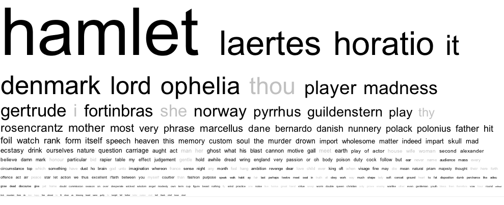
</figure>

The practical aspect of Wordhoard is that it not only shows the
most/least used words but also if the words are under/overused compared
to other Shakespearian texts. Words in black ore overused whereas words
marked in grey seem to be used less in Hamlet than in other plays.

**[What we found interesting here are 2 observations:]{.underline}**

1.  The lack of pronounces used in the play. Compared to other
    Shakespearian plays, the pronouns "I, she, thou, thy" seem to play a
    smaller role in Hamlet.

2.  "Madness" - as Wordhoard takes every word into consideration when
    doing its statistics, we have to consider ignoring the Names of the
    actors in the play as they are naturally always mentioned when
    speaking. Following this, we can see that one of the most used words
    in the play is "Madness". This gave us a first indicator for
    something to dip deeper into. The meaning of Madness and the absence
    of pronouns in the play.

    Right after this we changed the modifications of Wordhoard a bit and
    extended the search to "Multiword Units". This means Wordhoard
    showed us word combinations that appear most/least in the play. The
    number of words we used as an indicator was 2 to 5.

    <figure>
        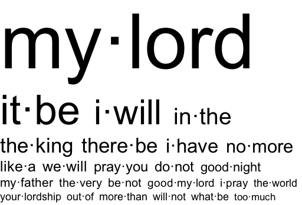
    </figure>

Paradoxical, this graph shows that one of the most used Multiword Units
in the Play includes the Word "I" in the context of "I will" , which is
one of the fewer used words compared to other Shakespearian plays.

We noticed that there is a lot of "Order" in the found data.

"My Lord"

"It be"

"I Will"

"There be"

All these words hint at contexts that are clearly defined. As "My Lord"
is the most used Unit in the play, we see that the King (Claudius,
murderer of Hamlets father) must be referred to in person a lot. It is
also quite expected from a King to talk in clear and defined Orders as a
King that talks vaguely might show weakness. Following this, we looked
back at the plot: as Hamlet is a revenge play and the character wants to
revenge his death father by any means, we wondered if there might be a
connection with the data collected.

On one hand, we have the lack of Personal pronouns, such as

**" " **

and the presence of Certainties and orders such as

**"It will, there be" **

or the presence of an authority known as

**"My Lord".** On the other hand, we have the presence of the word
**"madness".**

In this context we wondered how these could relate to each other.

The first thing we observed is that the overuse of **" My Lord "** is
not as specific as we thought. It is simply a form to address a male
person in the times of Shakespeare, so almost basically everyone uses it
to address his opponent while speaking in the play.

As we've seen when comparing *Hamlet* to the other tragedies, it can be
noticed that the word \'I\' is very rare. Using Wordhoard, we could see
that while \'I\' is underused, there are a variety of pronouns that are
much more prominent.

Shakespeare\'s use of pronouns such as \'Thy\', \'Thee\' \'Thou\' are
important in knowing the status of the person being addressed. With
these kinds of pronouns being rich throughout *Hamlet* we can gather a
sense of the relationships between the characters in the play. Using the
function *Find words* on Wordhoard, we were able to look up the specific
words:

<figure>
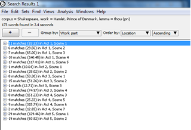
</figure>

An interesting point that can be drawn from this evidence is how many
times \'thou\' is said in certain Acts. With thou being used in *Hamlet*
to address an inferior such as King Claudius to servants and Queen
Gertrude, we know it is an informal mode of address used for anyone who
is of lower status than the speaker. 'You\', on the other hand, is a
word used among nobles which we know is much more formal. Hamlet shows a
switch between thou and you during his conversation with his ghost
father. From the results above, Act I, Scene 5 thou only appears in the
dialogue seven times. With this being a crucial point where Hamlet meets
the ghost, it shows he does not yet view the ghost of a higher status
than himself.

Conversely, going forward to the Act 3, Scene 5, Hamlet uses you to
address his ghost father. In this scene, Hamlet does not seem that he
sees ghost, rather he sees his father. Again, looking at the results
above it indicates that thou is not spoken in this scene. This is useful
evidence in showing that he now sees his father as superior and uses a
formal mode of address. One interesting thought we concluded was the
reason of the switching between thou and you is that he is convinced
that the ghost is really his father whom he adores very much.

Looking at some of the results from Wordhoard the following show the
comparing frequency of spelling (pn) in *Hamlet* compared to Shakespeare
tragedies:

         Relative Use   Analysis Count   Log Likelihood   Analysis parts per 10,000 words   Reference parts per 10,000 words
  ------ -------------- ---------------- ---------------- --------------------------------- ----------------------------------
  Thee   \-             59               38.3             19.98                             41.96
  Thy    \-             87               26.8\*\*\*\*     29.46                             50.21
  Thou   \-             105              54.4\*\*\*\*     35.56                             69.65

        Relative use   Analysis Count   Log Likelihood   Analysis parts per 10,000 words   Reference parts per 10,000 words
  ----- -------------- ---------------- ---------------- --------------------------------- ----------------------------------
  I     \-             546              23.7\*\*\*\*     184.90                            228.78
  You   \-             553              4.6\*            187.27                            169.58
  He    \+             423              0.4              141.53                            146.06

Data explained:

-   The "Relative Use" column shows whether a word is more or less
    frequent in *Hamlet* compared to the rest of Shakespeare's plays,
    just as the black/grey colour of the words show in the word cloud.
    Here we can see each of the pronouns is used less (minus in the
    table or grey in the word cloud).

-   The "Log Likelihood" column is much important. It shows the extent
    to which the frequency of a word in *Hamlet* in comparison to its
    frequency in the rest of Shakespeare's plays. The number of
    asterisks shows the significance of the result, i.e. the more
    asterisks, the more difference between the frequency of the word in
    *Hamlet* compared to the rest of Shakespeare's plays. Here, then, we
    can see that both "thy" and "thou" are used significantly less in
    *Hamlet* than in other Shakespearean plays.

-   The "Analysis parts per 10,000 words" column again shows the
    frequency of a word in *Hamlet* alone. For example, "thee" appears
    38.3 times per 10,000 words.

-   The "Reference parts per 10,000 words" column performs a similar
    function, showing the frequency of the same word but this time
    across all of Shakespeare's plays. E.g., "thou" appears 69.95 times
    per 10,000 words.

**Madness**
===========

Using WordHoard allowed us to uncover the words most used within the
play and forms them into a Word Cloud. From this, assumptions can be
gathered regarding the key themes:

<figure>
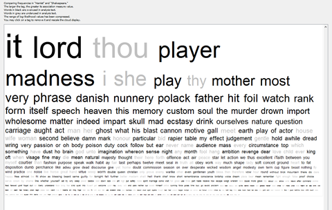
</figure>

One of the most used words in Hamlet is 'madness' or words associated
with this. The historical lemma of madness within Hamlet is high in
comparison of all Shakespearean plays:

-   Madness: + 14.1\*\*\*\* - Analysis count: 68. Reference count: 22.

The comparison of many word forms also supports the idea that madness is
a prominent theme by stating the word is overused in comparison to other
Shakespearean texts (whereas 'love', for example, is underused). Another
word that sticks out from the Word Cloud is 'player'. This is
interesting because it reflects the game of revenge which is central to
Hamlet. The strategic use of madness is used to seek revenge.

There are several characters who could be categorized as mad, the most
prominent two being Hamlet and Ophelia. The gender of madness and who
speaks of madness throughout the play is of interest. Women are linked
with madness only 603 times whereas male characters have 2974 linkages.
It is easy to think of Hamlet when you think of madness within this play
as he shows big signs of this. However, he originally feigns this
madness in order to avenge his father. Though it is questionable to what
extent this madness is real at the end of the play as it seems to
encompass him. As a result, Ophelia's madness worsens as she sees him
deteriorate and she ultimately dies.

The "Find Word" function lets us recognize the key quotes surrounding
the theme of madness:

> Hamlet: 'How strange or odd some'er I bear myself
>
> (As I perchance hereafter shall think meet
>
> To put an antic disposition on). (1.5.190-192)
>
> \- After the Ghost tells Hamlet that Claudius has murdered his father,
> Hamlet begins to plan his revenge. Here he describes his plan to
> pretend to be a madman, thus foreshadowing that he isn't actually mad.
> However, Hamlet is already in a deep state of melancholy and
> unstableness. It is also of relevance to point out the Elizabethan
> idea of madness is different to modern day notions of mental illness.
>
> Hamlet: 'I am but mad north- north- west. When the wind is southerly.
> I know a hawk from a handsaw'. (2.2.352)
>
> \- Here we see Hamlet admitting he is not truly mad, but it is part of
> a plan. He knows madness from sanity and is acting like a fool to
> further his plan of gaining revenge for his murdered father.
>
> Ophelia: 'I would give you some violets, but they withered all when my
> father died.
>
> They say a' made good end'. (4.5.174-175)
>
> \- Throughout the play Ophelia shows more and more signs of a
> depressive state. She struggles to deal with her father's death and
> continues to bring it up. Here she foreshadows her own death and hints
> that it is a 'good end' and possibly her solution to end the pain and
> suffering she is dealing with. The Queen states that Ophelia is
> 'incapable of her own distress' (4.7.177). The madness and lack of
> love from Hamlet probably does not help this.

**How important is the notion of Madness, and what does Shakespeare try to tell us in the play?**
=================================================================================================

1.) People affected by Madness

-Hamlet

Gradual Development of his mental state from Played Madness to Mad
Behaviour

-**Graph** of Moments where he acts "Insane" :

**[Data :]{.underline} **

**Act 1:**

Scene 5, 173-174 : I perchance hereafter shall think meet (To put an
antic disposition on) : Hamlet says he'll pretend to be crazy.

**Act 2:**

Scene 1, 84-95 : "He took me by the wrist and held me hard...At last, a
little shaking of mine arm, And thrice his head thus waving up and down"

We see Hamlet mistreating Ophelia and acting weirdly, the first signs of
his obsession and where his played madness seems to be not under
control.

Scene 1, 83 : Polonius "Mad for thy love?" Assuming Love is the reason
for Madness.

2.2.36 (My too much changed son) People assume reasons for his madness
and even his mother sees he has "changed too much".

**Act 3: **

Scene 4, 191-192 : Hamlet " That I essentially am not in madness/ But
mad in craft" He explains his mother that he is mad for real and that
Claudius will try to expose him as a liar. \*shows he is indeed not mad,
as he explains himself)

Scene 4, 107 "Alas, he's Mad" Gertrude when she witnesses Hamlet talking
to himself (the ghost).

Scene 2, 370 : " Let me be cruel, not unnatural.." Hamlet : shows he
still has human instincts, he does not want to act unnatural or
inhumane. His ability to reflect impose she is not mad (yet).

Scene 1, 163-165 : Claudius "Nor what he spoke, though it lacked form a
little/ Was not like madness. There's something in his soul/ o'er which
his melancholy sits on brood.." Claudius does not think Hamlet is mad.
He thinks Hamlet acts this way for a reason - anger to revenge his
father.

Scene 1, 57 : " To be, or not to be? That is the question/ Hamlet . The
famous speech / monologue implies that he struggles to figure things out
make decisions, it could be a strong indicator that he is losing
substance, that he is not so sure of his plans and acting anymore.

**Act 4:**

Scene 4, 65 "Oh from this time forth, My thoughts be bloody, or be
nothing worth!"

Hamlet decides to go after his goal. This determination shows his
obsession and the trigger point for his madness: he wants to blank
everything out, except for revenge.

Scene 1, 14 "His liberty is full of threats to all" Claudius.

**Act 5:**

"why, because he was mad" Gravedigger to Hamlet. Everyone thinks Hamlet
is mad except for Hamlet himself, for thinks he acts like it.

"how come he mad?" Hamlet asking the Gravedigger.

Scene 2, 216-219" And you must needs have heard, how I am punished/With
sore distraction. What I have done? That might your nature, honour, and
exception/ Roughly awake, I here proclaim was madness" Hamlet says his
actions result from madness.

Conclusion :

We can observe that it is never quite sure how much Hamlet is affected
by a state of real madness and/or if he is still following his plan of
faking it. What can be observed though is that the reason for his doubts
and episodes of madness come from his obsession to revenge his father.
It is the central point of his thinking and the main problem for him: he
wants to kill Claudius by any means.

This shows how important revenge is in the play and how it affects
everyone. Not only drives does it drive Hamlet mad, wo acts obsessed; it
also turned Ophelia mad and led to her death as she could not handle the
consequences of Hamlet's actions (the death of her family members)

This lead us to the question: what did Shakespeare want to tell us about
revenge?

**Why is revenge portrayed negatively in the Play?**
====================================================

Why and how does Shakespeare portray revenge in such a negative way?

Here are a few ideas:

1)  Leads to people going crazy :

    As we have seen with Hamlet and Ophelia, revenge and its
    consequences drive people into insanity. Revenge is bad as it
    incites obsession.

    Another example of this is the use of weapons in the play.

    Shakespeare made wide use of poison. 4 out of the 8 people dying in
    the play die of poisoning.

    <figure>
    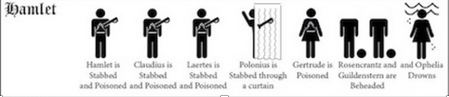[^1]
    </figure>

The problems are:

1)  To kill someone with poison is a cowards' way of seeking revenge. As
    revenge in Shakespearian times should be a task to save the Honour
    of the murdered person, the way they should be seeking it is not by
    cowards' methods.

> It is an immoral way of killing. Morality however is often very
> undefined in the play. An example of this is the often used word "
> good" , which is neutralized of any emotion in the play. One can say
> "good sir" which basically means 'yes, sir'. It shows that things are
> not always clear in the play.

2)  In the play, all that revenge does is leading to Misery and Death of
    affected and unaffected people.

-   8 people die. All of these 8 people die related to Hamlets revenge
    plans.

3)  Pretty much everyone dies, including people that should have been
    spared such as Gertrude (the ghost explicitly asked her to be
    spared) or Ophelia, who did no wrong. Shakespeare shows that revenge
    just leads to more misery, it is a vicious cycle.

4)  Eventually it even leads to the Avenger's death (Hamlet).

5)  A lesson that can be learned is shown by the only survivor in the
    play, Horatio: he shows the Importance of forgiveness and rational
    thoughts of consequences. Horatio is the only survivor of the main
    characters in the play. We concluded that this might be because he
    is the only character acting within arguments of reason and
    forecast. Instead of getting obsessed over things, Horatio tries to
    stay logical and fix problems. He tries to warn Hamlet and solve
    problems instead of running into misery. From the early start of the
    play, he questions if what the ghost says is of truth and/or wise to
    follow. He does not give in to obsession such as Hamlet, who fails
    to think more critically and calm.

**Hamlet** :

Motive : Anger more than Honor : Determination Tunnel Vision Obsession
Madness Tragedy (He Dies, everyone dies)

**Leartes** :

Honor Revenge Father Killed by Sword, Sister gone mad and drowned,
Honourable reasons to take Revenge on Hamlet Death/Tragedy (Revenge has
consequences even with good motives)

**Horatio** :

Rational Mind Thinking of Consequences Loyalty Acting right Survival
(Lesson, Learned, revenge does not pay off.)

When looking at these traits of Horatio, who only has the best of his
loyal friend Hamlet in mind, we tried to find any moments in the play in
which Hamlet might have tried to solve his actual problem with Claudius
instead of just raging to kill him.

To illustrate this, we used a program called "Sublime Text" which
creates Character Network graphs. These show how much any characters
interacted with each other:

<figure>
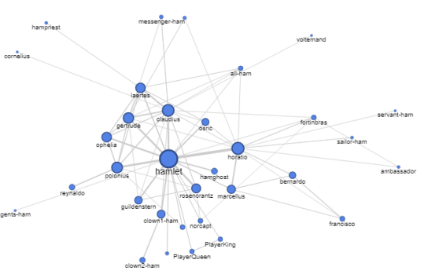
</figure>

Here we can observe that the amount of times Hamlet interacts with
people is pretty evenly spread. There is no significant amount of time
where he and Claudius actually interact and when looking deeper into the
text and its content, one can see that, if they speak, it is never of
much substance, nor does it constitute an attempt to talk about
problems.

It shows that all this misery and death could have been prevented, if
people would have just spoken more to each other, just like Horatio did.

**Analysis through custom programs:**

Additionally, we wrote 2 custom programs in Python in order to analyze
various attributes of language. Both were designed with minimal set-up.
So long as the text they were provided with was in a format where stage
directions are marked with \[\], acts and scenes are marked with the
word in block capitals followed by a line of = symbols, and character
names are written in block capitals.

**The first program:**

The first of these programs focused on analyzing and comparing
characters vocabulary to spot patterns.

The program created a table of all words featured in the play and how
frequently they occurred, as well as a series of trees: one shared tree,
and one for each character. Put simply, a tree is a data structure to
show what a given piece of data can be followed by. For example,
\"well\" might be followed by \"done\" or \"met\". The tree also stored
how likely each branch was to be followed.

The tree data ultimately was not particularly useful for conducting
analysis, although it could be put to use to \"mimic\" characters, with
somewhat mixed results:

<figure>
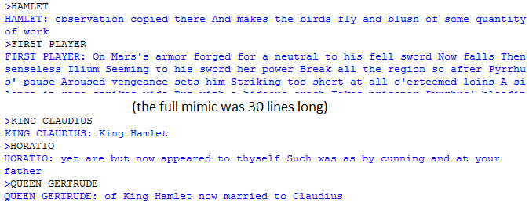
</figure>

Although occasionally amusing, the trees were not viable for aiding
analysis, thus the program was instead made to focus upon characters
vocabularies. The first iteration of this looked at a sentence provided
by the user, analyzed each word and decided who in the text provided (in
this case Hamlet) was most likely to have said it. Words were not
considered if they occurred too frequently, so as to minimize bias
towards characters with more dialogue.

This worked best when it was fed quotes from other Shakespeare plays.

<figure>
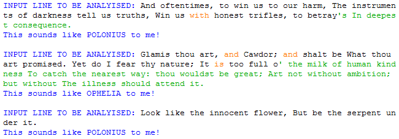
</figure>

Polonius seemed to resonate with lady Macbeth. Generally, the tone and
sentiment behind the quote and who it was matched to lined up quite
well. Although it fared worse if fed modern texts:

<figure>
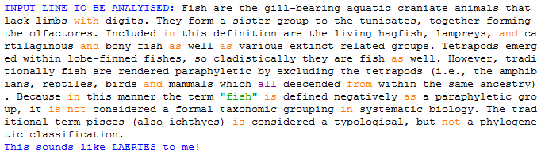
</figure>

Ultimately though, the trends it showed weren\'t especially useful, as
you could simply analyze direct quotes from characters to gauge their
general sentiment. We moved on instead to analyzing unique words. The
program found all of each character\'s unique words, and then divided
them by the total amount of words the character spoke, providing a
percentage:

<figure>
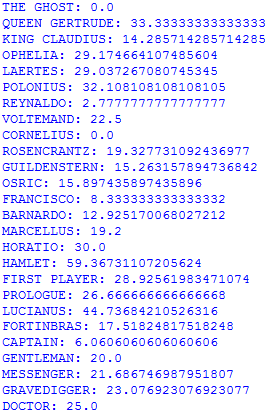
</figure>

It is interesting how a character\'s unique word rate is more or less
independent from how much they speak. For example, the king has a very
low rate, despite having a lot of dialogue. Characters such as the
Gravedigger and Doctor have higher numbers, although this is likely due
to specific terminology combined with very limited presence in the play
as a whole. Very generally, this seems to provide an estimated to how
active a character is. Hamlet has the highest score because he interacts
with many characters and takes a great deal of action, whereas the king
mostly reacts and delegates to others, especially Polonius.

Although these results were somewhat informative, we had reached the
limit of what language analysis alone could do. So, we started working
on a second program.

**The second program:**

The second program was developed based on observations about existing
programs used by Textlab; for the most part, they are all based upon the
idea of taking raw text and using inbuilt functions to provide
human-readable results and data. Whilst these are useful, this means
subsequent programs must be built from the ground up. So, the second
program was built with the idea of converting the raw text into a
convenient format so that subsequent python programs could be written to
understand and expand upon it.

> The program is based on the following system:

1.  Split the play into acts

2.  Split each act into scenes

3.  Split each scene into lines

4.  Separate stage directions out

5.  Convert the lines into its composite parts: the contents, the
    speaker, and a unique ID.

This can then be written into a file and loaded into future programs. we
wrote an example system into the program itself, which allows a user to
input statements in a formal logical structure and returns statements
that match. we then wrote a charting programing that took its output and
displayed it. For example:

<figure>
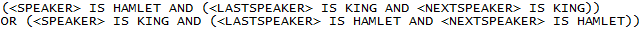
</figure>

Yields:

<figure>
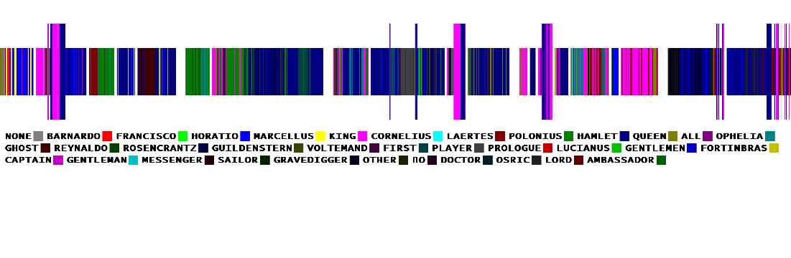
</figure>

The taller bars show all the times that Hamlet and the King engage in
conversation. It highlights that they mostly communicate in a few large
conversations and implies the chaotic nature of the finale.

And:

<figure>
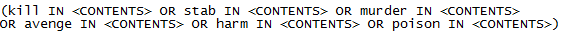
</figure>

Yields:

<figure>
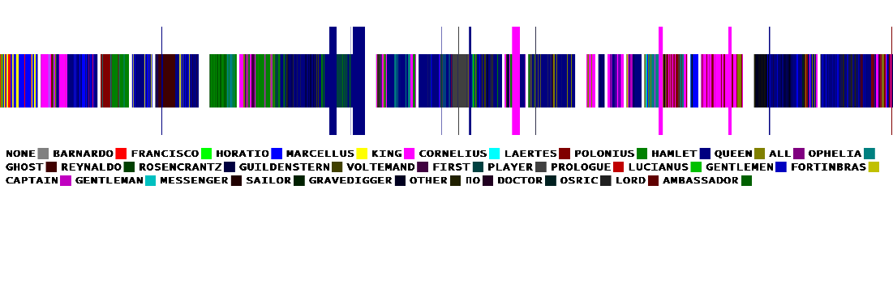
</figure>

This is searching for an assorted grab-bag of violent words, so it\'s
not surprising it mostly catches lines by the king and Hamlet; you can
see when Polonius is killed when the Queen, who normally doesn\'t use
violent words, uses some at the same time Hamlet does.

As discussed above though, the focus of this program is to provide an
easy program with format for any given text, although the application of
the graphing program does show that the data given to potential
programmers does have ample potential for deep analysis.

[^1]: Image retrieved from
    <https://io9.gizmodo.com/an-infographic-that-keeps-track-of-all-of-shakespeares-1534516437>,
    2018
