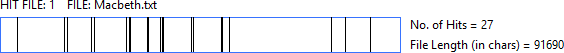
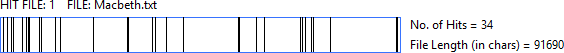
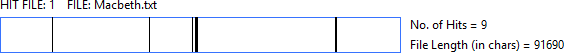



# Pronouns

**How does Shakespeare use Pronouns in Macbeth compared to the rest of the
Tragedies.**

If you compare how Shakespeare uses pronouns in the Tragedies with how he uses
them throughout his work, there are a number of interesting results. Using
Wordhoard, we can see how frequently Shakespeare uses certain pronouns (for
example: ‘my’, ’they’, ‘our’, and ‘we’). Doing this yields the following
results:

#### Table 1


This shows that when compared to the full corpus – that is, all of Shakespeare’s
published plays and poems – Shakespeare tends to use possessive pronouns (such
as ‘our’ and ‘my’) on a far more frequent basis across the tragedies. This,
while interesting, is not really surprising, as we know that as a genre, the
Tragedies tend to be identifiable primarily through the self-interested motives
of the plays’ protagonists. Compare, for example, the frequency of these
pronouns in Shakespeare’s comedies:

#### Table 2


As you can see, the frequency of these possessives drops dramatically in the
Comedies when compared to the Tragedies, reinforcing the notion that
possessiveness – as shown through pronoun use – is one of the hallmarks of
Shakespeare’s Tragedies.

**But how does that help us with relation to Macbeth?**

This effectively acts as a proof of concept. We have an idea (the Tragedies have
specific patterns in their pronoun use); we have shown that their frequency when
compared to the full corpus is increased (through our analysis in Wordhoard, the
values of which are shown in table 1); and we have shown that when compared with
another genre, there is a vast difference in their frequency (as shown by our
comparison with the comedies in table 2). Because of this, we can look at
Macbeth in isolation when compared to the full corpus and to the Tragedies as a
whole.

#### Table 3


This table shows that in some senses, Macbeth is particularly unusual as a
Tragedy. Its pronoun use, compared to both the full corpus and the mean pronoun
occurrence within the Tragedies as a genre is significantly different. For
example, “my” is used in Macbeth around 20% less frequently than the Full Corpus
or the Tragedies as a whole. While the frequent use of “my” in Romeo & Juliet
arguably disputes this theory of Macbeth’s factional nature – After all, the
conflict Romeo & Juliet’s stems entirely from the manner in which the Montagues
and Capulets are almost entirely oppositional – it can be argued that this
increase can be accounted for by romantic sentiments stated by both Romeo and
Juliet, which would inevitably influence any statistical analysis of the play.

One explanation for this is that when compared to the rest of the tragedies,
Macbeth is very much a “factional” play in that there are no characters who act
as singular individuals. Macbeth works together with Lady Macbeth in his pursuit
and protection of the throne; Macduff works together with Donalbain, Siward, and
others to remove Macbeth from the throne, and the witches work together as what
can perhaps best be described as “agents of chaos”: they appear to have no stake
in the outcome of the play, but set the events of the play in motion despite
this fact.

In addition to this, we can take this idea of oppositional factions and apply it
to Macbeth in other ways. As discussed above, Macbeth is driven by the above
factions encountering and coming into opposition with each other. However, it
can perhaps be argued that, at a deeper level, this is also reflected in some of
the play’s thematic conflicts.

# Night and the King

The contrasts between light and dark show up in several key scenes in Macbeth.
This symbolism of night and darkness is very important in understanding
Macbeth's character at these points in the play. The word "night" is used more
commonly in Macbeth than expected when compared to Shakespeare's other plays.
This can be seen in the WordCloud. Through Antconc we can see that it appears
the most densely between the murder of King Duncan and the death of Banquo.

Between these two actions, Macbeth is committing himself to the fulfilment of
the Weird Sisters' prophecy. One of the most important points that this
symbolism makes is again the nature of kingship. In Renaissance writing and
plays, the King is very commonly and closely associated with the sun. King
Duncan's murder marks the start of this frequent use of the word night, showing
this correlation between the death of the king and the absence of sunlight.

What is also interesting is the continued use of the word "night" through to
Banquo's murder. At this point, not only has Duncan died but he has been
replaced by Macbeth, an undeserving king. The lack of sunlight and the
predominance of night beyond Duncan's death can therefore be applied exclusively
to Macbeth and used as a reflection of his actions as king. Banquo's murder,
while not committed by Macbeth, was ordered by him. This is one of the first
things that Macbeth does with his new power as king. The scene of Banquo's
murder is full of light/dark symbolism but in this instance, since Macbeth is
now king, the light symbolism can now be applied to him.

## Kingship

Word choice is very important in Macbeth and using WordCloud some of the most
important of these words are revealed. Using this tool, the word 'tyrant' shows
up more frequently than in Shakespeare's other plays. In a play that centres
around kings and kingship, 'tyrant' is a very unusual word to use because the
king was believed to be chosen by God. This was known as the 'divine right of
kings.' Kings could only be judged by God so for the word 'tyrant' to be used so
frequently is interesting. More interesting, however, is where this word is used
in the play, especially compared to the word 'king.'

The word 'king' is used most densely in the beginning of the play before Duncan
is killed whereas 'tyrant' is used exclusively in the second half. This draws a
distinct parallel between Duncan's rule and Macbeth's. As well as being an
obvious description of the kind of rulers both characters were, the word choice
suggests a legitimacy in Duncan's rule that Macbeth lacks. This is an idea that
is reinforced at the end of the play when the word 'king' is repeated three
times in quick succession almost immediately after Macbeth is killed. This can
be seen clearly below.

# Light and Dark – Banquo’s Death

Right before Banquo’s death, Banquo asks for a light. This means that both he
and his son are illuminated when they enter stage. This is particularly relevant
as it is this illumination that allows the Three Murderers to spot and identify
them. As said before, light would normally represent the king. The relationship
between Macbeth, the king, ordering Banquo's death, and the light of the torch
that dooms him is clear here.

What is also interesting in this scene is the fact that it is the extinguishing
of this light that allows Fleance, Banquo's son, to escape. The torch dies out
during the attack; one of the murderers cries out "who did strike out the
light?” 3.3 in the fight and it is only once Banquo is dead that they notice the
son had fled. This symbolism is not only significant in portraying Macbeth but
it also acts as foreshadowing that extends back to the Weird Sisters' prophecy.
The image of the extinguished light is symbolic not only if Macbeth weakening
grasp of power but also of his future demise. The second part of the witches'
prophecy was that Banquo's descendants would go on to be future kings for
generations to come, a prediction that came true with Fleance's escape.
