

# Pronouns

**How does Shakespeare use Pronouns in Macbeth compared to the rest of the
Tragedies.**

If you compare how Shakespeare uses pronouns in the Tragedies with how he uses
them throughout his work, there are a number of interesting results. Using
Wordhoard, we can see how frequently Shakespeare uses certain pronouns (for
example: ‘my’, ’they’, ‘our’, and ‘we’). Doing this yields the following
results:

#### Table 1


This shows that when compared to the full corpus – that is, all of Shakespeare’s
published plays and poems – Shakespeare tends to use possessive pronouns (such
as ‘our’ and ‘my’) on a far more frequent basis across the tragedies. This,
while interesting, is not really surprising, as we know that as a genre, the
Tragedies tend to be identifiable primarily through the self-interested motives
of the plays’ protagonists. Compare, for example, the frequency of these
pronouns in Shakespeare’s comedies:

#### Table 2


As you can see, the frequency of these possessives drops dramatically in the
Comedies when compared to the Tragedies, reinforcing the notion that
possessiveness – as shown through pronoun use – is one of the hallmarks of
Shakespeare’s Tragedies.

**But how does that help us with relation to Macbeth?**

This effectively acts as a proof of concept. We have an idea (the Tragedies have
specific patterns in their pronoun use); we have shown that their frequency when
compared to the full corpus is increased (through our analysis in Wordhoard, the
values of which are shown in table 1); and we have shown that when compared with
another genre, there is a vast difference in their frequency (as shown by our
comparison with the comedies in table 2). Because of this, we can look at
Macbeth in isolation when compared to the full corpus and to the Tragedies as a
whole.

#### Table 3


This table shows that in some senses, Macbeth is particularly unusual as a
Tragedy. Its pronoun use, compared to both the full corpus and the mean pronoun
occurrence within the Tragedies as a genre is significantly different. For
example, “my” is used in Macbeth around 20% less frequently than the Full Corpus
or the Tragedies as a whole. While the frequent use of “my” in Romeo & Juliet
arguably disputes this theory of Macbeth’s factional nature – After all, the
conflict Romeo & Juliet’s stems entirely from the manner in which the Montagues
and Capulets are almost entirely oppositional – it can be argued that this
increase can be accounted for by romantic sentiments stated by both Romeo and
Juliet, which would inevitably influence any statistical analysis of the play.

One explanation for this is that when compared to the rest of the tragedies,
Macbeth is very much a “factional” play in that there are no characters who act
as singular individuals. Macbeth works together with Lady Macbeth in his pursuit
and protection of the throne; Macduff works together with Donalbain, Siward, and
others to remove Macbeth from the throne, and the witches work together as what
can perhaps best be described as “agents of chaos”: they appear to have no stake
in the outcome of the play, but set the events of the play in motion despite
this fact.

In addition to this, we can take this idea of oppositional factions and apply it
to Macbeth in other ways. As discussed above, Macbeth is driven by the above
factions encountering and coming into opposition with each other. However, it
can perhaps be argued that, at a deeper level, this is also reflected in some of
the play’s thematic conflicts.

# Night and the King

The contrasts between light and dark show up in several key scenes in Macbeth.
This symbolism of night and darkness is very important in understanding
Macbeth's character at these points in the play. The word "night" is used more
commonly in Macbeth than expected when compared to Shakespeare's other plays.
This can be seen in the WordCloud. Through Antconc we can see that it appears
the most densely between the murder of King Duncan and the death of Banquo.

Between these two actions, Macbeth is committing himself to the fulfilment of
the Weird Sisters' prophecy. One of the most important points that this
symbolism makes is again the nature of kingship. In Renaissance writing and
plays, the King is very commonly and closely associated with the sun. King
Duncan's murder marks the start of this frequent use of the word night, showing
this correlation between the death of the king and the absence of sunlight.

What is also interesting is the continued use of the word "night" through to
Banquo's murder. At this point, not only has Duncan died but he has been
replaced by Macbeth, an undeserving king. The lack of sunlight and the
predominance of night beyond Duncan's death can therefore be applied exclusively
to Macbeth and used as a reflection of his actions as king. Banquo's murder,
while not committed by Macbeth, was ordered by him. This is one of the first
things that Macbeth does with his new power as king. The scene of Banquo's
murder is full of light/dark symbolism but in this instance, since Macbeth is
now king, the light symbolism can now be applied to him.

## Kingship

Word choice is very important in Macbeth and using WordCloud some of the most
important of these words are revealed. Using this tool, the word 'tyrant' shows
up more frequently than in Shakespeare's other plays. In a play that centres
around kings and kingship, 'tyrant' is a very unusual word to use because the
king was believed to be chosen by God. This was known as the 'divine right of
kings.' Kings could only be judged by God so for the word 'tyrant' to be used so
frequently is interesting. More interesting, however, is where this word is used
in the play, especially compared to the word 'king.'

The word 'king' is used most densely in the beginning of the play before Duncan
is killed whereas 'tyrant' is used exclusively in the second half. This draws a
distinct parallel between Duncan's rule and Macbeth's. As well as being an
obvious description of the kind of rulers both characters were, the word choice
suggests a legitimacy in Duncan's rule that Macbeth lacks. This is an idea that
is reinforced at the end of the play when the word 'king' is repeated three
times in quick succession almost immediately after Macbeth is killed. This can
be seen clearly below.

# Light and Dark – Banquo’s Death

Right before Banquo’s death, Banquo asks for a light. This means that both he
and his son are illuminated when they enter stage. This is particularly relevant
as it is this illumination that allows the Three Murderers to spot and identify
them. As said before, light would normally represent the king. The relationship
between Macbeth, the king, ordering Banquo's death, and the light of the torch
that dooms him is clear here.

What is also interesting in this scene is the fact that it is the extinguishing
of this light that allows Fleance, Banquo's son, to escape. The torch dies out
during the attack; one of the murderers cries out "who did strike out the
light?” 3.3 in the fight and it is only once Banquo is dead that they notice the
son had fled. This symbolism is not only significant in portraying Macbeth but
it also acts as foreshadowing that extends back to the Weird Sisters' prophecy.
The image of the extinguished light is symbolic not only if Macbeth weakening
grasp of power but also of his future demise. The second part of the witches'
prophecy was that Banquo's descendants would go on to be future kings for
generations to come, a prediction that came true with Fleance's escape.

#Manly Macbeth

It should come as no surprise that male characters dominate the stage in
Shakespeare's plays. We can see this clearly when we compare how many
lines are spoken by men and women in the tragedies.

<figure>
    
</figure>

However, some scholars argue that Shakespeare's female characters often
react against this under-representation by becoming manipulative and
cunning, forcing us to question what dominance really means.
Unsurprisingly, Macbeth has more than double the lines of his wife, Lady
Macbeth (715 to her 259), however it is still possible to argue that
Lady Macbeth is the dominant half of this power couple. While Macbeth's
lines outnumber Lady Macbeth's across the play in its entirety, this
dynamic is reversed in Act I Scene vii. Macbeth comes to his wife to
declare that their murder plot is off the table, however her influence
over him can be tracked across the course of the short scene. The
conversation becomes notably one-sided, with Macbeth speaking only 21
lines, while Lady Macbeth has 43. In order to find out how the language
in Act 1 Scene vii reflects this subversion of roles, we can use
Ubiqu+ity to examine the types of language used by Macbeth and Lady
Macbeth. Ubiqu+ity is an online application that generates statistics
and can be used to tag specific words and phrases using LATs (Language
Action Types) which can help identify the type of language used, its
connotations and the effect on the reader. After running the dialogue of
both Macbeth and Lady Macbeth through Ubiqu+ity, a .csv file of
statistics is returned which can be visualised using the Slim Text
Viewer and JMP. Several of the results are particularly interesting as
they appear to contradict traditional gender roles i.e. the strong male
and weak female character; the gentle woman and violent man; and the
dominant man and subjugated woman.

a.  Question

    LAT: Question

    *The use of words and punctuation to indicate the requesting of
    specific information (e.g., what, hast, is it, why not, why, how,
    ?). Experience created: The addressee is being asked to provide
    specific information on a certain topic or issue.*

While Lady Macbeth statistically uses more language that comes under the
Questions LAT than Macbeth throughout the whole play, there is an even
greater disparity between the use of questioning language in Act 1 Scene
7.

<figure>
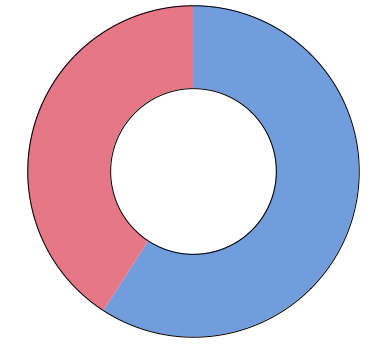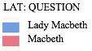
</figure>

Lady Macbeth uses a significantly higher proportion of questions
throughout Act 1 Scene vii than Macbeth. As we can see above, these
Question words are described on the Docuscope LAT list as suggesting
that "the addressee is being asked to provide specific information on a
certain topic or issue". However, in this case, what Docuscope cannot
identify is that Lady Macbeth's questions are largely rhetorical, and
she is using this language to mock Macbeth's change of heart about the
murder of Duncan.

<figure>
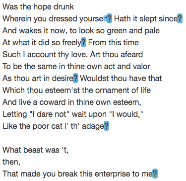
</figure>

#### Figure 2 Macbeth Act 1 Scene vii ll.35-45 with Question LATs highlighted

b.  Positivity

> LAT: Positive Emotion
>
> *The use of words that convey, connote, or evoke emotions that are
> considered positive (e.g., pleasant, gentle, happiness, delight, shine
> upon, happy, heaven, pleasure, friendship, splendor). Experience
> created: The text indicates a person in a state of happiness, joy,
> elation, pride, or some other feel-good emotion.*

An unexpectedly high LAT for Lady Macbeth in this scene is Positivity.
This is the seventh most used LAT in Lady Macbeth's dialogue in this
scene according to the Slim Text Viewer, and it is defined as indicating
a character in a state of happiness. From this, we might expect Lady
Macbeth to be in high spirits in this scene, at least in comparison to
Macbeth who doesn't use any language that Docuscope identifies as
indicating positivity.

<figure>
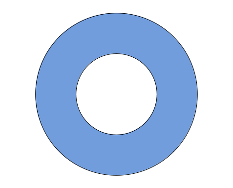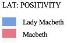
</figure>

Using SlimTV, however, we can visualise the words that generated this
figure in context. It becomes clear that Lady Macbeth is not using this
positive language to demonstrate her happiness.

<figure>
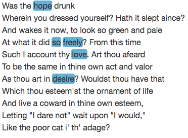
</figure>

<figure>
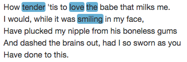
</figure>

#### Figure 4 Macbeth Act 1 Scene vii ll.55-60 with Positivity LAT highlighted

The words highlighted in blue are those that were identified by
Docuscope as belonging to the LAT Positivity. In lines 35-45, the
positive language is used to compare Macbeth's previous resolve with his
current cowardice, describing his previous desire to murder Duncan which
he has now decided against.

In lines 55-60 she uses this type of language for another purpose. Her
use of words like "tender" evoke images of gentleness and innocence
which she sharply contrasts with her violent assertion that she would
murder her own infant child if she had promised to do so. This has the
further purpose of emphasising Lady Macbeth's departure from femininity,
as words that connote motherhood, delicacy, and gentleness are strongly
counteracted by her violent promise.

c.  Negativity

> LAT: Negative Emotion
>
> *The use of words indicating negativity (e.g., gloom, distrust, abhor,
> wretched, disappointment, warning, death, complaining to, ugly,
> villain). Experience created: The text conveys a sense of negativity
> for the situation being described.*

While Lady Macbeth has the monopoly on positive language in Act 1 Scene
7, Macbeth has the edge when it comes to language associated with
negativity.

<figure>
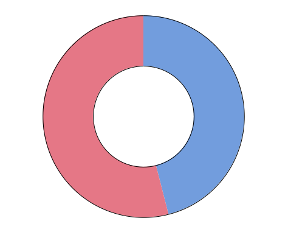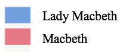
</figure>

Using SlimTV again, we can find examples of this language in context:

<figure>
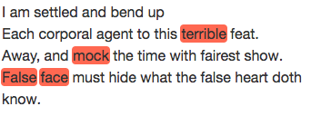
</figure>

#### Figure 5 - Macbeth Act 1 Scene vii ll.79-81 with Negativity LAT highlighed

Macbeth uses negative language to express his unhappiness with the plot
to kill Duncan which is clearly indicated with the word "terrible". He
refers to Lady Macbeth as "false" twice in one sentence, although
Docuscope only identifies the first instance of this as negative
language. We can see, however, that they serve a similar purpose,
emphasising Macbeth's distaste for their ensuing betrayal of the king.
Lady Macbeth's negative language, however, is almost exclusively
directed towards Macbeth, expressing her contempt of his cowardice:

<figure>
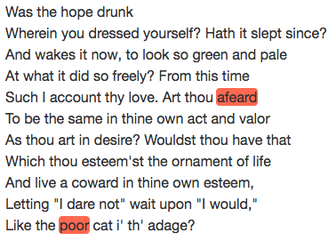
</figure>

#### Figure 6 - Macbeth Act 1 Scene vii ll.35-45 with Negativity LAT highlighted

In this way, we can see that Lady Macbeth's positive and negative
language is used to the same end: to emasculate Macbeth and pressure him
into agreeing to the murder of the king. This highlights the importance
of not fully basing research on the results from these digital tools
since Lady Macbeth's positive language is not being used to connote a
positive state of mind, nor are Macbeth and Lady Macbeth using negative
language to elicit the same effect. Because of this, some amount of
human analysis is still vital in achieving a well-rounded conclusion.

d.  Comparison

<figure>
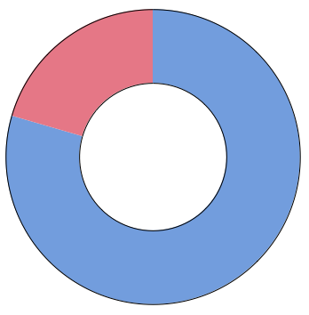
</figure>

Lady Macbeth's also uses more comparative language than Macbeth in this
scene. As we saw above, Lady Macbeth uses both positive and negative
language to berate Macbeth's cowardice, comparing his previous positive
attributes to his current negative ones.

<figure>
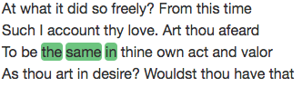
</figure>

#### Figure 7 - Macbeth Act 1 Scene vii ll.38-41 with Comparison LAT highlighted

<figure>
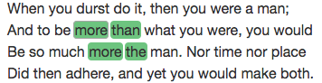
</figure>

#### Figure 8 - Macbeth Act 1 Scene vii ll.49-52 with Comparison LAT highlighted

In lines 38-41 (see Figure 7) she compares bravery and desire,
suggesting that Macbeth is all talk and no action. She then goes on to
continue her attempted emasculation of her husband by telling him that
he is no longer a man, comparing him again in line 50 to his previous
self when he was committed to the murder of Duncan. She uses comparative
language yet again in line 51 to compare him to a hypothetical future
self who has murdered Duncan and as a result is even more masculine than
before.

e.  Direct Address

> LAT: Directing Address
>
> *The use of words summoning another\'s attention or making implicit
> acknowledgement of an interlocutor (e.g., you, you are, prithee, thy,
> thou, yourself, my Lord). Experience created: Establishing exactly who
> the intended addressee of a message is.*

<figure>
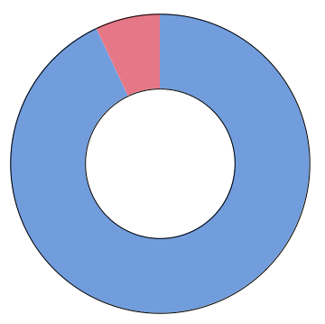
</figure>

Lady Macbeth uses a large amount of Direct Address in this scene, while
Macbeth does not. This demonstrates clearly the internal struggle of
Macbeth, and the heavy influence of Lady Macbeth. Lady Macbeth's
constant use of direct address indicates her attempts to influence her
husband. Macbeth on the other hand uses much less direct address which
could be interpreted as an indication that his struggle, while voiced
aloud in the presence of his wife, is much more internal.

f.  LAT Conclusions

By examining these LATs we can identify the specific words and use of
language that Lady Macbeth uses to manipulate her husband throughout Act
1 Scene 7. We can see that masculinity is considered to be desirable,
precluding traits like cowardice and passivity. By convincing Macbeth
that he is at risk of losing his masculinity, Lady Macbeth successfully
manipulates him into pledging himself to the murder plot. Her
manipulation of Macbeth and embodiment of more traditionally masculine
traits like bravery, action and a propensity for violence, subvert
traditional gender roles. These traits, as well as her blatant rejection
of femininity, position her in the dominant role in this relationship,
despite the sustained under-representation of female characters, not
only in Macbeth, but in Shakespeare's corpus as a whole.

Something to think about

a)  How would you define a dominant character?

b)  Do you agree that Lady Macbeth is the dominant character in this
    scene?

c)  Do you think she's still the dominant one throughout the rest of the
    play?
