#A Summary of The Merchant of Venice

This Shakespearean comedy play is set in Venice and Belmont and starts with two of the lead characters of Antonio, a wealthy Christian merchant and his friend Bassanio, an aristocrat who has squandered all of his money. Bassanio asks Antonio for a loan in order to woo the third main character, Portia the wealthy heiress of Belmont. As Antonio’s wealth is all tied up at sea he cannot give Bassanio a direct loan, but agrees to be a guarantor for him, if Bassanio can get a loan from some-one else instead. Bassanio finds a Jewish moneylender called Shylock and persuades him to a loan of three thousand ducats. Antonio signs the contract, which demands a pound of his flesh from him instead of any interest if Bassanio cannot pay the loan back in time. Antonio agrees to it thinking it not to be a serious threat. Bassanio takes the money and leaves Venice for Belmont in order to pursue Portia. Her father has set all her suitors a challenge to choose one casket out of three that contains her picture. That suitor will then be free to marry her with her father’s blessing. The caskets are each made of gold, silver and lead. Prince of Morocco picks the gold casket which has a skull in it depicting corruption and has an inscription in it reading ‘what every man desires’. The famous line is said here of ‘All that glitters is not Gold’. Then Prince of Arragon chooses the silver casket which says that ‘ a man will get what he deserves’ and it has a picture of an idiot showing him that he is foolish and self-centred. They both lose the challenge and leave in shame. Meanwhile in Venice Shylock’s daughter Jessica has fallen in love with Antonio’s friend Lorenzo also a Christian and they run away together with her dressed as a boy and with a large amount of her father’s money and jewels. Upon hearing this Shylock blames Lorenzo and is furious as he loathes Antonio who has insulted him repeatedly. He also hears rumours that Antonio’s ships have been lost or sunk in the sea and that he feels he is now not going to get his money back and wants his pound of Antonio’s flesh again as he loathes him because Antonio has been anti-Semitic and badmouthing him around Venice about how Shylocks interests are very high. Bassanio is recognised by Portia as the soldier she fell in love with and he by chance chooses the lead casket with her picture in it and they are engaged to be married the next day. A messenger gives Bassanio a letter telling him that Antonio has lost all his money and must honour his contract with a pound of his flesh. Portia sends Bassanio with double the money for Shylock in order to cancel the contract by paying off his debt. Portia and her maid follow behind both disguised as men. Shylock arrests Antonio and takes him to Duke of Venice who takes the matter to court. The Duke asks Shylock to have mercy on Antonio and let him go, but he refuses. As Balthazar i.e. Portia as a lawyer intervenes and points to some flaws in the contract. A typical Shakespearean heroine. Here Portia has the most lines as Balthazar. Shylock is cornered and gives up his wealth to his daughter and agrees to convert to Christianity and pardons Antonio the debt. Antonio’s fleet returns home safely after all. The truth is revealed about Portia as Balthazar and the three couples; Bassanio and Portia, Lorenzo and Jessica and Nerissa and Graziano are reunited and celebrate at the end of the play.

#The Breakdown of the Play

## Act by act

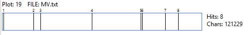

## Scene by scene

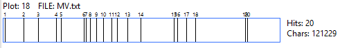
The above diagrams are called concordance graphs and were created using
a computer programme called **Antconc.** They serve to indicate the way
the play is divided into acts and how these acts in turn are divided
into scenes. They can illuminate where the most important sections occur
within a play. This can be seen by the size of the act and number of
scenes in the act. Typically the ending of one scene and the beginning
of another indicates the changing of view points from character to
character. With that being understood we can see that acts 3 and 4
contain the most scenes therefore contain the greatest scope for the
play. (Though not necessarily the best scenes or most action)

Using the computer programme **Wordhoard** we produced the cloud diagram
seen below. It shows the words that were used most frequently within the
course of the text with the size of the words indicating the frequency
of their use in the play:

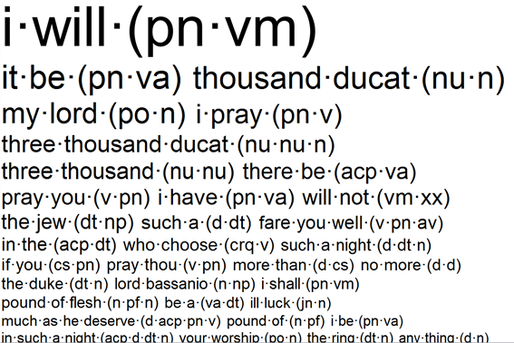

The most used words relate to the prevalent themes found within the text
which include:-

-   Vengeance
-   Love
-   Friendship
-   Mercy
-   Religion

Why do you think these are the most important themes?

# Character List and brief description

##Shylock

One of Shakespeare's more memorable characters, Shylock is a character
which feels he is justified for his religious fuelled rage at the
Christians for how they have treated him and his fellow jews. Though
from the perspective of the rest of the characters within the play he
can be seen as a monster he has been shown to be quite human due to his
motivations. A jewish money lender who charges large sums of interest in
order to be seen in a equateable light to his Christian contemporaries
is instead looked down on by those same people for what they view as
poor business practices. Furthermore it is highlighted that Shylock as a
character is viewed as bitter and prone to anger which affected his life
at home as well with his daughter, Jessica until she leaves.

##Antonio

Antonio as a character cannot be easily nailed down. While the play
essentially revolves around him putting himself in danger for the
benefit of his friend, Bassanio, it should be remembered that Antonio's
treatment of Shylock and the jewish people is also at fault. Like
Shylock, Antonio is a character comprised of both positive and negative
elements, Antonio adhering to his religion delivers forgiveness to
Shylock after conditions are met. While Shylock is viewed negatively
Antonio is referenced as being well liked often, this being shown
particularly at the trial with the number of individuals coming to his
defense.

##Bassanio

Friend to Antonio and the eventual husband of Portia, Bassanio is the
key factor of the play which ties the various stories of the Merchant of
Venice together. His desire for Portia led him to ask for monetary aid
from Antonio and necessitates the events of the play. Just as Antonio
proves himself to be a good friend and kinsman to Bassanio so too does
Bassanio. This can be highlighted both during the events of the deal at
the start where he implores Antonio not to agree to the forfeit and
later during the trial when he offers to pay whatever is needed to save
his friend.

##Lorenzo

Friend to both Antonio and Bassanio, Lorenzo is in love with Jessica,
the daughter of Shylock. With Lorenzo's help Jessica successfully
escapes the home of her father and elopes to Belmont to live out a new
life both with the money she taken from her father and the money she
will eventually inherit.

##Portia

The love of Bassanio, Portia is a wealthy heiress residing in Belmont.
While her beauty is unparalleled within the dimensions of the play her
intelligence is just as prominent. Due to her father's will she was
bound by a clause to only marry whoever chose correctly from three
caskets. Nonetheless Portia still gets to marry her love, Bassanio, who
chooses correctly.

##Balthazar (Portia's disguise)

In the guise of Balthazar, a young doctor of the law, Portia is able to
demonstrate that she is the most clever character within the play twice
over. Initially she succeeds in fooling all present during the trial
through the use of her disguise and more prominently succeeds in saving
Antonio from Shylock's revenge.

##Nerissa
Portia's lady-in-waiting and confidente, Nerissa marries Gratiano at the
same time as Portia marries Bassanio. Nerissa also acts as escort for
Portia on her trip to Venice and aids in the saving of Antonio by posing
as law clerk to Portia.

##Gratiano

Friend to Bassanio, Gratiano accompanies him to Belmont where he falls
in love with and eventually marries Nerissa. During the trial Gratiano
is the most vocal opposition to Shylock's demand for Antonio's pound of
flesh.

##Jessica

Daughter of Shylock, Jessica is seen as a woman caught in the middle
between the jewish and christian elements. Her life is made difficult by
her father as such she seeks to leave her home and elopes with Lorenzo.
Marrying him it is stated that she converts from the jewish faith to
christian which leaves us to question how she is viewed by her new
christian counterparts.

##Launcelot

Shylock's servant, Launcelot severs his ties to him in favour
of Bassanio. While his life was made difficult being a servant to Jewish
moneylender when he is in fact christian he poses as the comedic element
of the play. Furthermore it is this attitude which Jessica describes as
helping her cope with her time at her father's house.

Shakespeare contrasts the main characters Shylock and Antonio to
represent these key ideas within The Merchant of Venice. He presents the
two characters as conflicting opposites and personifies the juxtaposed
themes of this play; justice and mercy, forgiveness and revenge.

#Forgiveness and Revenge

Revenge as a concept is one of the few that is central to Shakespeare's
work and a good story in general. Revenge as a noun occurs four times in
the Merchant of Venice. As a verb it occurs only once yet overall as a
verb it occurs in 28 out of the 42 of Shakespeare's plays.

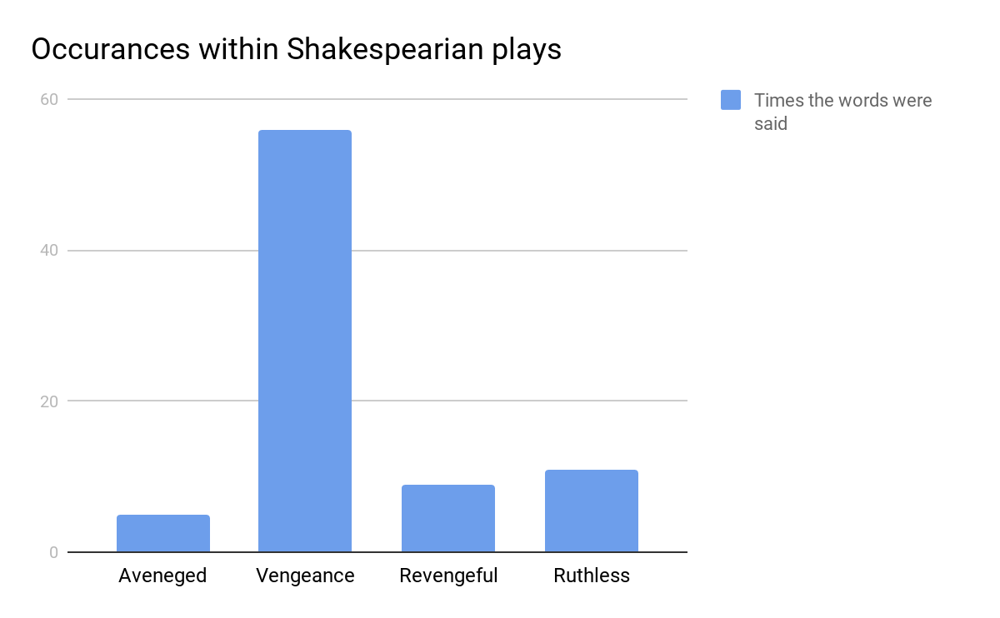

Shylock is portrayed primarily as the aggressor, seeking from Antonio
what he believes to be justice but to others it would be viewed he is
seeking revenge for the Jewish people.

As a verb forgive occurs through Shakespeare's work for a total of 83
times. Within Merchant of Venice it occurs as a verb four times. Once
each by Portia, Shylock, Duke and Bassanio. Forgave occurs once from
Lorenzo. Therefore the contrasting themes are presented equally within
the play Merchant of Venice. The following words are related to the
subject of forgiveness to set a parallel between what is more common
within Shakespeare's work.

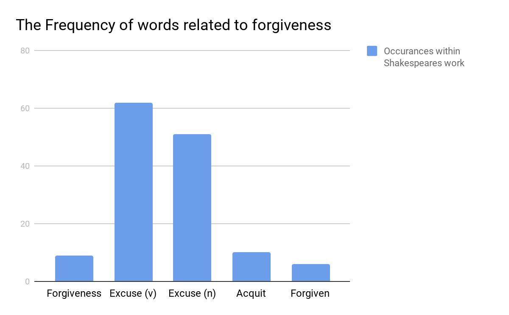

Forget occurs twice in Merchant of Venice coming both from Shylock. This
is interesting as it comes at the start of the play in which Shylock
convinces Antonio to make the bargain with him in Act 1, Scene 3. This
is crucial as it juxtapositions the end of the play in which Shylock
refuses to let go of his grievance to his near fatal detriment. Revenge
(n) occurs in a cluster within Merchant of Venice whereas forgive (v)
occurs sporadically throughout. "If a Jew wrong a Christian, what is
humility? Revenge. If a Christian wrong a Jew, what should his
sufferance be by Christian example? Why, revenge." This quote shows that
Shylock has power to change the way that people think. Shakespeare has
portrayed this using rhetorical questions to be ironic and to state the
obvious, he has also used repetition of the word "revenge" to highlight
one of the themes of this.

#Mercy and Justice

According to the figure given by Antconc, the word "mercy" is used
thirteen times, mostly in the end of the play, due to the famous quote
from Portia - "the quality of mercy". It occurs during Act IV, Scene 1,
set in a Venetian Court of Justice: Portia tries to beg Shylock for
mercy.

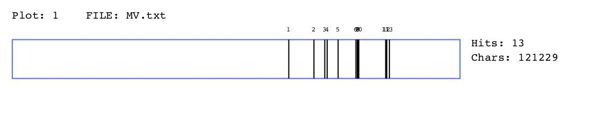

Figure: the times "mercy" being used in the Merchant of Venice

According to Doloff (2009), the English word "mercy" can be traced from
the Latin root "merces", a noun donating "price" or "payment". A related
group of other cognates with "mercy" also is deployed by Shakespeare in
the play: "mercenary" (4.1.416), "merchandise" (1.1.40, 1.1.45, 3.1.120)
and "merchant" (which occur 12 times in the play).

Hence from the perspective of etymology, Portia\'s disquisition on the
iterated word \"mercy\" and its moral superiority over Shylock\'s
demanded \"justice\" lies the wonderful irony, mercenary Latin meaning
of \"price\" to its transcendent Christian meaning of charitable
forbearance (Doloff, 2009). Besides, it can be noted that the
association of "mercy/merces" in the Merchant of Venice may also be
further linked with the word "render", which occurs in the "mercy"
speech and twice more elsewhere in the same scene:

\"How shalt thou hope for mercy, *rend\'ring* none?\" (4.1.88)

\"And that same prayer, doth teach us all to *render*

The deeds of mercy \...\" (4.1.199-200)

\"What mercy can you *render* him, Antonio?\" (4.1.376)

Although in Shakespeare's other plays, he used the verb "render" to mean
"requite" or "hand over" and also sometimes "describe", he at least
three times evoked the word's financial connotations of to "pay".
Therefore, is the triple "rendering" of "mercy" in the Merchant of
Venice a kind of hint of the latter term's mercantile root?

Moreover, the play also presents anti-semitic ideas, depicting Shylock,
a Jew, as evil and Antonio, a Christian, as good. Stereotyping in this
play is used to portray Shylock as malicious, selfish and hateful man
who only cares about money. Antonio, on the other hand, is portrayed as
the \'perfect Christian\'; merciful and kind. Shylock only appears in a
couple of scenes in the play, but the audience can gather an opinion of
him by the way the other characters on stage talk about him. Shylock
appears to be disliked by those who are closest to him, for example his
daughter, Jessica (in act 2). This is one of the reasons the audience
see him as the evil character. On the other hand, Antonio appears to the
audience as a very merciful man. When he does not appear in a scene,
those closest to him talk about him highly emphasising his good
features, this makes Antonio appear in a better light than Shylock.
Every time Shylock is talked about or seen by the Elizabethan audience
in a bad manner, consequently, Antonio\'s good qualities are emphasised.

#Religion in the Merchant of Venice

Judaism and Christianity appear as seemingly rival religions.
Shakespeare portrays this using the two main characters Shylock and
Antonio. It could be said that Shakespeare uses Antonio to represent
Christianity where Shylock is seen to represent Judaism. We are first
introduced to the idea that they are rivals in Act one, Scene 3. Shylock
says:

This quote identifies that the theme of hatred is personified using
religious intolerance. Shylock\'s hatred for Antonio is based solely on
his religion and the treatment he receives because of his. The themes
hatred and religion are closely linked as can be seen from the quote
above.

The word 'Jew' appears more times than the words Christian and
Christianity combined. This, at first glance isn't unusual considering
one of the main character is a Jew. What was interesting, however, was
not just how the play focuses more on Judaism rather than Christianity-
which was the dominating religion in Europe at the time- but why this
may be.

The words Christianity and Jew appears more frequently in the Merchant
of Venice than any other Shakespeare play. Figures 1 and 2 draw your
attention to religion showing its overall importance to the play as a
whole.

Figure 1- 'Christian'

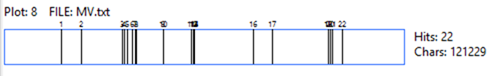

Figure 2- \'Jew\'

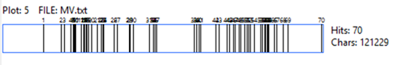
'Christian' was only said a total of 22 times whereas 'Jew' was repeated
70 times in the overall play. This is interesting because the word 'jew'
is only said across only 7 Shakespeare plays in total. Using these
figures, religion can clearly be seen as significant to the over all
text.

##So what was its role in the play?

Critics have argued that the way Shylock is presented in the play is
anti- semitic. 'One would have to be blind, deaf, and dumb not to
recognize that Shakespeare\'s grand, equivocal comedy The Merchant of
Venice is nevertheless a profoundly anti-Semitic work' (Riga 2010) It
has been argued that this was deliberate and that Shakespeare was trying
to criticize society\'s prejudice and encourage religious tolerance. On
the other hand, Bradizza argues that Shakespeare wrote this play with
the intent to please and entertain hence why it is considered a 'comedy'
and that we should assume 'that Shakespeare shared the prejudices of his
audience'(Bradizza 2014, p.183).

While its deliberence is debated there is, however, no debate that
anti-Semitism is demonstrated through the character of Antonio. He views
himself and his religion superior than that of Shylocks. It can be seen
in Act 1 Scene 3 when Shylock confronts Antonio for spitting on his
gabardine. Antonio compares him to an animal calling him a \'dog\'. In
doing this it implies that Shylock is inferior to himself and that
because of his religion he is animal like. Antonio not only does not
deny that he spat on him but says:

'Missbeliever, cut- throat, dog' (1.3.107)

The lack of remorse and an apology furthers this idea that he justifies
his actions because of Shylock's religion. It can also be seen when it
is said that if a Jew were to convert to Christianity 'it would raise
the price of pork'. (3.5.35) One could argue that Jessica is saying;
they are worth less if they are Jewish but if they were to convert then
they are worth more. On the other hand, it could literally mean that if
everyone were to convert to Christianity, the price of pork would
increase. Either way the way the characters treat Jewish people and
their religion is as if their own is superior.

Furthermore, characters themselves are rarely identified by name but
rather religious identity. While Shylock does refer to Antonio as 'The
Christian', Shylock is called by his religious identify more frequently
and by multiple characters in the text. The graph below shows how many
times each character says the word 'jew'.

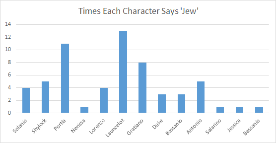

The religious conflict within the novel is projected using Antonio and
Shylock, however, the word 'Jew' was said more frequently by Launcelot,
Portia and Gratiano. More frequently than both characters. Launcelot too
exhibits anti- semitic behaviour which can be seen in the second act. He
is debating whether or not he should seek a new employer solely on the
fact that he works for Shylock who is Jewish. 
He ends up choosing to run away from him rather than continue working for
someone of a different faith than his own. Not only does he refer to Shylock
as the devil but says, \"I am a Jew if I serve the Jew any
longer\" (2.2.104).

The image below shows words most frequently used around 'jew' within the text starting with the most frequent to the least.

The fact that 'rich' appears frequently near the word 'jew' is important
to note as it highlights the importance of money within the play. It
could be said that the attitudes towards wealth is a way to distinguish
the Jewish and Christian characters. Shylock, as said previously, is
portrayed at the villian who is a money lender. It has been suggested
that Shakespeare is calling this stereotype into question. However, it becomes clear that money is used to pit the two religions against one another.

It can be seen that the word 'the' is used most frequently then followed
by 'rich'. Firstly, this demonstrates that fact that he is being singled
out. He isn't 'a jew' he is 'the jew'. It therefore creates this idea
of isolation. It is also important as it again highlights that he is
referred to as ' the jew' therefore is identified by his religious
identity.

##Religion and Isolation:

It is clear that due to their religion characters within the text feel
isolated. This can be seen predominantly with Jessica.

I am sorry thou wilt leave my father so.

Our house is hell and thou, a merry devil,

Didst rob it of some taste of tediousness.

But fare thee well. There is a ducat for thee,

And, Lancelet, soon at supper shalt thou see

Lorenzo, who is thy new master\'s guest.

Give him this letter, do it secretly.

And so farewell. I would not have my father

See me in talk with thee. (2.3.1-9)

In Act 2 Scene 3 Jessica is seen to be ashamed of her father and that they do not share the same beliefs. Jessica, you could argue, feels isolated in her own home. She lives with her jewish father and does notfeel like she belongs. She eventually converts to Christianity but has to live with the fact she will never truly belong because she was Jewish by birth.

Jessica demonises her father by comparing his house to hell .The comment
'merry devil' is in reference to Lancelet making Jessica's home life
more bearable. The use of devil and hell so closely linked could instead
be a reference to Lancelet being intrinsic to her home life as a hell is
nothing without its devils.

By abandoning her father, Jessica serves as a function to isolate
Shylock as a character. It is clear in Act One that isolation is a
recurring theme. Shylock says:

I will buy with you, sell with you, talk with you, walk with you, and
so following; but I will not eat with you, drink with you, nor pray with
you. (1.3.9)

This demonstrates further that he feels isolated from Christian society.
This is important to note as it shows that characters- because of
religious estrangement- feel isolated.

Isolation can be seen also using character relationships. For example
the relationship between Antonio and Bassanio. Therefore, isolation it
seems, is an important theme within the text that closely links with
religion.

So ask yourself this: do you think isolation is self-imposed in the play
and do you think shakespeare want us to perceive it as this?

#Love and Friendship

Keyword 1: Love

In Shakespeare's comedies, LOVE is usually considered as a main theme
(Pawar, 2017). In the Merchant of Venice, there are three couples:
Bassanio and Portia (the major one), Gratiano and Nerissa, and Jessica
and Lorenzo. The word 'love' is mentioned 60 times in the text (see
figure 4), and there are more than twenty times belonging to the major
couple Bassanio and Portia. However, it can be noted that the frequency
of speaking or expressing 'love' might be associated with the
characters' family background and their social status.
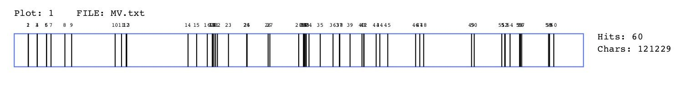

Figure 4: the times of 'love' being mentioned in the Merchant of Venice

The statistics (see figure 5) illustrates that Portia mentions 'love'
fifteen times in the play, which is almost twice as Bassanio (8 times).
The gap between Bassanio and Portia might is due to their different
family backgrounds: Portia was born in a wealthy family, whereas
Bassanio does not have enough money to hold the wedding for Portia.
Moreover, the subordinate couple Gratiano and Nerissa has the similar
situation: Nerissa is the maid of Portia, which means her social status
is slightly lower than Gratiano, and the data shows that Gratiano
mentions 'love' four times as Nerissa (2 times). Thus, in the Merchant
of Venice, it can be concluded that the character who is wealthier or
has higher social status probably expresses 'love' more than those who
are in the lower class -

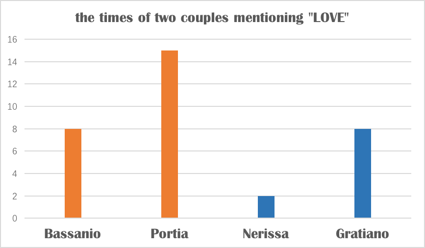

figure 5: the times of 'love' being mentioned by different characters in
the play.

So here comes an interesting question: why Portia chooses Bassanio
instead of Prince of Aragon and Prince of Morocco who are much wealthier
and have better family background? The first reason might be Shakespeare
often uses the technique of 'love at first sight' in his works (Pawar,
2017), no exception in Bassanio and Portia. However, more importantly,
Shakespeare is considered revolutionary in terms of creating female
characters (Pawar, 2017). In the 16^th^ century, western women usually
had limited rights. For instance, they did not have rights to vote. As
Portia lives in a wealthy family, she has to follow her father's will,
but in the casket scene as well as the court scene, the characteristics
of Portia is portrayed as an emancipated, intelligent and confident
figure (Pawar, 2017).

##Key Word 2: Fair

Figure 6: the times of characters mentioning "FAIR"

In most cases, the adjective 'beautiful' is frequently used if people
want to describe someone as good-looking. However, the word "beautiful"
only occurs one time in the text, whereas the word "fair" is mentioned
thirty-five times (see Figure 6). Typically, Bassanio mentions "fair"
eight times, Lorenzo eight times, and Gratiano four times. In fact,
Shakespeare also uses quite a lot of "fair" in his other literary works,
such as Love's Labor's Lost (56 times) and Troilus and Cressida (49
times).

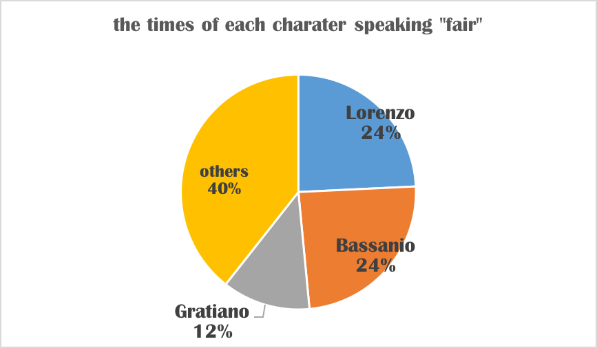

Figure 7: the percentage that each character speaking the word "fair".

Therefore, it is interesting to see why Shakespeare uses "fair" instead
of "beautiful" to describe female characters' appearance. According to
Whitefield-Madrano (2011), the word "fair" comes from old English
"*faeger"*, which means "beautiful, lovely, and pleasant". Until the
1550s, the word "fair" was used to describe a good-looking or attractive
person without regard to the color spectrum, and meanwhile, with not
much regard to sex. Whitefield-Madrano (2011) also states that in the
Elizabethan era, Shakespeare uses "fair" that sticks with its original
meaning.

Key Word 3: Ring

Figure 8: the times that characters mention the word "RING".

"Ring" can be considered as an important symbol of love and commitment
in the Merchant of Venice. The word "ring" is mentioned forty six times
in the text (see figure 8). According to the statistics, Bassanio
mentions "ring" fourteen times and Portia mentions it thirteen times,
which makes them become the major contributors of speaking "ring" (see
figure 9).

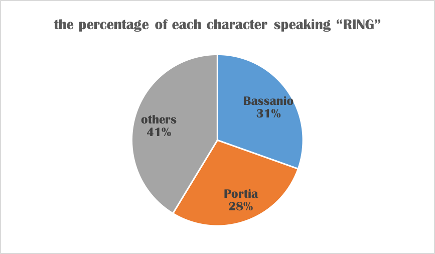

Figure 9: the percentage of each character speaking "RING"

From the figure given by Antconc, the word "ring" is mostly mentioned at
the end of the play, which is significantly related to the plot that
Portia gives Bassanio the ring along with her vows and inheritance. She
says she gives all of her wealth to her soon-tsatto-be husband and tells
Bassanio should always wear the ring or she will reclaim her wealth: "I
give them with this ring/ which when you part from, lose or give away/
let it presage the ruin of your love/ and be my vantage to exclaim on
you" (III.ii.175-178).

As a reply, Bassanio vows that "but when this ring/ parts from this
finger, then parts life from hence/ O, then be bold to say, Bassanio's
dead" (III.ii.187-189). However, dramatically, when Portia steals her
servant's name "Balthazar" and disguises as a lawyer on the court, she
asks Bassanio into giving the ring as appreciation for saving Antonio's
life. Although Bassanio resists this decision initially, he still
bestows his ring to "Balthazar". That's why Portia chastises Bassanio
for not understanding his worth and the meaning of the ring: "If you
have known the virtue of the ring/ or half her worthiness that gave the
ring/ or your own honor to contain the ring" (V.i. 199-201). The ring
represents the moral relationship of love instead of financial union or
business contract, which Bassanio fails to understand (Trepanier, 2014).

Love vs. Friendship?

Another crucial theme related to human's relationship in the Merchant of
Venice is friendship. According to the statistics given by Antconc
(figure 10), the word "friend" and "friends" are mentioned thirty-eight
times in total.

Figure 10: the times that characters mention "friend" or "friends"

In the play, the friendship between Antonio and Bassanio could be an
interesting point to discuss. From the figure below, it is not strange
to see that Bassanio is the person who mentions "friend" or "friends"
most (twelve times in total, accounting for one third of the total times
that other characters mention "friend" or "friends") probably because he
needs money to prepare his wedding with Portia and also he needs friends
to help him.

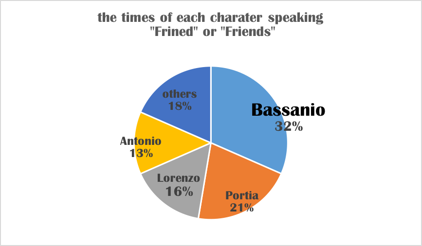

Figure 11: the percentage of characters speaking "friend" or "friends"

Although Antonio mentions only five times of the word "friend", it
cannot be denied that friendship is important for him. The evidence is
that Antonio calls Bassanio's name nine times in the play, which is two
more times than Bassanio's fiancée Portia.

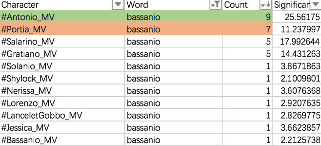

Figure 12: the times that each character speaking "Bassanio"

At the beginning of the Merchant of Venice, Antonio expresses his
sadness: "in sooth, I know not why I am so sad." According to
Trepanier's (2014) analysis, Antonio is sad because he desires a
meaningful relationship that is rooted in non-contractual value, rather
than utility or financial profit. However, Antonio also realizes that
such an idealized relationship is hardly possible in the commercial
republic of Venice -- his experience in business has trained him to view
relationships in contractual ways.

As a successful merchant, Antonio is self-disciplined and is good at
weighing benefits against threats, but in the meantime, he lacks a
non-contractual relationship that is based on moral values (Trepanier,
2014). Due to his inexperience in this realm, Antonio fails to form a
non-profit friendship with Bassanio because he wrongly understands the
material for the moral.

Is marriage superior to friendship in the Merchant of Venice? The answer
might be positive. Antonio is always alone no matter in the beginning or
at the end of the play, and his friendship with Bassanio has become
subordinate to Bassanio and Portia's marriage.

However, we cannot draw a conclusion that friendship weighs less than
love in Bassanio's heart. There is little doubt that Antonio gives
Bassanio a big favor, and Bassanio might not be able to marry Portia
without Antonio's financial support. Besides, based on the tables below,
Bassanio calls Antonio's name nine times, whereas "Portia" is only
mentioned six times by Bassanio. Although Bassanio sometimes calls
Portia by using other phrases such as "fair lady", it cannot be ignored
that Bassanio still considers Antonio as an important person in his
life.

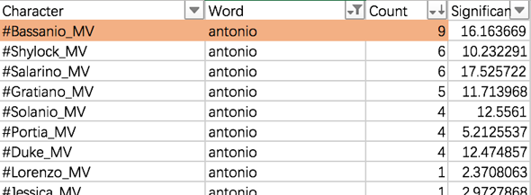
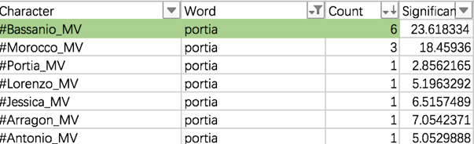

Figure: the times that each character calls Antonio and Portia's names.
