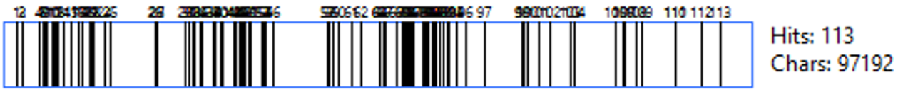
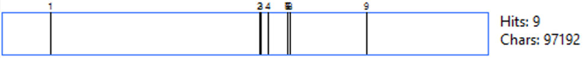

<figure>
    
</figure>

# The Prominant Theme of Love

Shown by the wordcloud, 'love cloud' above, we see the love is a very prominant part of this shakespeare piece. The story bases of a complicated love triangle, or love square, between Hermia, Lysander, Demetrius and Helena. Whilst Hermia and Lysander were already smitten for eachother, Demetrius began to have feelings towards Hermia also, thus denouncing his love for Helena. It is through this complicated scenario that the fairies of the forest, as well as Oberon who is the King of the fairies, cause the plots to twist and accidentally divert Lysander's love away from his true soulmate Hermia, and instead towards Helena. 

Oberon discovers puck's (the fairy who gave Lysander the love potion) mistake, and fixes his doings by enforcing the love potion on Demetrius to make sure he falls for Helena. However, Helena feels that she is being mocked by the two men due to their overwhelmingly greatened affection towards her.

The King Oberon decides that his good sport of love medlling must come to an end. He puts the lovers all to sleep and gives Lysander a new potion in order to divert his affection back towards Hermia, whilst Demetrius remains in love with Helena.

There is indeed other interesting events and occurences in the play, however, the clear theme of love is prominent and shines above the others.

We can also see this using a software called AntConc, a textual analysis software which allows for specific word counts and extensive text study. Using this software, we can see that throughout the play the word is used over 100 times, being used more towards the middle of the play.

<figure>
    
</figure>

In comparison to this we see the word hate only appear 9 times throughout, with Lysander being the most common user of the word, usually towards or speaking about Demetrius.

<figure>
    
</figure>

If we look at the use of words in all of shakespeare's texts, compared to this play, we can see that love is very common throughout out his texts, however, is not as prominant as it is in this piece.

<figure>
    
</figure>

# Use of Language and Rhyme Scheme
In A Midsummer Night’s Dream, the use of language is varied to correspond with the different character’s personalities and their status within the play. There are four different writing styles used through the play and each will be examined in relation to what it reveals about the characters:

* Iambic Pentameter 
* Rhymed Verse                                        (12,859 words total, 79.9% of text)   
* Catalectic Trochaic Tetrameter 
* Prose (3,225 words total, 20.1% of text)

### Iambic Pentameter
In A Midsummer Night’s Dream, the noble characters use iambic pentameter verse throughout the play. Iambic pentameter is the most common style of verse in Shakespeare’s plays and the most common meter used in Middle English poetry. [1] The style combines a series of “iambs” (pairs of syllables containing a short syllable followed by a long syllable) with “pentameter” verse in which each line contains five pairs of syllables, ten in total. Shakespeare uses blank, unrhymed verse in conjunction with the iambic pentameter form. 
The effect of this within the play is to emphasise the noble characters’ refined speech in contrast with the simple way of speaking of the working class craftsmen. It also places the less realistic characters of the nobles on a more theatrical plane within the play that emphasises the realistic and relatable flaws of the craftsmen in comparison. 

##### THESEUS:

*Now, fair Hippolyta, our nuptial hour*

*Draws on apace. Four happy days bring in*

*Another moon. But oh, methinks how slow*

*This old moon wanes! She lingers my desires,*

*Like to a stepdame or a dowager*

*Long withering out a young man’s revenue. (1.1:1-6)*

### Rhymed Verse
Within the play, monologues expressing love are emphasised through the use of rhyme and rhyming couplets. The rhyme scheme generally follows an AABB scheme of rhyming couplets as in traditional love poetry as seen in the example below:

##### HERMIA:

*By the simplicity of Venus' doves,*

*By that which knitteth souls and prospers loves,*

*And by that fire which burned the Carthage queen*

*When the false Troyan under sail was seen,*

*By all the vows that ever men have broke*

*(In number more than ever women spoke),*

*In that same place thou hast appointed me,*

*Tomorrow truly will I meet with thee. (1.1.170-8)*

Actor Rebecca Carey discusses the role of rhyme in the text in a performance context:
“The lovers, of course, are all too human, and their rhyme can be some of the trickiest in the play. What we've been finding, however, is that the rhymes can help the actors to be even more specific in their playing of the text. If they take the rhymes for granted, we can all feel how they start to weigh on the speech or scene, but when they are active in choosing to rhyme and finding just the right word, it gives their performances urgency and immediacy.”[2]
As such, Shakespeare uses language to give performers room to interpret the text and add meaning to it in performance, with rhymed verse just one way that this is done. 

Catalectic Trochaic Tetrameter
Shakespeare applies catalectic trochaic tetrameter in verse when he wishes to add a mystical quality to the speech of supernatural beings. A “trochee” is a pair of syllables consisting of a long, stressed syllable followed by a short one. “Tetrameter” is a verse with four measures or pairs of syllables and in this case, the verses are “catalectic” which means that the final syllable of the verse is dropped. The results in seven syllable lines with the following rhythm – LONG, short, LONG, short, LONG, short, LONG.

#### FAIRIES:

*(sing)*

*Philomel, with melody*

*Sing in our sweet lullaby.*

*Lulla, lulla, lullaby, lulla, lulla, lullaby.*

*Never harm*

*Nor spell nor charm*

*Come our lovely lady nigh.*

*So good night, with lullaby.(2.2:13-9)*

This separates the supernatural beings from the rest of the characters in the plays and adds a mystique to their spells.

### Prose
Like in other Shakespeare plays such as As You Like It and Henry V, prose is used to capture the relaxed rhythms of ordinary life and for contrast with more flowery and organised pentameter. This conveys the practicality of Bottom and the other craftsmen, which is then humorously contrasted with the melodrama of their lines in the performance of Pyramus and Thisbe.

##### BOTTOM:

*Not a word of me. All that I will tell you is, that*

*the duke hath dined. Get your apparel together,*

*good strings to your beards, new ribbons to your*

*pumps; meet presently at the palace; every man look*

*o'er his part; for the short and the long is, our*

*play is preferred. (4.2:15-20)*

