## Word Cloud
Below is a ‘Word Cloud’ for Othello. It compares the most frequently used words in the play with the most frequently used in Shakespeare’s other plays (it was created using the ‘Word Hoard’ computer programme):

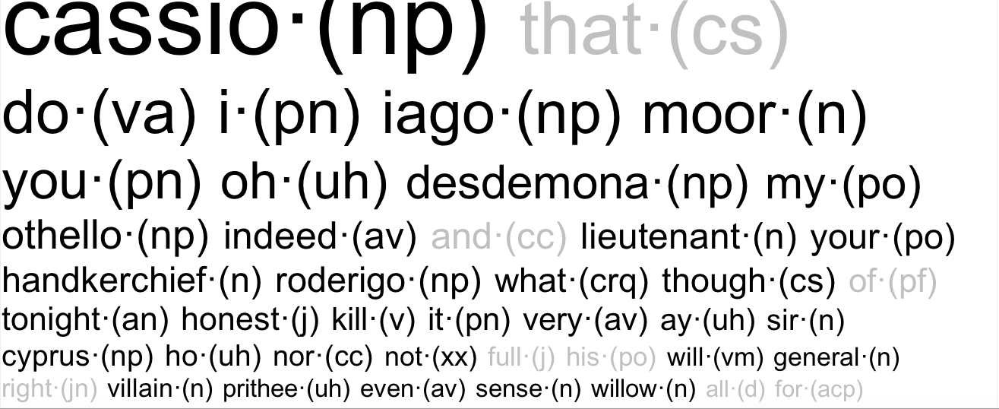

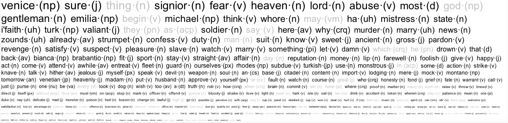

The words in black are those which occur most often in Othello – the bigger the word, the more frequently it appears. The grey-coloured words appear a lot in Shakespeare’s other work, but are absent from Othello. Usually, though not always, the most significant words are the black, mid-sized ones. 

Take these examples, and ask yourself why they are important:

- “Murder”
- “Honest”
- “Kill”
- “Liuetenant”
- “Abuse”

## Act by Act/Scene by Scene Concordance

This website makes frequent use of ‘concordance graphs’ (created through the free software ‘AntConc’. These specifically designed graphs visually resemble a barcode, with each black line showing something of importance (eg. how often one specific word is used). The more black lines; the more that particular thing happens.

Below are two examples of concordance graphs. 

The first tells us where each new act begins in Othello:

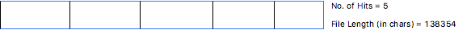

The second tells us where each new scene begins:

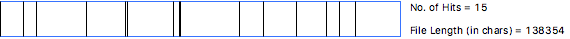

These are not of use on their own! They only tell us very simple, basic information. However, they can be used in comparison with other Othello concordance graphs to immediately show which act/scene contains the most of a particualr something.

# Othello - The Protagonist

## Who is Othello?

Othello, the titular moor of Venice, is the central tragic character of Shakespeare’s play but his portrayal throughout the play provides an interesting starting point for analysis. “Moor” is used as one of the main descriptors when characters refer to Othello, with Moor being the most frequently used word when comparing the word’s use in Othello compared to the words usage across the whole of Shakespeare’s work. 

## Race and the "Moor"

Moor itself brings no inherent racial connotations except that Othello is of some kind of African Muslim dissent but does not give much in the way of specificity in Othello’s racial identity. This could be seen to imply that the specifics of Othello’s race are unimportant and so it may be more useful to consider Othello’s race as the physical manifestation of his symbolic otherness, separating him from his peers. 

Race has, however, remained a key aspect of Othello as a play throughout all its subsequent interpretations. This is shown by the fact that only one interpretation of the play contained a white skinned Othello but still contained an all-black supporting cast to maintain the theme of race, showing its important as a factor for consideration. 

“Moor” is however used to refer to Othello in a positive sense, even being referred to by the First Senator as “the valiant Moor” (Act 1, Scene 3), showing that “Moor” is not meant as a slur for Othello but as a descriptor for him with reverence to his status. 

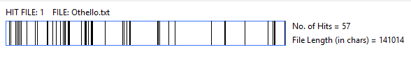

The data above shows the use of “Moor” within Othello and it highlights that it is mostly concentrated within the first few Acts of the play. This could be argued to be symbolic of Othello’s reputation as the decline in its use shows a warping in the perception of Othello from “noble Moor” to the tragic figure he becomes by the play’s end. 

## The Lover or The Soldier

Othello’s decision to kill Desdemona for her alleged infidelity is also interesting as it hints towards the internal conflict for Othello between the lover and the soldier. 

<figure markdown="block">
> All my fond love thus do I blow to heaven-‘tis gone!
> Arise black Vengeance from thy hollow hell,
> Yeild up, O Love, thy crown and hearted throne
> To tyrannous Hate. 
<figcaption>(Act 3, Scene 3)</figcaption>
</figure>

This quotation from Othello highlights, through metaphor, the change in Othello from being ruled by Love (shown through the reference to “crown and hearted throne”) to being ruled by “tyrannous Hate”. Othello then portrays himself as being previously dictated by the whim of “Love” but now coercively brought to action by “Hate”, which is itself ironic due to the manipulation of Iago being the actual force guiding his actions. This can be said to be dramatically ironic as the reader has more information about this scene than Othello as he presumes there are metaphysical forces impeding his happiness when in reality it is his trust in Iago which is leading toward his downfall. This can be seen as emblematic of the struggle between the loyalty and trust of the soldier and the blind love and happiness which he found in Desdemona.

## Parts of Speech - A 'World Cloud' 

Here is a ‘Word Cloud’ detaliing Othello’s most commonly used parts of speech (that is not what he says, but how he says it, and who to)

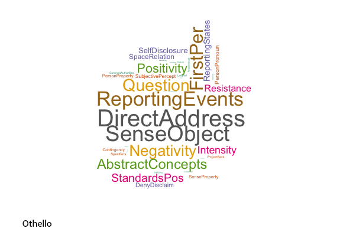

Each of these tells us something about Othello’s inner character. For example:

- Question: Othello spends much of his time enquiring about events and looking to other characters for answers to his inner queeries. This makes sense in the context of the play as Iago confuses and distorts Othello’s perception of reality (a topic which will be adressed later in greater detail).
- Negativity: Othello’s use of negative language is larger than his use of possitive language, which is interesting to consider as it mirrors the graph of the usage of possitive and negative terms throughout the novel which can be found below.
- Reporting Events: This means Othello sticks to portraying the events he has heard given the facts he has been told. The fact that the events he reports are not factual is interesting to consider as this demostrates the success of Iago’s manipulation.

On the whole, this word cloud can be seen as an accurate portrayal of Othello’s role as the victim of the play and demonstrating the power Iago holds over him.

## Otherness:

Othello’s otherness is also shown by how characters describe him throughout the play. The play makes use of Orientalism to emphasise how different the “Moor” is from his contemporaries. Edward Said describes Orientalism as the exploration and description of 
“a place of romance, exotic beings, haunting memories and landscapes.” (Said E., 1961, P.1) 
Brabantio uses Orientalism to describe Desdemona and Othello’s relationship. He describes how his daughter is bound by “chains of magic” (Act 1, Scene 2) as well as describing how she was been “abused, stolen […] and corrupted By spells and medicines” (Act 1, Scene 3) and even describes how Othello has “conjured” the “effect, He wrought upon her.” (Act 1, Scene 3). Brabantio’s insistence that Othello can only acquire the love of Desdemona, playing with the mysticism of Othello’s oriental heritage being used to allow him to be presented as a malevolent force. This use of mysticism heightens Othello’s separation from the other characters of the play as he is said to manipulate Desdemona (the character portrayed as being pure) mirroring the deception of Iago. Mysticism is used in a similar way to religion throughout the play as both are presented as metaphysical forces. 

The word “devil” is used in various points throughout the play in interesting contexts.

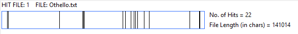

Othello is referred to as the “devil” in two important contexts:

- Once by Iago wherein he tells Rodrigo how he cannot understand what “delight” she has “to look on the devil?” (Act 2, Scene 1) 
- And at the end where Emilia after Othello has killed Desdemona, referring to him as “the blacker devil!” (Act 5, Scene 2)

In these instances Iago refers to Othello as a devil because he is defining him as the villain of his plot but also mirroring Barbantio’s racist use of orientalist mysticism as both attempt to paint Othello as a malevolent force. This becomes true by the plays end through his killing of Desdemona, making Emilia’s use of “blacker devil” a way of highlighting the otherness of Othello’s ethnicity as well as the despicable nature of the act. 

This does raise the question however, does calling Othello the “devil” and describing him as a corrupting spell caster excuse his actions as he is subject to the allegations and impressions those around him give of him or by calling him the “devil” in fact influence his devilish acts? 

## Positivity and Negativity

As is shown below in the Possitivity and Negativity graph, there is a shift in the play where negativity succeeds possitivity by the end of the play. This shift can be said to be a literal manifestation of the symbolic succession from “Love” to “Hate” as the positivity with which the play begins with is succumb by the negativity. This can also be seen as a physical representation of the internal fight within Othello between the lover and the soldier with his initial love induced daze fading with perceived loss of his wife’s love. 

Othello’s killing of Desdemona can be seen therefore as a physical representation of the soldier in Othello sacrificing the lover, which was dominant at the beginning of the play. This sublimation of Othello to love is even referenced by Iago describing how Othello has been “eaten up with passion” (Act 3, Scene 3) which is presented by Iago as a fault towards his perceptiveness. 

Othello is represented in the play as a metaphorical other as he is separated by his fellow soldiers by both race and rank, highlighted by the fact he is referred to at points in the play as the “Moor” with his rise in “Hate” even being described as “black Vengeance”. Iago perceives and exacerbates this by making Othello doubt his perception, love and belief in Desdemona, presenting his pursuit of justice against Desdemona as the only honourable action in a dishonourable situation.

# Iago - The Antagonist

## Who is Iago?

Iago is the main antagonist of Othello and, arguably, one of the greatest villains in all of English literature. On the surface, he is an honest man and a good friend while, in truth, he is the villainous manipulator whose actions trigger the negative nature of the play, and set in motion its tragic events.

## Part of Speech - A 'Word Cloud'

Here is a ‘Word Cloud’ detaliing Iago’s most commonly used parts of speech (that is not what he says, but how he says it, and who to).

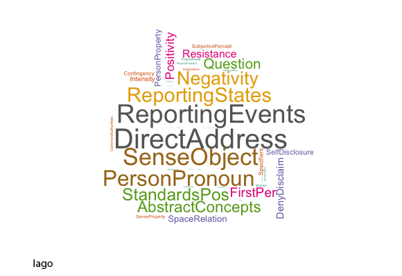

Each of these tells us something about Cassio’s inner character. For example:

- Direct Address: Iago spends his time talking to people. This adheres to his role as “master-manipulator”: he moves between each character, talking to them, lying to them, deceiving them, twisting their vulnerabilities, and convincing them to do as he desires (which is always something bad!).
- Person Pronoun: Not only does Iago talk to people, he talks about them. He spreads lies and rumours, and points accusations, pertaining to certain individuals (eg. that Desdemona and Cassio are sleeping together) in order to create chaos and, ultimately, destroy Othello.
- Reporting Events: Iago talks to people, about people, reporting on specific events he claims have occurred (“claims” being the optimal word). Often the events Iago reports on are untrue (eg. the affair between Cassio and Desdemona), used as a method of manipulation.

<figure markdown="block">
> CASSIO: “In sleep I heard him say 'Sweet Desdemona,
> Let us be wary, let us hide our loves’”
<figcaption>(Act 3, Scene 3)</figcaption>
</figure>

- Self-Disclosure: There is a complete lack of self-discolosure, meaning Iago never explains himself, his actions, or his motives. This makes him appear more villainous, as if he is simply being evil for the sake of being evil. We will explore Iago’s motives in close detail soon.

All in all, this ‘Word Cloud’ presents us with an accurate portrayal of Iago’s true nature.

## "O brave Iago, honest and just..."(Act 4, Scene 3)

Iago is perceived by other characters as being an honest and innately good man; a fact which they often state directly. Furthermore, he is Othello’s ensign (banner bearer), one of the Moor’s oldest and most “reliable” friends, and his right-hand man/trusted adviser.

Below is a bar graph which compares how the characters refer to Iago overall; whether they think of him in a positive or negative way (or whether the reference is irrelevant and carries no meaning at all):

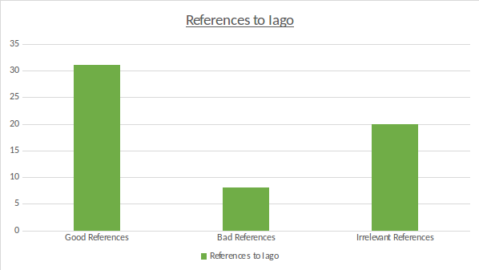

(According to AntConc Software) Iago is referred to by name 59 times throughout the duration of the play. 31 of these are accompanied by a good refernece, 8 by a bad reference, and 20 are completely irrelevant. Therefore, it becomes immediately obvious that Iago’s façade is more successfully perceived than his true nature. 

So, when does this shift of opinion from good to bad occur? Or are the bad references drip-fed throughout the narrative? To answer this question, we must compare concordance graphs, the first detailing positive references to Iago, the second the negative ones:

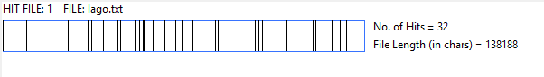

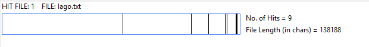

As we can see, the shift from positive to negative occurs at the end of the play, following the reveal of Iago’s true nature.

In terms of positive references, one of the most frequent indications given to Iago’s character is his honesty:

<figure markdown="block">
> OTHELLO: “…my ancient;
> A man he is of honest and trust”
<figcaption>(Act 1, Scene 3)</figcaption>
</figure>

<figure markdown="block">
> OTHELLO: “Iago is most honest”
<figcaption>(Act 2, Scene 3)</figcaption>
</figure>

<figure markdown="block">
> OTHELLO: “O brave Iago, honest and just,
> That hast such noble sense of thy friend's wrong!
> Thou teachest me”
<figcaption>(Act 4, Scene 3)</figcaption>
</figure>

In fact, according to Word Hoard, the word “honest” is used 42 times throughout the play (though not always in reference to Iago). It is ironic, however, that Iago, the most dishonest, scheming character in the play, is the one most often referred to as honest.

The only character who appears to see through Iago’s façade is Emilia, as she reveals his nature in the end.

Overall, Iago’s deceptive personality is a very successful one.

<figure markdown="block">
> “I am not what I am…” 
<figcaption>(Act 1, Scene 1)</figcaption>
</figure>

From the beginning, Iago reveals one very important detail about himself:

<figure markdown="block">
> IAGO: “I am not what I am”
<figcaption>(Act 1, Scene 1)</figcaption>
</figure>

Iago might appear honest, and brave, and kind, but he is none of these.

Iago is manipulative. He uses peoples’ vices against them. He is a liar. He is deceptive. He is incredibly clever and cunning. He is cruel and cold-hearted, caring nothing for those who come to harm because of his actions. He is a man bent on a path of vengence, determined to destory Othello, no matter the cost.

Because of these traits, he is similar to the character of The Devil in old fasioned ‘Morality Plays’ (popular moral stories from the 15th and 16th centuries which depicted a character suffering under the opposing forces of good and evil). In these, The Devil was a liar, manipulating characters through their weaknesses, making false promises, and willing to any length to enact their standpoint.

This deceptive Devil is the true face of Iago.

## Iago's Motive

Iago is one of the few Shakespearean villains – perhaps the only one – without a clear-cut motivation. Consider Claudius in Hamlet, a man bent on ascending to the throne, or Cassius in Julius Caesar, a man propelled by politics.

It is never implicitly nor explicitly stated why Iago does anything. 

There is a lot of critical debate surrounding the question. Some of these theories can be supported by textual analysis  while others have no evidence at all. Here are some of the likely theories on why Iago is so motivated to destory Othello:

- Iago is jealous that he was neglected for promotion to lieutenant in favour of Michael Cassio –reference to this occurs immediately at the opening of the play.

- Iago believes that Othello slept with his wife, Emilia.

<figure markdown="block">
> IAGO: “I hate the Moor:
> And it is thought abroad, that 'twixt my sheets
> He has done my office: I know not if't be true;
> But I, for mere suspicion in that kind,
> Will do as if for surety”
<figcaption>(Act 1, Scene 3)</figcaption>
</figure>

This particular theory might explain Iago’s obsession over Desdemona, and his disregard for her safety in relation to Othello’s jealousy.

- Iago’s revenge could potentially carry racist undertones in line with the ‘otherness’ discussed previously.

- Iago is merely an opportunist, setting in motion these events without fully contemplating their effects; then taking advantage these arising circumstances.

Samual Taylor Coleridge (the famous 19th century poet) states that Iago’s behaviour is simply “motiveless malignity”: that he commits these abhorrent acts with no rhyme nor reason. 

In relation to this, some argue that Iago is Shakespeare’s attempt towards writing a more complex, well-rounded, human character.

While all these theories can be argued well – as can many more – there is no definitve answer. When discussing Iago’s motives, therefore, it is important to make use of textual evidence. 

## Manipulator Extraordinaire

Iago is a very manipulative character, warping the weaknesses of others to suit his own needs. There is no length he won’t go to for revenge upon Othello.

His manipulation links closesly with his use of Person Pronouns (discussed previously), as well as Direct Address and Reporting Events (whether they be true or false). This can be seen in relation to some of the most popular bigrams used throughout the play. What is a bigram? Simply speaking, it’s a collection of two words: the most popular bigrams are those pairs of words which occur most frequently together. Here are some of the popular bigrams in relation to personal pronouns:

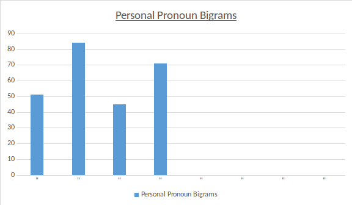

Consider how a rumour begins: one person claims another person did something. The whole play is based around this. Iago tells Othello that Cassio and Desdemona are having an affair, that Desdemona gave her handkerchief to him, all through use of these bigrams. It is important to note that the above graph refers to the play as a whole, not just Iago – does this tell us that the manipulation extends beyond our central antagonist?

Of course, there are many instances of Iago’s manipulation throughout. Here are a few to consider in your study of the play:

- Iago convinces Othello that Desdemona and Cassio are having an affair.
- Iago manipulates Cassio into a drunken brawl that results in Cassio losing his job. 
- Iago manipulates Roederigo into becoming his right-hand man.
- Iago concinces Emilia (who is not immune to his charms) to steal Desdemona’s handkerchief.
- Iago convinces Othello that he saw Cassio with Desdemona’s handkerchief.

Consider these moments. How does Iago manipulate each character? What type of language does he use during manipulation? Is he secretive or upfront? There is no doubt that his manipulation knows no bounds, and he cares little who gets hurt in the process.

The audience are given their truest glimpse of Iago during his soliliquies.

<figure markdown="block">
> IAGO: :It is merely a lust of the blood and a permission of
> the will. Come, be a man. Drown thyself! drown
> cats and blind puppies…it is clean out of the way: seek
> thou rather to be hanged in compassing thy joy than
> to be drowned and go without her:
<figcaption>(Act 1, Scene 3)</figcaption>
</figure>

# Cassio - One of Many Victims

## Who is Cassio?

Cassio, like Othello, is a tragic figure in the play being subject to the manipulation of Iago but is used as a symbol of jealousy. Cassio’s role as lieutenant provides the antagonism for Iago which prompts his plan, this role also defines Cassio as being of higher rank and regard compared with Iago. 

## Reputation, Honour and the "Lieutenant"

The word “lieutenant” is used throughout the play without any reason other than to refer to Cassio or his role.

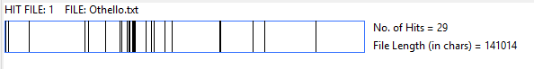

The word “lieutenant” is used infrequently throughout the play, as an identifier for Cassio with his identity being deeply tied in with this role which he identifies himself with. Iago uses this against him and seeks to destroy Cassio’s reputation through his drunken fight. Cassio cries that he was lost his reputation, saying how he has “lost the immortal” of himself “and what remains is bestial.” (Act 2, Scene 3). This demonstrates Cassio’s view that he means little without his reputation. 

Interestingly however this pursuit to retain his rank and regard mirrors Iago’s want to retain Cassio’s role as “lieutenant”. Cassio is also envied by Othello for his supposed relations with Desdemona. Othello justifies this by saying “Haply, for I am black” (Act 3, Scene 3) showing that Cassio is used by Iago to supplement Othello’s otherness. Both Iago and Othello view Cassio as a threat to their sense of personality, with Iago it is because of his rank as lieutenant while for Othello it is because he is not separated by race in the way that Othello is.

Cassio, despite being a victim of Iago’s manipulation, is most notably one of two main characters left alive by the play’s end. Othello is granted an honourable death by his own hand, Desdemona is murdered by her lover, Emilia is killed by her husband and Iago faces imprisonment for his crimes. Arguably this resolution only leaves Cassio where he began. Iago proving to be a liar restores Cassio’s reputation as he is proved to be innocent of the charges laid against him and as his reputation is what Cassio values most, he can be said to be the only character to have been redeemed by the end of the play.

## Parts of Speech - A 'Word Cloud'

Here is a ‘Word Cloud’ detaliing Cassio’s most commonly used parts of speech (that is not what he says, but how he says it, and who to).

Each of these tells us something about Iago’s inner character. For example:

- First Person: This means Cassio refers to himself much throughout the play. Given the importance of reputation and status for Cassio this makes sense, his value and perception of himself is shaped by others and so his emphasis on First Person speech may be seen as his way of instating his reputation, as well as a symbol of his individualist pursuit.
- Possitivity: Compared to Negativity, Cassio uses more possitive language. Othello and Iago both use more negative than possitive language so comparitively Cassio can be seen as a more possitive character, which can be argued as evidence that despite Cassio’s victimhood he is ultimately still a possitive character by the play’s end.
- Self-Disclosure: Cassio reveals a lot about himself throughout the play which can be said to be proof of Cassio’s innocence as a victim of Iago’s plan.

# Desdemona, Emilia & Bianca – The Role of Women

Quite often the female characters in Othello are overlooked in favour of their male counterparts. Criticism, therefore, tends to focus on Iago’s manipulation of Othello rather than, for example, the role Emilia plays in the downfall of her husband.

Disregarding these female characters is a fundamental mistake.

Desdemona, Emilia and Bianca are all, in fact, critical to Othello.

## Desdemona

Desdemona is a symbol of purity within the play. She is often associated with the colour white:

<figure markdown="block">
> IAGO: “Even now, now, very now, an old black ram
> Is topping your white ewe” 
<figcaption>(Act 1, Scene 1)</figcaption>
</figure>

She is frequently contrasted with her husband, Othello, a character regularly referred to alongside the colour black. There is a recurring implication that, through Othello’s “blackness”, Desdemona’s purity and “whiteness” will be tainted. 

Obvious racial undertones are evoked through the use of these colours, particularly in relation to interracial marriage (the union of a white person, and a black person, frowned upon in the Shakespearean era).

Additionally, Desdemona fills the role of stereotypical patriarchal wife (a relationship where the husband wields all the power): loving and loyal, no matter the cost (even when the cost is her life), strong and determined (although not enough to rival her male mate), and with a good heart. This type of marriage was the norm during the Elizabethan era.

Here is a ‘Parts of Speech Word Cloud’ for Desdemona:

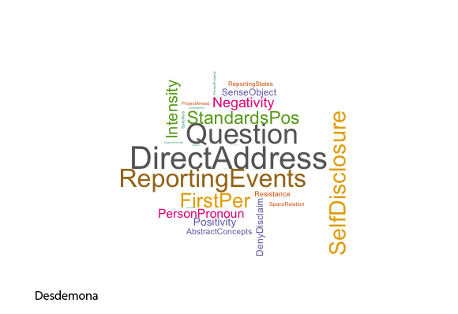

Of particular note:

- Self Disclosure: Desdemona is an open, honest individual with no hidden motives, unlike the deceptive Iago.
- Question: The implication is either that Desdemona is given less access to information (perhaps due to her gender) or that she has a curious, keen mind, and seeks out additional knowledge.
- First-Person: Unlike Iago’s wish to talk to everyone, Desdemona’s concerns relate back to herself.

## Emilia

Emilia is not the typical patriarchal figure. She constantly questions her husband’s orders, and frequently disobeys them (with the exception of stealing Desdemona’s handkerchief), and regularly speaks her mind. Her relationship is an abusive one, and leads to her cynical outlook on marriage:

<figure markdown="block">
> EMILIA: 'Tis not a year or two shows us a man:
> They are all but stomachs, and we all but food;
> To eat us hungerly, and when they are full,
> They belch us”
<figcaption>(Act 3, Scene 4)</figcaption>
</figure>

Emilia’s loyalty does not lie with Iago, nor does she share his cruel, deceptive nature.

Interestingly, Emilia’s bond of friendship with Desdemona initiates a stronger loyality between them.

Here is a ‘Parts of Speech Word Cloud’ for Emilia:

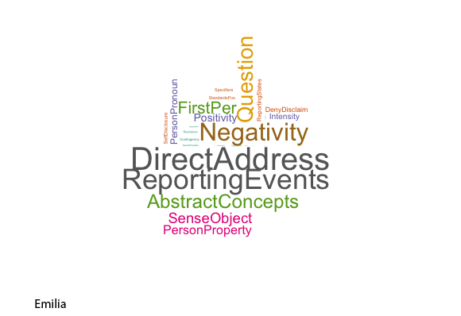

Of particular note:

- Reporting Events: Arguably, Emilia’s most significant role in the narrative is the revelation of Iago’s true nature. With this, she reports an event which completely alters the tide of the play.
Negativity: Emilia speaks her mind, frequently arguing with, and scalding, her husband. 

EMILIA: “Do not you chide; I have a thing for you” (Act 4, Scene 3).

She also presents a cynical view of marriage.
- Question: Consider this in the same way as we did for Desdemona.

##Bianca

Bianca has the least screen-time of all the women and her role, therefore, is of significantly less value. Nevertheless, she is a noteworthy character.

Bianca is a Venetian prostitute and represents impurtiy: the opposite of the virgin-white Desdemona. 

Her relationship with Cassio is key to Iago’s manipulation: the villain uses a conversation between himself and Cassio on the topic of Bianca to convince Othello that Desdemona and Cassio are having an affair.

<figure markdown="block">
> IAGO: “Now will I question Cassio of Bianca” 
<figcaption>(Act 4, Scene 1)</figcaption>
</figure>

## The Role of Women

Women are presented to the audience in a number of ways throughout Othello.

One of these is the frequent reference to women as promiscuous – an intended insult upon their integrity. Bianca’s character is outcast because of her presumed sexual nature. Additionally, Othello’s jealousy hinges on the belief that Desdemona is promiscious, and having an affair with Cassio. Under the growing belief that his wife is a whore, Othello’s rage builds until he finally accuses her such:

<figure markdown="block">
> OTHELLO [to DESDEMONA]: “Impudent strumpet!”
<figcaption>(Act 4, Scene 2)</figcaption>
</figure>

<figure markdown="block">
> OTHELLO [to DESDEMONA]: “I took you for that cunning whore of Venice
> That married with Othello” 
<figcaption>(Act 4, Scene 2)</figcaption>
</figure>

These cruel, derogatory terms are meant to wound Desdemona, and they do, considering she has done nothing wrong. They are words consistently used throughout the play too, in reference to all of the women.

Interestingly, none of these women are ever proven to have committed any acts of sexual deviancy: they are accused by men under false pretenses; often decieved.

Women are also treated as objects.

When Brabantio learns that his daughter has eloped with Othello, he refers to the Moor as a “thief’ (Act 1, Scene 2), as though she were property to be taken. Even Othello’s request for Iago to transport Desdemona to Cyprus, and take care of her, implies that she is on parallel with the concept of ship cargo; designed to be moved from A to B.

It can be quickly recognised that Desdemona is submissive (easily bending to the wishes of Othello) while Emilia is less so (she frequently argues with Iago). However, even so, Emilia’s act of giving the handkerchief to Iago shows that, on some level, she cares about his approval.

Finally, women are portrayed as some of the most powerful characters in the play, particulalry Emilia. In the end, it is Emilia who reveals Iago as the villain and brings his plan to the attention of everyone else:

<figure markdown="block">
> EMILIA: “Twill out, 'twill out: I peace!
> No, I will speak as liberal as the north:
> Let heaven and men and devils, let them all,
> All, all, cry shame against me, yet I'll speak” 
<figcaption>(Act 5, Scene 2)</figcaption>
</figure>

This is arguably the most crucial point in the play; a final turning point, where Iago’s true nature is exposed.

## Women and Marriage

In Othello, marriage is not the traditional union of two souls which we might expect from a modern romance. Instead it is portrayed as a dark, depressing symbol of oppression, echoing some of the ideology behind an Elizabethan marriage.

Lets begin with the marriage of Othello and Desdemona. Initially their romance blossoms: they have recently fallen in love and eloped. Even with negativity bearing down on them in the form of Brabantio and Iago, they manage to maintain a consistent level of happiness.

Here is a concordance graph showing all the positive references Othello makes to his wife, Desdemona, and about her:

The positivity persists throughout the play, though dwindles in act four, just as Iago’s manipulation takes a true hold on Othello.

It is diffiicult to measure the positivity with complete accuracy since many of the references come during Othello’s inner struggle with jealousy. You should take time to explore the positive references between the couple, and identify whether or not they are genuine.

As a comparison, here are the times when Othello makes a negative reference to Desdemona:

This is concentrated in act 3 and act 4, which coincides with the height of Iago’s maniuplation. It draws a clear correlation between Iago’s control, and Othello’s opinion of his wife, showing that Iago’s plan is thus far successful.

Iago and Emilia’s marriage, on the other hand, is bad from the offset. Iago treats all women horribly; he verbally abuses his wife, uses her as a pawn in his schemig, as he does with Desdemona too. 

Here are the negative references Iago uses to describe Emilia:

This might seem like an insignificant number, but take into consideration that this graph highlights every scene in which the two interact. There are none, or very few, positive references to even consider.

## Female Screen-Time

One vital thing to look at in reference to women is their allotted screen time: just how often do they speak in comparison to men?

# Who Said That? Speakers in Othello

On the stage, speech is power. 

The character on centre stage has the ability to manipulate events (consider Iago), reveal important details – either to characters, the audience, or both – and even alter the tone of the play.

When was the last time you really thought about who the speaker of a play was? Not just their name, but more revealing details; their age, gender, social class, political stance, and relationship to other characters. Taking these into account tells us exactly where the power balance falls in any given play. Is it with the rich or the poor? Male or female? Old or young? Each of these will vary in importance depending on the production.

In Othello, arguably the most important factor to consider is gender. Why? Because with jealousy and marriage acting as two key themes in the play (themes which women are crucial to), and female characters securing such an important overall role, it is prudent to see whether their screen time is proportionate.

Here is a pie chart which presents speaker gender in Othello:

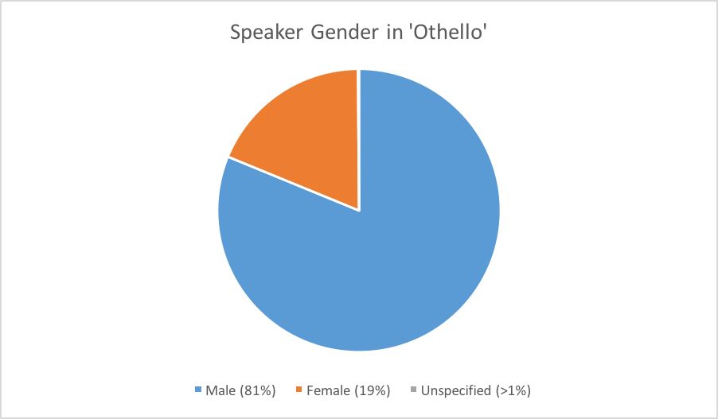

What is immediately obvious?

Men have more speaking roles than women do (4x more), while unspecified characters (those whose gender is unassigned) get only a fraction of the stage time. Men clearly dominate Othello and, therefore, they must hold the narrative power, right? Consider all the male-driven drama throughout: Iago’s manipulation of events, Othello’s jealousy, the conflict between Cassio and Roderigo, as well as that between Brabantio and Othello.

Does this tell us that women are side-lined? No it doesn’t. The power of speech is not in quantity, but quality of message, and women hold key positions in the narrative power of the play. 

To prove this, we reiterate one very simple question: Who unravels Iago’s sinister plot and reveals him to be the villain? Emilia’s role in the narrative is often understated in importance, but it is one critical to the play’s conclusion.

How does the speaker gender gap in Othello compare with the rest of Shakespeare’s work?

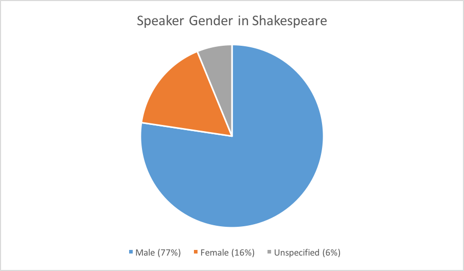

Similar statistics are uncovered here: men speak 5x more than women – although we must remember to look at what is said rather than how often it is said.

One interesting fact to take note of is that unspecified characters make up 6% of all Shakespeare dialogue. That is incredibly close to the 16% ratio for women. How can it be that women are given almost equal footing with characters of such irrelevance that they are not even assigned a gender?

While it is vital to look at speaker in broad terms, as we have done, it is just as important to look at it specifically, character by character. In Othello, which character actually speaks the most? 

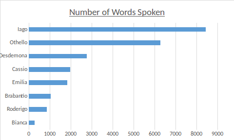

This graph, which details the number of words spoken per character, shows Iago taking a clear lead; he speaks 2000 more words than Othello in 2nd place. Why would Iago be given a greater speaking role than the title character? Could it be related to his lying tendencies? Furthermore, this 2000 word margin is almost as many words in itself as Desdemona is given, and 100 more words than Emilia.

When looking at speaker, we must consider the number of speeches given, as well as the number of words used:

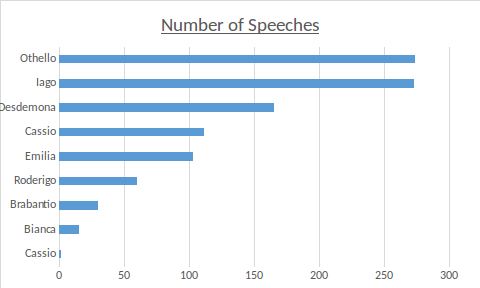

Othello is shown to make more speeches than Iago. This tells us that, while the Moor speaks more frequently, he has less to say when compared with Iago. What does this tell us about their dialogue, and its content? Additionally, there is still a divide between male and female speaker, although the gap is somewhat lessened.

Remember that it is not a matter of who speaks most frequently, but whose speech has the greatest value. Using a computer algorithm, we were able to calculate the most important word spoken by each character. With 15 hits, Desdemona’s most important word was “willow” – this ties with her singing of the ‘Willow Song’ as she dies. Emilia’s most important word was “villainy” (with 7 matches): this is vital because it is her revelation of Iago’s villainy which offers her a powerful role in the narrative. 

# Deception and Appearance vs Reality

More often than not, the appearance of something in Othello does not ensure its reality. Deception is rife, meaning we must carefully vet the truth from each assertion or claim.

Here are some examples where appeareance and reality fail to convene:

- It **appears** to Othello as though Desdemona and Cassio are having an affair but in **reality** this is a deception courtesy of Iago.
- It **appears** as though Desdemoa is begging Othello to re-hire Cassio out of affair-induced love but in **reality** she is motivated by friendship.
- It **appears** as though Iago is an honest, trustworthy friend when in **reality** he is the villain who manipulates and intitiates the play’s terrible events.
- It **appears** as though Desdemona gave her handkerchief to Cassio when in **reality** it was Iago who planted it in Cassio’s bedroom after Emilia stole it.

Iago is the most deceptive of characters. His convincing appearance obscures his true nature in the eyes of other characters. Iago conceals his intentions and motives (never revealing the latter), and pretends to care for those who consider him a friend. It is ironic, therefore, that he should state this:

<figure markdown="block">
> IAGO: “Men should be what they seem” 
<figcaption>(Act 3, Scene 3)</figcaption>
</figure>

There is further irony in the fact that Othello considers Iago honest and Desdemona deceptive when, in fact, the truth is the reversal. This links with some of the gender roles enforced in the play; Brabantio, at the beginning, makes a claim on the deceptive nature of women:

<figure markdown="block">
> BRABANTIO: “Look to her, Moor, if thou hast eyes to see:
> She has deceived her father, an
<figcaption>(Act 1, Scene 3)</figcaption>
</figure>

In many ways, this claim on Desdemona’s integrity plants the initial seed of doubt within Othello.

Interestingly, Desdemona can be considered deceptive, though in a much less antagonistic way. She lies to her father about her relationship with Othello, and falsely claims to Othello that she has his handkerchief in her possession, when she in fact lost it.  These deceptions are not meant to manipulate others, but to protect them from truths which they could not handle.

Othello regularly claims that he will not accept accusations without proof; that he must see reality before he accepts the appearance. Unfortunately, he bases his beliefs on weak evidence, namely, Iago, as well as circumstantial evidence, and borderline coincidence:

<figure markdown="block">
> OTHELLO: “I'll see before I doubt; when I doubt, prove;
> And on the proof, there is no more but this,--
> Away at once with love or jealousy!”
<figcaption>(Act 3, Scene 2)</figcaption>
</figure>

# The Symbol of the Handkerchief

The handkerchief is used as a symbol throughout the play as Othello’s love for Desdemona which Iago uses to manipulate and contort Othello’s opinions towards her. The concordance graph below highlights where each use of “handkerchief” is roughly situated within the play.

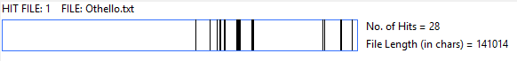

As you can see, the uses of the “handkerchief” are focused mainly in the middle of the play with a recurrence at the end as the handkerchief is itself used by Iago as the evidence of Desdemona’s infidelity. This makes the positioning of where it is referenced in the play important as its reference at the end is used by Othello as his justification to Emilia of his actions. Othello also uses the work “handkerchief” most, referring to it 16 times, with the word proving to be most significant with him among other characters with Iago using the word second most, at 6 times, and proving to be much less significant. Emilia comparatively uses the word only three times but has a greater significance compared to Iago which is interesting as this suggests, given the implications of the handkerchief, that Iago is less concerned about Othello’s happiness and Love than Emilia.

# Collective vs Individual Nouns

The play works as an interplay between the central characters with the war in the background making little effect on the characters and resolving itself off-screen. This interplay is however very insular, as to say it focuses on each individual’s perception of events and this individualism is represented through the language of the play. As shown in the cloud below collective nouns such as “we”, “our” and “their” are in this play comparatively less than the individual “I”. It is also easy to see that female pronouns such as “she” and “her” being more prevalent compared to their male counterparts, which could be argued to be worth considering as Desdemona is presented by Iago as the villain but Emilia is the character that reveals Iago’s deception.

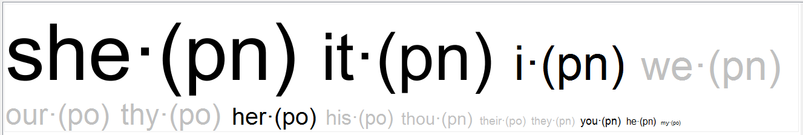

# Jealousy - 'O that green-eyed monsted'

<figure markdown="block">
> IAGO: “O, beware, my lord, of jealousy;
> It is the green-eyed monster which doth mock
> The meat it feeds on”
<figcaption>(Act 3, Scene 3)</figcaption>
</figure>

Jealousy is situated amongst character drama and adds a strong element of realism to the play. In many ways, Othello is a cautionary tale concerning the power jealousy can have over someone: the central conflict, after all, is the jealousy that arises from Othello when he believes his wife and liuetenant are having a secret affair.

Jealousy is Othello’s downfall; his tragic, fatal flaw, that eventually results in his destruction.

Only under Iago’s deception is Othello jealous. There is no concrete evidence for the affair, as discussed, only the circumstantial, as well as a series of provoking, visceral images and statements from Iago:

<figure markdown="block">
> IAGO: “Lie—“
> OTHELLO: “With her?”
> IAGO: “With her, on her; what you will” 
<figcaption>(Act 3, Scene 3)</figcaption>
</figure>

Jealousy  corrupts all that it comes it contact with. For Othello, it leads to anger, then rage, and then, consequently, revenge, all spurred by a vision of madness:

<figure markdown="block">
> OTHELLO: “Get me some poison, Iago; this night: I'll not
> expostulate with her, lest her body and beauty
> unprovide my mind again: this night
<figcaption>(Act 3, Scene 3)</figcaption>
</figure>

This jealousy leads down a path which destroys many characters.

Othello’s jealousy even renders him to the animalistic state he is so often described as being.

# Positivity vs Negativity

In this graph, the red line represents positivity while the blue one represents negativity. There are instances where both lines crossover, and even times when they completely invert positions:

- 1st Crossover: Iago enlists the help of Roderigo. Momentarily, because of the alliance, positivity takes the lead over negativity.
- 2nd Crossover: Othello explains at court how Desdemona came to love him, putting negativity back in the lead (why could this be?).
- 3rd Crossover: Desdemona and Iago have a playful conversation on the basis of Iago telling her his thoughts on her true nature, with positivity spiking well above negativity, and maintaining this position for a while.
- 4th Crossover: Othello arrives at the drunken brawl between Cassio and Roderigo.
- 5th Crossover: Iago introduces the notion of jealousy and, meanwhile, Emilia steals Desdemona’s handkerchief. Negativity takes the lead again, though barely. For the remainder of the play, positivity and negativity are intricately linked…
- Final Crossover: This is where positivity drops drastically while negativity spikes (and both stay this way until the end). It occurs when Othello is listening to Iago’s staged conversation with Cassio, about Bianca. 

Consider the importance of deception and how this could affect these graph results.

# Key Quotes

<figure markdown="block">
> “with as little a web as this I will ensnare as great a fly as
> Cassio” – Iago
<figcaption>(Act 2, Scene 1)</figcaption>
</figure>

<figure markdown="block">
>“Your son-in-law is far more fair than black.” – Duke
<figcaption>(Act 1, Scene 3)</figcaption>
</figure>

<figure markdown="block">
> “Oh, the more angel she, and you the blacker devil!” - Emilia
<figcaption>(Act 5, Scene 2)</figcaption>
</figure>
