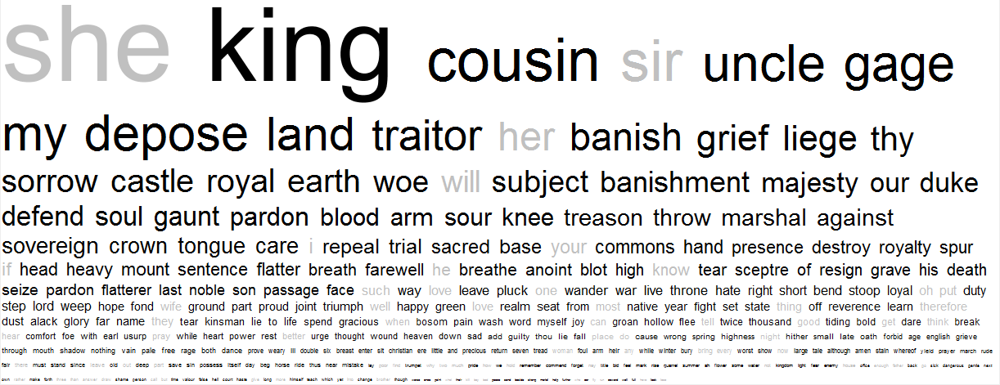
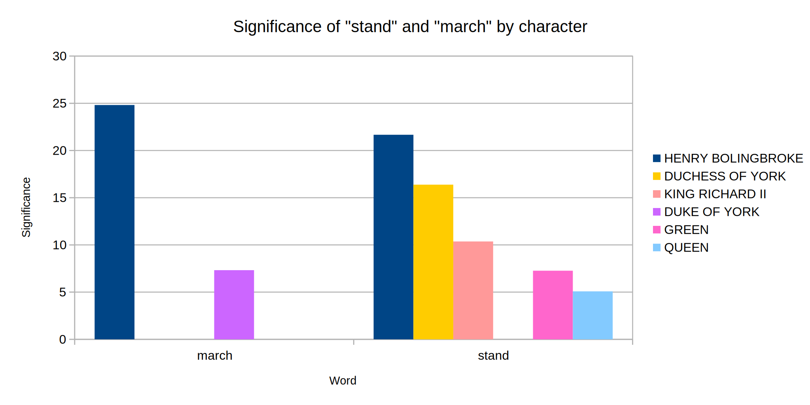
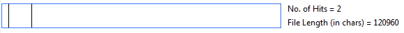
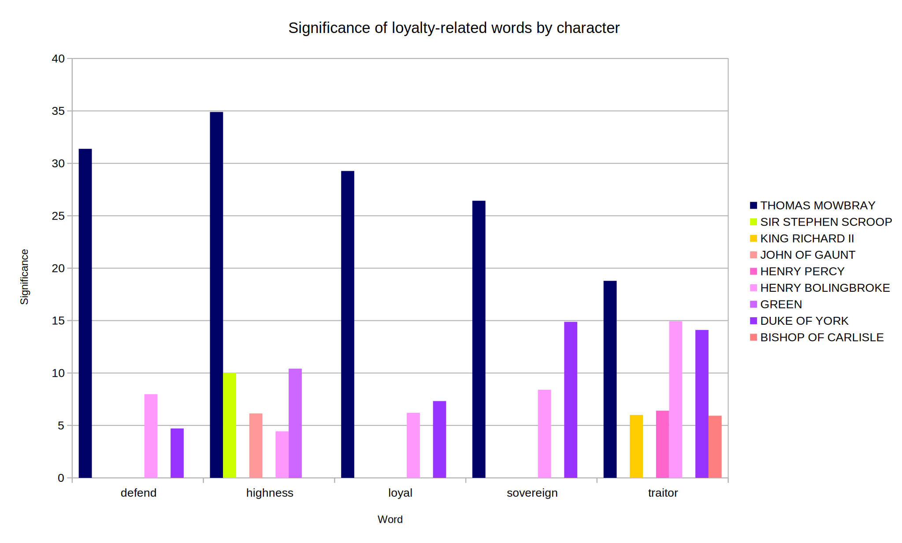
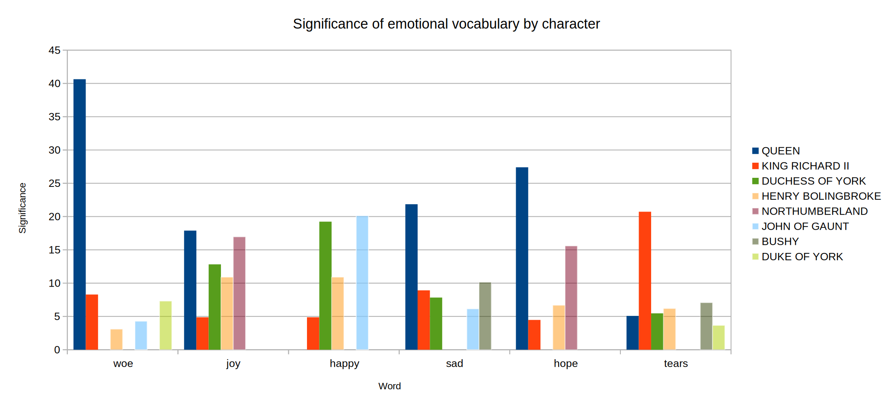

 
Using a tool called WordHoard, we can view the words that appear in Richard II
more or less than would be expected, compared to the rest of
Shakespeare’s plays.  The words in black appear more frequently in Richard II
than in other plays; words in grey appear less frequently.

<figure>
    
</figure>

# Nature of Kingship

## Sovereign Richard and the Divine Right of Kings

The concept of divine right of kings emerged in Europe after the Middle Ages. It
legitimised the monarch’s authority by stating that God has bestowed power upon
him/her for life, therefore providing an ‘explanation’ for absolutism. It was
prominent in the 16th century, when civil wars deeply affected
England and there was a need for a strong, absolutist monarch able to take
charge and bring peace.

We argue that Richard II addresses this idea throughout the play, though not in
a conventional way. We have conducted our analysis through AntConc and
VocaBalance, where the former shows how many times words recur in the play, and
the latter analyses their significance in relation to certain characters; our
findings have depicted an image of Richard which is that of an inept king, who
is led to downfall by his own mistakes. His power is not absolute and his
authority is rejected by his subjects in favour of a more suitable authority,
identified in Henry Bolingbroke (the future Henry IV).

We have analysed the use of the following words in the play: sovereignty, power,
weakness, king, God, pride, thoughts, tears.

The results will be illustrated below.

## Sovereignty

The divine right of kings is directly linked to the concept of sovereignty,
[defined by the Encyclopedia Britannica][sovereignty] as “a theory of politics
which claims that in every system of government there must be some absolute
power of final decision exercised by some person or body recognized both as
competent to decide and as able to enforce the decision”.

[sovereignty]: http://www.encyclopedia.com/topic/sovereignty.aspx

We have conducted a research on the use of the term sovereign in Richard II
through AntConc. The results show that the word, always used when referring to
Richard himself, appears 16 times, and it is more frequent at the beginning,
while gradually disappearing as we approach the end of the play:

<figure>
    
</figure>

## Power / Weakness

We went on researching the terms power and powerful to see whether there would
be a correlation between the two concepts and how these play out in the text.
AntConc reported the following data:

- Log likelihood: 4.7
- Analysis count: 19
- Analysis parts per 10,000: 6.68
- Reference parts per 10,000: 4.99

<figure>
    <figcaption>Power</figcaption>
    
    <figcaption>Powerful</figcaption>
    
</figure>

Power appears 18 times in the play and powerful only one. Through a more
in-depth analysis we found that of these 19 hits, only one refers to Richard,
and it is spoken by the king himself: *“That power I have, discharge” (Act III,
Scene II)*.

At the start of the play Richard is in power; the word power is not used as it
is not a debatable topic. In the middle of the play Bolingbroke is trying to
usurp Richard and is claiming Richard’s power is redundant. The word is more
frequent because it becomes a subject of contention. At the end of the play
Bolingbroke has gained power -which no one questions- and Richard is no longer
king. This again renders the topic of power insignificant.

The only instance of the word weakness in the play is spoken by the Bishop of
Carlisle specifically when talking to the king: *“To fear the foe, since fear
oppresseth strength, / Gives in your weakness strength unto your foe, / And so
your follies fight against yourself.” (Act III, Scene II)*

## King / God

The word king more frequently than expected and is spread evenly throughout the
play. God appears 67 times in the play, many of which are in direct correlation
with the word king. All these instances are referred to Richard and mostly
spoken by Mowbray and the Bishop of Carlisle. The latter also addresses Richard
II with the following words: *“Fear not, my lord: that power that made you king”
(Act III, Scene II)* in a clear reference to divine power. Moreover, his most
spoken words are subject and foul, both in direct correlation with the idea of
absolutism.

## Pride / Thoughts

The word pride is spoken about or by Richard:

<figure markdown="block">
> For time hath set a blot upon my pride
<figcaption>(Act III, Scene II)</figcaption>

> I give this heavy weight from off my head \\
> And this unwieldy sceptre from my hand, \\
> The pride of kingly sway from out my heart
<figcaption>(Act IV, Scene I)</figcaption>

> […] how these vain weak nails \\
> May tear a passage through the flinty ribs \\
> Of this hard world, my ragged prison walls, \\
> And, for they cannot, die in their own pride
<figcaption>(Act IV, Scene V)</figcaption>
</figure>

Richard places power and significance on his own thoughts *“High be our thoughts”
(Act III, Scene II)*. This highlights his passivity, as his thoughts are more
important than his actions. This is reinforced by hints throughout the play at
Richard’s confidence that his words are so powerful he does not have to act on
them.

## Tears

<figure markdown="block">
> With mine own tears I wash away my balm
<figcaption>(Act IV, Scene I)</figcaption>
</figure>

Balm refers to the substance used to coronate a king, it is a symbol of
Richard’s kingship. He talks of his tears as having power to erase his kingship.
Therefore the act of ‘un-kinging’ himself he suggests that he has amazing power.
This adds to Richard’s warped perception of kingship: ceremony and religion
rather than abilities as a king or support from his subjects.

# Henry Bolingbroke

Henry Bolingbroke is Richard’s cousin. After being banished for treason, he
returns to England to depose the King.

## Power / Proud

As already mentioned, the words power and powerful are spoken only once by
Richard, while most instances come from Bolingbroke himself. This confirms that
Bolingbroke is the character that actually holds power in the play, and he gains
support thanks to his skills and patriotism. He is never addressed as
“sovereign” but rather as “King” or “Lord”. This could further suggest a
differentiation between Richard’s sovereignty - conferred by divine right - and
Bolingbroke’s kingship, acquired by merit.

The word proud also appears quite often whenever Bolingbroke makes a speech or
someone speaks about him, particularly towards the end of the play:

<figure markdown="block">
> Fair cousin, you debase your princely knee \\
> To make the base earth proud with kissing it
<figcaption>(Richard to Bolingbroke, Act III, Scene III)</figcaption>

> Is doom'd a prisoner by proud Bolingbroke
<figcaption>(Queen about Bolingbroke, Act V, Scene I)</figcaption>

> but my time / Runs posting on in Bolingbroke's proud joy
<figcaption>(Richard about Bolingbroke, Act V, Scene V)</figcaption>
</figure>

## Freedom

The word freedom only occurs once in the play and it is spoken by Bolingbroke.

<figure markdown="block">
> Nay, rather, every tedious stride I make \\
> Will but remember me what a deal of world \\
> I wander from the jewels that I love. \\
> Must I not serve a long apprenticehood \\
> To foreign passages, and in the end, \\
> Having my freedom, boast of nothing else \\
> But that I was a journeyman to grief?
<figcaption>(Act I, Scene III)</figcaption>
</figure>

This passage highlights Bolingbroke’s sadness at leaving England. It builds him
up as a patriotic character and explains his motivations for returning home and
deposing Richard.

## Stand / March

According to our findings through VocaBalance, the words stand and march are
most significant in relation to Bolingbroke.

<figure>
    
</figure>

The use of both words shows Henry’s assertive nature, his ambition and his
confident and demanding character:

<figure markdown="block">
> Harry of Hereford, Lancaster and Derby am I; who ready here do stand in arms
<figcaption>(Act I, Scene III)</figcaption>

> Stand all apart, and show his fair duty to his majesty
<figcaption>(Act III, Scene III)</figcaption>

> Cousin, stand forth, and look upon that man
<figcaption>(Act IV, Scene I)</figcaption>

> Go, signify as much, while here we march \\
> Upon the grassy carpet of this plain. \\
> Let's march without the noise of threatening drum. \\
> [....] March on, and mark King Richard how he looks
<figcaption>(Act III, Scene III)</figcaption>
</figure>

## Loyalty

The research we have conducted through AntConc allowed us to highlight two
different ways in which loyalty is conceived in the play. The words “loyal” and
“loyalty” appear 11 times and are used differently.

<figure>
    <figcaption>Loyal</figcaption>
    
    <figcaption>Loyalty</figcaption>
    
</figure>

# Loyalty to the Monarch: Mowbray and the Bishop of Carlisle

Loyal and loyalty are in most cases spoken by Thomas Mowbray. In the actual plot
of the play, Mowbray does not appear as loyal in the eyes of Richard, but our
findings show that he is one of the few who actually are loyal.

<figure>
    
</figure>

The argument between Mowbray and Bolingbroke - that causes them to both be
banished- arises from them accusing each other of being disloyal to the king.
This is ironic because both characters begin as appearing very loyal to Richard
II but this contention leads to Bolingbroke’s desire to depose Richard and
become king himself. By defending Richard and accusing Mowbray of being a
traitor, Bolingbroke sets in motion the events which lead to him becoming one.

The Bishop of Carlisle is also loyal to Richard, often pointing out how his
power is legitimised by God:

<figure markdown="block">
> [...] Would God that any in this noble presence \\
> Were enough noble to be upright judge \\
> Of noble Richard! then true noblesse would \\
> Learn him forbearance from so foul a wrong. \\
> What subject can give sentence on his king? \\
> And who sits here that is not Richard's subject [...]
<figcaption>(Act IV, Scene I)</figcaption>
</figure>

His negative comments towards Bolingbroke’s reign in his Act IV speech,
prophesising violent wars, confirm that he believes in the divine right of
kings:

<figure markdown="block">
> [...] And if you crown him, let me prophesy: \\
> The blood of English shall manure the ground, \\
> And future ages groan for this foul act; \\
> Peace shall go sleep with Turks and infidels, \\
> And in this seat of peace tumultuous wars \\
> Shall kin with kin and kind with kind confound; \\
> Disorder, horror, fear and mutiny \\
> Shall here inhabit, and this land be call'd \\
> The field of Golgotha and dead men's skulls. \\
> O, if you raise this house against this house, \\
> It will the woefullest division prove \\
> That ever fell upon this cursed earth. \\
> Prevent it, resist it, let it not be so, \\
> Lest child, child's children, cry against you woe!
<figcaption>(Act IV, Scene I)</figcaption>
</figure>

# Loyalty to the Country: Bolingbroke and Gaunt

Gaunt and Bolingbroke appear as the most patriotic characters in the play. We
have found that the words Gaunt uses more frequently than other characters are:
England, happy, grave, world, shame, dear.

## Grave

It refers to his own grave allot: *“Convey me to my bed, then to my grave” (Act
II, Scene I)*. He is not afraid to die or he is content to leave this world,
which no longer appeals to him since Richard II banished his son.

## England

*“This earth, this realm, this England” (Act II, Scene I)*. His frequent use of
the word England hints at his patriotism and this example confirms Gaunt’s
positive view of his country, even though he thinks Richard’s reign has
corrupted England.

## World

He sees England as a perfect; as an Eden he calls it *“This little world” (Act
II, Scene I)*. The idea that England is its own world adds to his patriotism.

## Happy

Englishmen are a *“happy breed of men” (Act II, Scene I)*. He says his death would
be “happy” if it could restore England’s reputation.

## Dear
This refers to England, its people and its world standing.

Bolingbroke also uses patriotic language:

<figure markdown="block">
> Then, England's ground, farewell; sweet soil, adieu; \\
> My mother, and my nurse, that bears me yet! \\
> Where'er I wander, boast of this I can, \\
> Though banish'd, yet a trueborn Englishman
<figcaption>(Act I, Scene III)</figcaption>
</figure>

Both characters use “nurse” to describe England:

Gaunt: *“This nurse, this teeming womb of royal kings” (Act II, Scene I)*

Bolingbroke: *“my nurse, that bears me yet!” (Act I, Scene III)*

Both very patriotic and positive ideas/images/depictions of England.

On the other hand, Richard’s most common used words “tears” “proud” “thoughts”,
when analysed in context, do not portray patriotism or a love for his country.
When Gaunt dies after his patriotic speech, Richard shows no respect and decides
to absorb Gaunt’s “plate, his goods, his money and his lands.” Richard’s selfish
attitude towards his relatives and noblemen links to his lack of patriotism.
This ties into the idea of Richard worshipping himself and divine kingship
rather than striving to be a successful leader of a country.

# Emotions

## Love and Feelings

(n)

- Log likelihood 7.3
- Analysis count 26

(v)

- Log likelihood 9.2
- Analysis count 14

Since many of the relationships in this play are not fond, warm or affectionate,
this frequency is unexpected. It is often used as a word for loyalty, which is a
key theme of the play. It highlights the familial bond between Bolingbroke and
Richard which adds to the tension and sense of betrayal.

The concordance plot is pretty even throughout the play.

The Queen appears as the most emotional character in the play. We have found
that some of her most spoken words are woe, hope, better, sad and joy.

<figure>
    
</figure>

# Relationships

We conducted a research on the role of women in the play and how they are seen
by other characters.

The main findings show that Richard has a positive view of the Queen, referring
to her in positive terms:

<figure markdown="block">
> Join not with grief, fair woman, do not so, \\
> To make my end too sudden: learn, good soul, \\
> To think our former state a happy dream
<figcaption>(Act V, Scene I)</figcaption>
</figure>

The Duke of York, on the other hand, always refers to his Duchess in negative
terms:

<figure markdown="block">
> Peace, foolish woman.
<figcaption>(Act V, Scene II)</figcaption>

> Thou fond mad woman
<figcaption>(Act V, Scene II)</figcaption>

> Make way, unruly woman!
<figcaption>(Act V, Scene II)</figcaption>

> Thou frantic woman, what dost thou make here? Shall thy old dugs once more a
> traitor rear?
<figcaption>(Act V, Scene III)</figcaption>
</figure>

WordHoard shows that the pronoun she is not used as much as in other Shakespeare
plays; this might suggest that women do not have a role in the play at all.
However, it is interesting to highlight the Queen’s contrasting emotions and the
significance of her emotive words as opposed to relevant characters such as
Bolingbroke and Richard. It could suggest that women, despite their minor role,
are as well-rounded as their male counterparts. Perhaps we could say that in a
social environment dominated by treason and fake loyalty, women remain true to
their flawed, real self?
