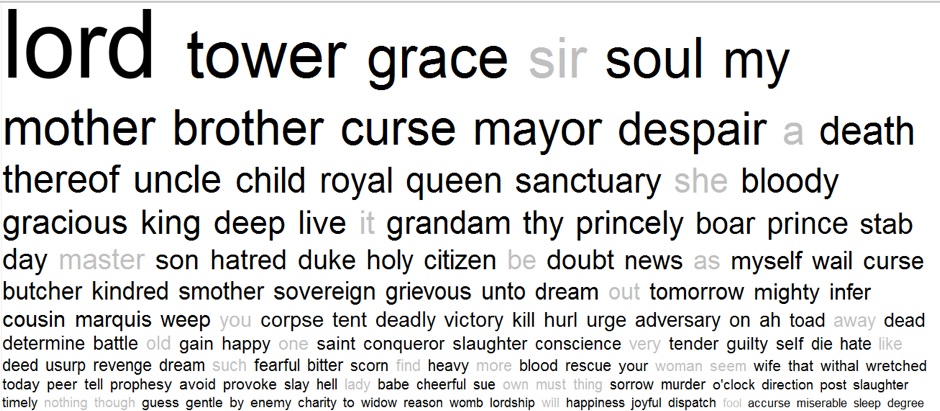
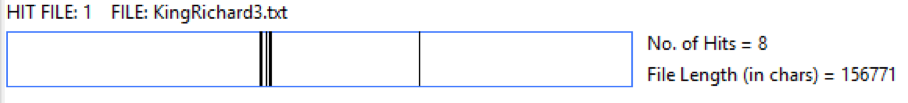
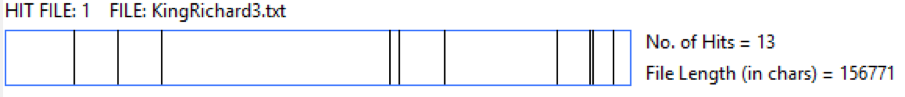
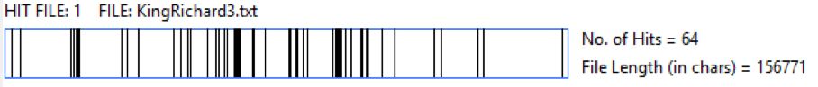
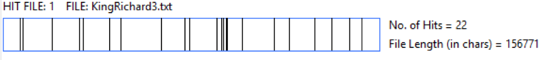
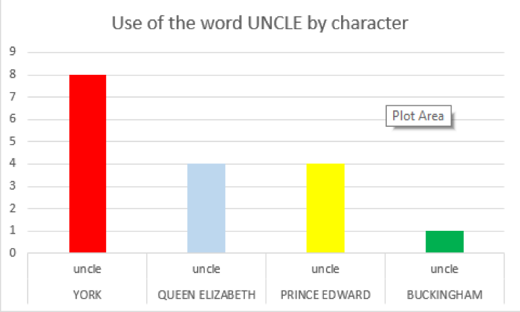
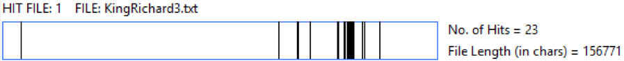
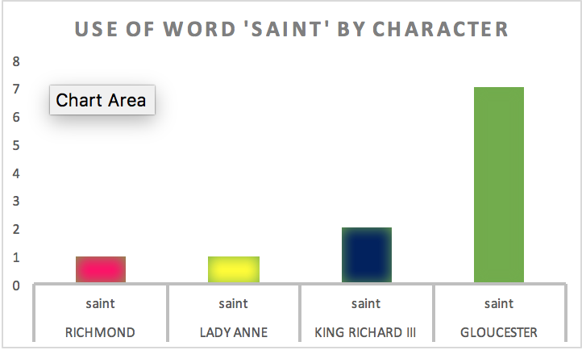
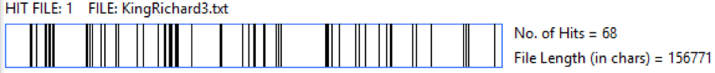
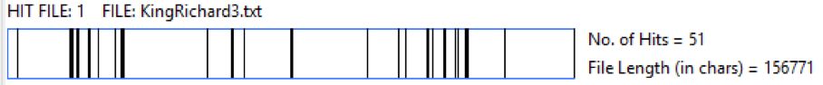

<figure>
    
</figure>

# The significance of words

The word cloud shows the words which are overused (in black) and underused (in grey) compared to other Shakespeare plays.  Analysing individual words used in Shakespeare’s work can be just as effective as analysing an entire scene. The following examples have been analysed using WordHoard and have produced the following results:

## Sanctuary

  * It appears 8 times in total throughout the play
  * The relative use of the word compared to other historical plays is + which means it is used more frequently in Richard III than any other historical play
  * The log likelihood is 9.4** which is significant as it shows a numerical representation of the frequency with which this words occurs in this play compared to other historical Shakespeare plays
  * The ** is a graphic representation of the relevance of the word as well as how often it is used

  <figure>
      
  </figure>

As we can see, the word SANCTUARY occurs more frequently in Richard III than it does in any other play within the historical genre of Shakespeare’s work. We can interpret this as it is now, or we can compare it to the rest of Shakespeare’s work (not restricted to historical plays):

  * Log likelihood: 28****
  * The result is even more noticeable when compared to every other play written by Shakespeare
  * Analysis parts per 10,000 words: 2.83
  * Reference parts per 10,000 words: 0.15
  * The ‘analysis parts’ statistic is the text of Richard III itself and how many times the word SANCTUARY is used in every 10,000 words of the play
  * The ‘reference parts’ statistic is similar except it represents every other play written by Shakespeare and how often the word occurs every 10,000 words

When compared to the rest of Shakespeare’s plays, the word SANCTUARY is used more frequently in Richard III than anywhere else. These results raise several points of interest about the play as a whole, especially when we think about the context in which the word is used and the overarching themes of the play.

#### Something to think about:

  * What is the literal meaning of the word SANCTUARY? Is there a difference between what it means now vs. what it meant historically?
  * Why is it important to think about the frequency with which the word is used within the play? What does it mean in relation to the main themes at work in Richard III?
  * What is significant about the number of times it is used in Richard III compared to how often it appears in any of Shakespeare’s other plays? Does it allow us to make a comment on the themes/characters/tone/etc of Richard III in relation to the themes/characters/tone/etc of other plays?

### ‘Conscience’, ‘Grace’, ‘Holy’ and ‘Lord’:

The above words are similar to each other as they are used when talking about religious matters and concerns of the soul; something Shakespeare deals with in many of his other works. The England in which Shakespeare lived was deeply divided along religious lines as Protestantism was transformed from the outcast religion of rebels and heretics to the official religion of England in place of Catholicism. However, when Richard III was King of England, Catholicism was still in place as the official religion of the country. Therefore, Shakespeare’s play of Richard’s life could be viewed as an attempt to portray his religion as evil alongside his character.
Another thing those four words have in common is they all feature in Act 3, Scene 7:

  * CONSCIENCE: appears twice in Act 3, Scene 7 (13 in total throughout the play)

  <figure>
      
  </figure>

  * GRACE appears 14 times in Act 3, Scene 7 (64 in total)

  <figure>
      
  </figure>

  * HOLY appears 6 times in Act 3, Scene 7 (22 in total)

  <figure>
      
  </figure>

  * LORD appears 17 times in Act 3, Scene 7 (216 in total)

  <figure>
      
  </figure>

This might lead us to wonder just what is so significant about Act 3 Scene 7? By looking at these words grouped together we can see at a glance that something important must be happening in this particular scene.

# Act 3 Scene 7

When we turn to Act 3 Scene 7 we can indeed witness an important scene in the play, as it is the scene where Richard III succeeds in manipulating the right people into begging him to claim the throne of England for himself. On the whole this scene is relatively short at roughly 247 lines, though it is a significant moment in the life of King Richard III.
The Duke of Buckingham informs Richard of his initial unpopularity, which he says he can remedy by appearing religious and saint-like in front of the Mayor and the town citizens. Richard agrees to this plan and disappears upstairs ready to be called by Buckingham when the Mayor arrives to seek audience with him. When the Mayor arrives and asks to see Richard, Buckingham calls on him several times and each time Richard refuses to come down, as he is at prayer and does not wish to be disturbed. The Mayor and Buckingham then engage in deep conversation where Buckingham does his best to portray Richard as a deeply holy and religious man who only has the concerns of the nation and its people in his heart. His speeches compare Richard to his deceased brother King Edward IV – who had a reputation for drinking and wasting money and was rumoured to be illegitimate. Buckingham also makes such declarations as, ‘But, sure, I fear, we shall not win him to it’ when talking about the likelihood of Richard bowing to their wishes and declaring himself King. According to Buckingham and Richard himself, he cannot be persuaded to take the throne and deprive his nephews of their birthright.

#### Richard’s Ulterior Motives

Richard declares his true intentions and shows his true character in the very first scene of Act 1 in his opening monologue, “And therefore, since I cannot prove a lover, /To entertain these fair well-spoken days, /I am determined to prove a villain/And hate the idle pleasures of these days” (lines 28-31). It is worth remembering that he actively refers to himself as a villain and is ‘determined’ to do everything in his power to cause the downfall of those he believes have wronged him, as well as those who have not. This is something to remember when reading Act 3 Scene 7.

#### Something to Think About:

  * What does the religious content of Richard’s monologues convey about his character?
  * How does Richard persuade the Mayor and citizens successfully into begging him to take the crown from his young nephews?
  * To what extent is Act 3 Scene 7 a turning point/pivotal scene in the play?

# Dysfunctional Family

One of the most famous and mysterious disappearances in English history happened just prior to Richard III being crowned King. The story of the Princes in the Tower has baffled historians for centuries, as their remains have never been discovered or formally identified. In Shakespeare’s play, Richard III is blamed for their disappearance and supposed murder, an accusation which he fails to deny and thus gave rise to the popular myth that he murdered his own nephews or they were killed on his orders.

<figure>
    
</figure>

With this in mind, it is perhaps surprising to see that UNCLE is one of the words used most frequently by both Prince Edward and his younger brother York. The irony of this is that the instances in which they are referring to/conversing with their uncle are usually positive exchanged where they profess their love for him and their faith that he will look after them as Lord Protector.
Richard’s questionable attitude towards his blood relatives also extends to his niece Elizabeth of York, future wife of Henry Tudor (more spoilers if you don’t know history). He uses the word ‘daughter’ 14 times in Act 4 Scene 4 when he attempts to persuade Queen Elizabeth that he is in love with her eldest daughter – and his blood niece – Elizabeth. This word is his most frequently used word; it is four times more significant than any other character’s use of the word. His manipulation of Queen Elizabeth proves somewhat successful as he manages to convince her to speaker to her daughter and tell her how he feels, though nothing comes of the proposed marriage. This highlights Richard’s gift for manipulation and has echoes of his successful campaign to convince Queen Anne to marry him earlier on in the play.

##### Daughter

<figure>
    
</figure>

# Saint or Sinner?

Act 5, Scene 3 contains a crucial moment in the history of Richard III, as it concerns his defeat and death on Bosworth Field at the hands of Henry Tudor, Earl of Richmond (the future King Henry VII). In this particular scene, the word ‘saint’ is used 4 times – the most in any scene in the play. It is mostly used by Henry and Richard as they both call upon St. George, patron Saint of England, to aid them in their quest to defeat and kill the other.

<figure>
    
</figure>

In this scene, the night before the battle is depicted in both Richard and Henry’s camps. As Richard sleeps, he is visited by a large number of ghosts; everyone from his dead wife Queen Anne to the Duke of Buckingham. Each ghost delivers a message to the sleeping King Richard and Earl of Richmond, the content of which is mostly the same. They wish for Richard to be defeated and killed by Henry Tudor, as Richard has shown himself to be unworthy of the crown through his evil deeds and words. Henry is very much depicted as the knight in shining armour who will save England from tyranny and another civil war.

# To Live and To Die

While it may seem obvious that certain words, such as DEATH, appear more frequently in this play due to its violent and tragic nature, other words like the verb LIVE were further investigated through WordHoard to identify their use. It reported that:
 

* DEATH (n)

log likelihood + 12,7*** (compared to other Historical plays)
And + 34,2**** (compared to Shakespeare's plays)

<figure>
    
</figure>

* LIVE (v)

log likelihood + 16,4**** (compared to Shakespeare’s Histories)
And +26,2**** (compared to Shakespeare's Plays)

<figure>
    
</figure>

Their positive log likelihood means that both words appear much more frequently than in any other historical play or any other Shakespeare play. As previously mentioned, the prominence of the word DEATH might not be considered particularly significant, but the relevance of LIVE (v) in a play which deals with its opposite has prompted a further investigation.
 
Through an act-by-act analysis of the play, WordHoard showed that LIVE (v) is mostly used in concordance with "shall"/ "might"/ "hope". Furthermore, it is used:

1. In a negative sense only predominantly by Richard:

    * "So wise so young, they say, do never live long" (act 3, Scene I)

2.	In a positive sense primarily by Queen Margaret:

     * "Dear God I pray, / that I might live and say "The dog is dead" (act 4, scene IV)
     * "So she may live unscarred of bleeding slaughter" (act 4, scene IV)
     * "If thou wilt outstrip death, go, cross the seas, / And live with Richmond, from the reach of hell" (act 4, scene I)
     * "Outlive thy glory, like my wretched self. / Long mayst thou live to wail thy children's death / And see another, as I see thee now, / Decked in thy rights, as thou art stalled in mine" (act 1, scene III)
     * "God I pray Him / That none of you may live his natural age, / But by some unlooked accident cut off" (act 1, scene III)
 
3.	It is a relevant word for Prince Edward - though he dies - in Act 3 Scene 1, in his conversation with Richard and Buckingham:

     * "Methinks the truth should live from age to age, / As 'twere retailed to all posterity, / Even to the general all-ending day"
     * "An if I live until I be a man, / I'll win our ancient right in France again / Or die a soldier, as I lived a king"
     * "That Julius Caesar was a famous man; / With what his valour did enrich his wit, / His wit set down to make his valour live: / Death makes no conquest of this conqueror; / For now he lives in fame, though not in life."

#### Something to think about

* The play contains more instances of death than any other Shakespeare play or historical play; however, it also shows the greatest use of the word LIVE. Is death to be considered then as entirely negative or as a first step towards life, change, progress?
* With reference to the use of the word LIVE made by Prince Edward: should we think about living in mere physical terms or as something connected with survival through history and tradition?

# The woman question
 
The pronoun SHE also appears to be highly underused, despite the amount of female characters in the play. WordHoard reports that:

* SHE  
Log likelihood -18,2**** (compared to Shakespeare's plays)  
Analysis count: 48  
Reference count: 2558.

<figure>
    
</figure>

The results prompted us to investigate the actual prominence of the play's female characters. Through a speech script, we have generated a spreadsheet which lists the amount of words spoken by each characters and how many times they speak overall. It results that Queen Elizabeth speaks more times than everyone but Richard and Buckingham, even though she speaks less words. In general, all the ladies in the play speak more than most of their male counterparts.
 
VOCABALANCE has also allowed us to find out what words are most significant to the women of Richard III:
 
* LADY ANNE: unnatural, mortal, cursed, blood, poison, miserable
* QUEEN ELIZABETH: wail, tender, oath, wilt, curse, destruction, never, dead
* DUCHESS OF YORK: accursed, weep, shame, lost, grief, damned, woes, sorrow, death
* QUEEN MARGARET: kill'd, woes, hell, shame, sorrow, loss, curse, clouds, traitors, fool, prey

#### Something to think about:

* Women are the ones who directly address the tragedy of the story through their language; they are the most emotional characters, the most angered and the most devastated. But they're also the most hopeful - particularly Queen Margaret. She's often depicted as being a one-dimensional character who expresses only rage/anger. However, she is the one who teaches a lesson about the use of language to alleviate pain and she is also one of the character who uses the verb LIVE the most in concordance with instances of hope. Could it be, then, that Queen Margaret is the one who propels the other characters forward through her feelings?
* The women in the play speak overall more than the men. Even though the pronoun SHE is underused compared to Shakespeare's plays, this could be seen as a positive element. Could it be argued that this further enhances the argument by which women take on an active rather than passive role in the play? They speak up rather than being spoken of.
