# Identity

It is obvious that Romeo and Juliet is a play that is centered around identity; the plot contains two forbidden lovers who cannot be together because of their family names. However, the importance of investigating this on a much deeper scale became clear as we looked into the play further. Identity is not as simple as it seems in Romeo and Juliet. Some characters are conflicted with the concept, whereas others seem indifferent towards it. 
Using a tool called AntConc, we can see the number of times the word ‘name’ appears throughout a selection of Shakespeare plays. Evidently, it is most predominantly present in Romeo and Juliet. 

<figure>
    <figcaption>
    Use of the word 'name' in Shakespeare plays
    </figcaption>
    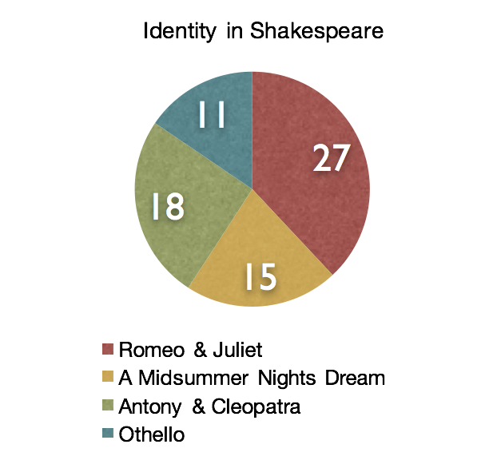
</figure>

AntConc allowed us to view the occurrences of this specific word through presenting the results in a Concordance Plot. As each vertical line represents whereabouts in the play ‘name’ appears, we can see that it is used consistently and significantly throughout. From this Concordance Plot produced by the software it is obvious that ‘name’ is not simply a ‘throwaway’ word with no meaning.

<figure>
    <figcaption>
    Occurrences of the word ‘name’ in Romeo and Juliet
    </figcaption>
    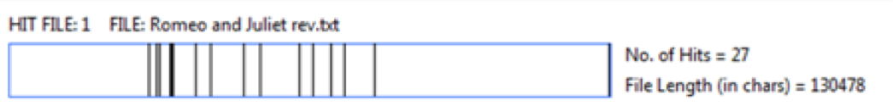
</figure>

# What's in a Name

<figure>
    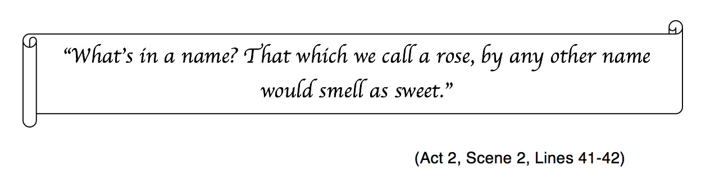
</figure>

In one of her most famous lines, it is clear that Juliet questions the weight that this specific word holds. She challenges the notion that the title an object or person holds in fact defines them, claiming that without their title they would still remain the same. This suggests that it is not a name which gives a thing its essential qualities, it is not the defining factor. A name is in fact arbitrary, irrelevant, or unnecessary to an extent. Changing your name does not change your identity. 
It is clear that the play prompts you to consider the relationship between word and meaning, between name and being. These two lovers attempt to negotiate an identity independent of family name. The hero and heroine are nameless when they meet and fall in love; their subsequent identification by family labels bring with it emotional and cultural baggage.  

<figure>
    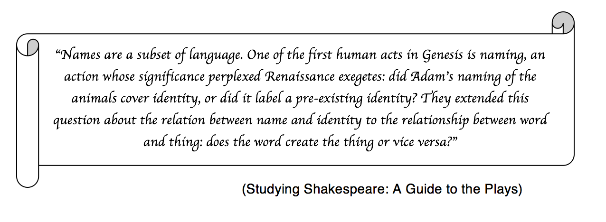
</figure>

# A Conclusion

In Romeo and Juliet, it could be argued that the name is the essence of the love between the two. Although they are besotted with one another before they discover the history between the family, the very fact that they are from a different namesake creates a passionate, intense, forbidden love scenario from which neither of them can abstain. 
Juliet is tortured by Romeo’s identity: “Why are you Romeo?” So much so, that the protagonist begins to proclaim that he will change his title. 
To an extent, existence is based on the very fact that you hold a title, you occupy a space and time through your overall being, which in some part owes thanks to your name.

<figure>
    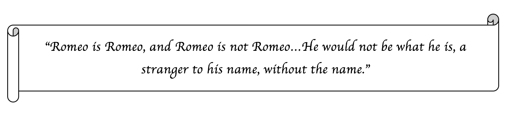
</figure>

With name comes a historical background, a blood line, a span of cultural and economic wealth. This one word is historical, significant and symbolic of so much. It holds so much weight in a family – the falls and successes of ancestry, feuds, friendships and relationships of the past.
Thus, it could be argued that the name is an artificial and meaningless convention, but it ties the play together. It is what throws the two young lovers into an endless struggle of forbidden love. It is the very essence of Romeo and Juliet.

# Romeo vs Juliet

It should also be noted that Romeo, is a word that appears 128 times in the play, whereas Juliet only appears 44 times. This is a significant difference between the two who are both protagonists and title characters. This correlates significantly as it ties in with the concept of identity, and Juliet’s incessant need to call Romeo by his title whilst still proving the importance of name in terms of identity. 

# Pet Names in Romeo and Juliet

Juliet is fascinated with saying her lovers name 36 times throughout the play, whilst Romeo is subtle, only speaking her name 17 times and continues to call her by ‘pet names.’ 
Thus, it is clear that Romeo tends to call Juliet by nicknames that are tender and affectionate instead of addressing her by her title. This could suggest that perhaps Romeo is not caught up in the idea of identity in the same way that Juliet is. He views her as something more than a title. For him, a name is not significant. But for Juliet, she needs to prove to herself and convince her own self that a name is not necessarily an indicator of identity. She repeats his name constantly, hinting that perhaps she is more caught up in it than she thinks. She is a character who finds it necessary to call him by his defining title yet contradicts herself when she fights against it. She is a conflicting being.

<figure>
    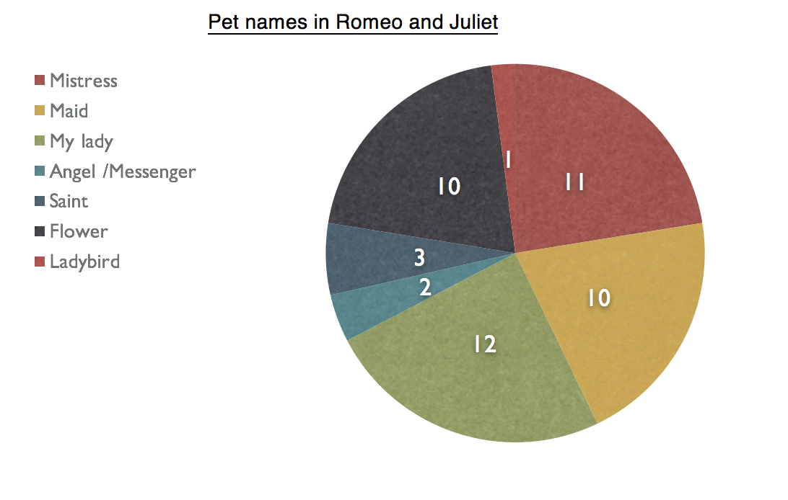
</figure>

# Confidence versus Uncertainty

I am looking at the play from an angle that questions whether the overall play is a play of confidence or a play of uncertainty and doubt. 
Using computer programme Ubiquity, we can see highlighted words in the whole text that are semantically connected to a specific topic, in this case Confidence and Uncertainty. It also presents an overall number of such words, making it very presentable to the user.

<figure>
    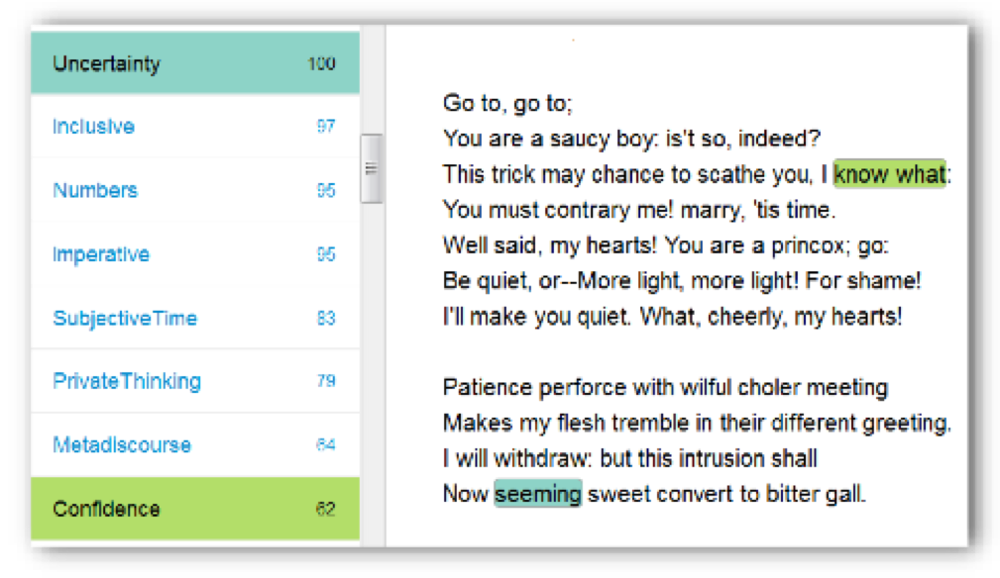
    <figcaption>
    Picture 1: Ubiquity programme
    </figcaption>
</figure>

From the Ubiquity, it can be already seen that the play contains significantly more uncertain words than words of confidence. However, it is imperative to double check if the words really mean what they suppose to. By doing that, one can also see the layout of the play and how these words are integrated in the text. Interestingly, the word of confidence ‘know’ is presented first in the middle of the act 1, scene 1, line 121 (Prince Escalus: “To know our further pleasure in this case”), followed by many other words of confidence. The word ‘seem’ as the first word of uncertainty is presented later in act 1, scene 1, line 185 (Romeo: “Ay me! sad hours seem long.”). It could be argued that the play started with confident content, leading the readers to believe that the play and its characters are certain in what they are saying therefore behaving. However, the end of the play does not present that the same observation. More and more words of uncertainly are presented as the reader reads closer to the end and two of those words (some, things) finalise the play in act 5, scene 3, 
lines 3283 and 3284 (Prince Escalus: “Go hence, to have more talk of these sad things; Some shall be pardon'd, and some punished”). 
To deeper understand Romeo and Juliet, one should always ask themselves whether the play is different from other Shakespearean plays or similar, and to what extent the differences and similarities portray the real understanding of Romeo and Juliet. 
Using computer programme AntConc, we can see how many times a specific word or a symbol is used in the play and exactly where and when in the play that occurs. Continuing with the research of uncertainty versus confidence, a question mark (?) in the play would be interesting to explore as it presents a sense of questioning therefore uncertainty. 

<figure>
    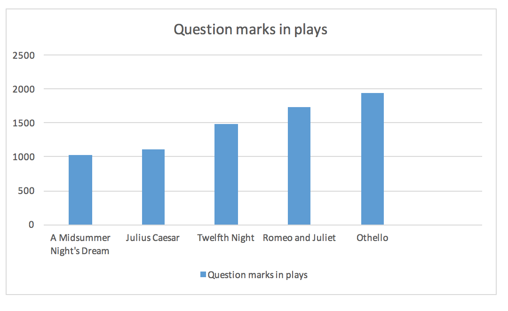
    <figcaption>
    Figure 1: Bar chart presents who many times a question mark occurs in the play
    </figcaption>
</figure>

With the use of AntConc result, it was clearer to the readers to create a bar chart rather than presenting the raw results. As the Figure 1 above shows, question mark in Romeo and Juliet occurs around 1700 times; this is significantly more than in A Midsummer Night’s Dream, Julius Caesar and Twelfth Night. However, Othello presents even more question marks than Romeo and Juliet. This could occur due to the nature of Othello as it is not only a tragic play but also a play of uncertainty, in which characters continuously question their fidelity, truthfulness and promise. 
As the result of the AntCont shows a high occurrence of question marks in the play, taking a closer look at the characters is important to see whether a feeling of uncertainly is specific for a character or the overall play. With the help of computer science student and using the operating system Linux, the question mark was examined further and focused on how many times a character asked a question.

<figure>
    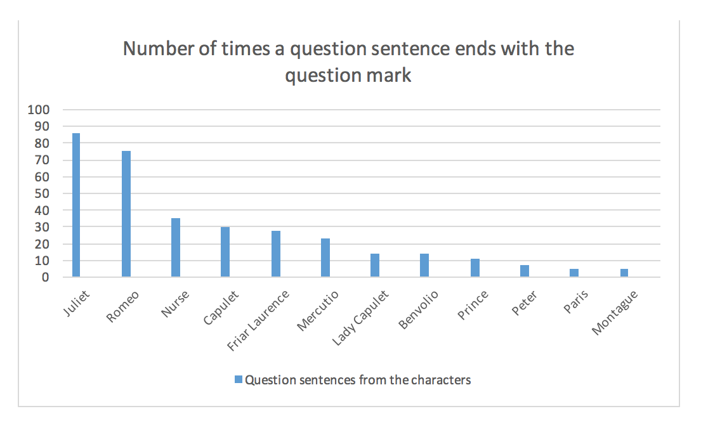
    <figcaption>
    Figure 2: Bar chart presents a number of question marks in sentences spoken by characters 
    </figcaption>
</figure>

As Figure 2 above shows, Romeo and Juliet ask the most questions, which is understandable because they are the main protagonists of the play. However, interestingly, Juliet asks around ten more questions than Romeo. Therefore, it could be also argued that the play itself is not only uncertain but also the characters, especially Juliet portray a sense of uncertainty to the reader. 
With the use of AntConc, it is possible to examine specific words of confidence and uncertainty in greater detail, especially to see the frequency of such words in other Shakespearean plays. As Figure 3 below shows the concordance plot of AntConc’s results, ‘I will’ or ‘I’ll’ occurs significantly more in Romeo and Juliet than in other plays. This is presented in a light of confidence. However, one should keep in mind that shown results of frequency of one word cannot generate an overall interpretation of the play. Therefore, looking at other words of confidence would be imperative.

<figure>
    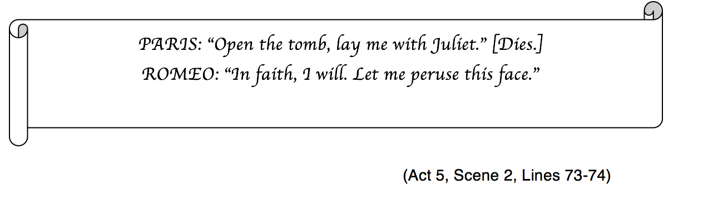
</figure>

<figure>
    <figcaption>
    Figure 3: Concordance plot for 'I'll'
    </figcaption>
    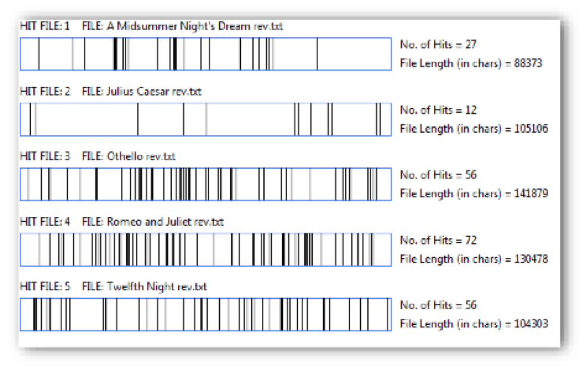
</figure>

As Figure 4 below shows the concordance plot of the word ‘know’, including ‘I know’, the results on the other hand present such word in Romeo and Juliet occurring significantly less than in Julius Caesar, Othello and Twelfth Night. In comparison to Julius Caesar and Othello and other words of confidence, Romeo and Juliet almost always present less confident words. Therefore, it can be argued on that basis Romeo and Juliet is indeed less confident play.

<figure>
    
</figure>

<figure>
    <figcaption>
    Figure 4: Concordance plot for 'know'
    </figcaption>
    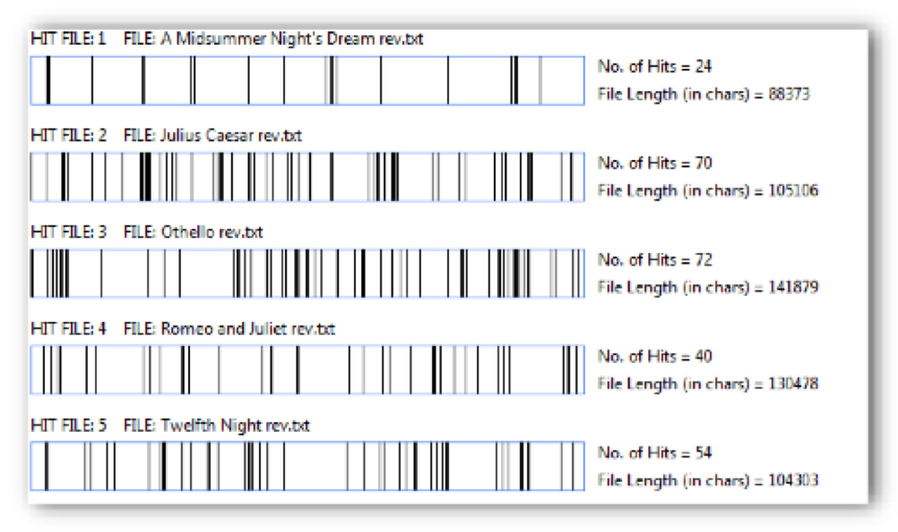
</figure>

On the other hand, looking at the words of uncertainty, word ‘some’ occurs often enough to support the argument that the play’s content as well as character’s speech and behavior portray uncertain atmosphere, as it is shown below in the Figure 5. However, Othello again scores the highest.

LADY CAPULET: “The people in the street cry Romeo, Some Juliet, and some Paris; and all run.” (act 5, scene 3, lines 191, 192) 

<figure>
    
</figure>

<figure>
    <figcaption>
    Figure 5: Concordance plot for 'some' 
    </figcaption>
    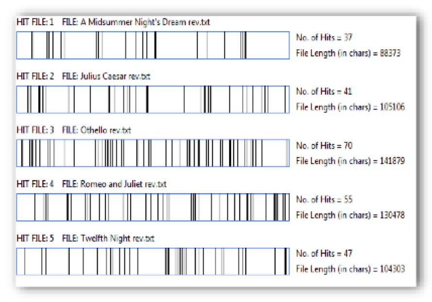
</figure>

The same can be observed in the Figure 6 below, which furthermore emphasises the overall observation of the play.

FRIAR LAURENCE: “Stay, then; I'll go alone. Fear comes upon me: O, much I fear some ill unlucky thing. (act 5, scene 3, lines 3090, 3091)

<figure>
    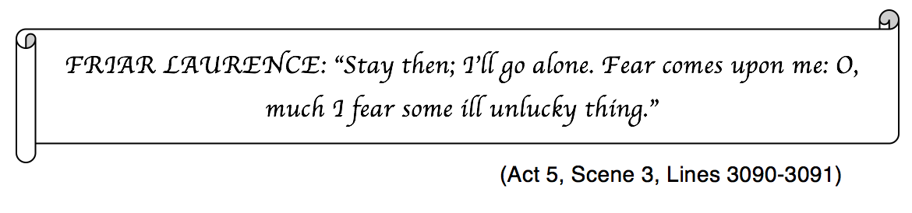
</figure>

<figure>
    <figcaption>
    Figure 6: Concordance plot for 'thing' 
    </figcaption>
    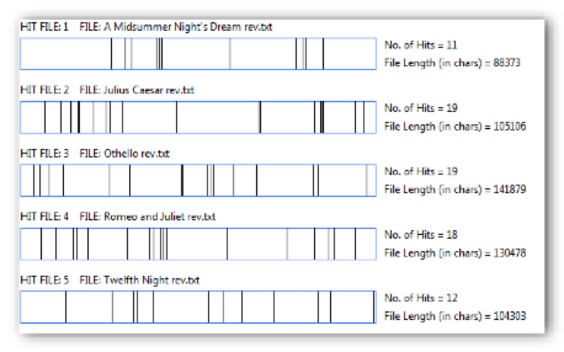
</figure>

# Positivity vs Negativity

<figure>
    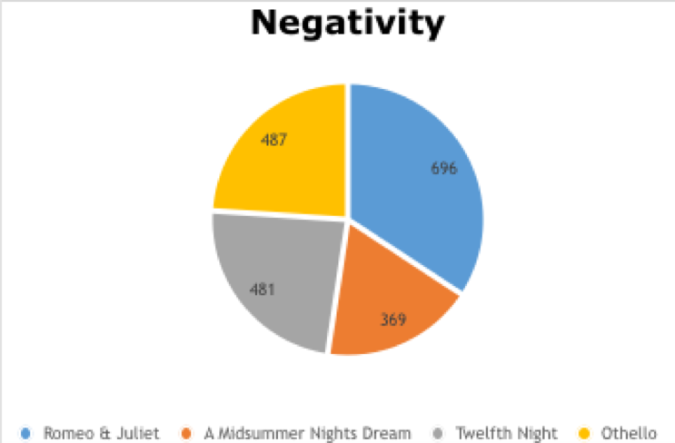
</figure>

<figure>
    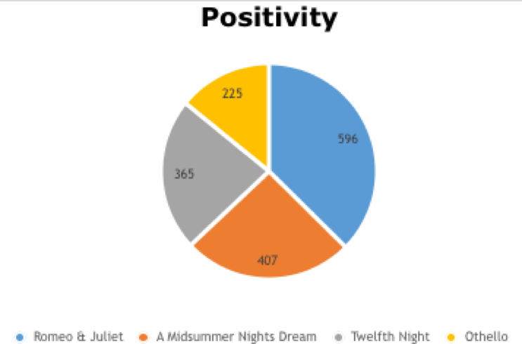
</figure>

**Negative Ratios**

Romeo & Juliet: **1:37**

A Midsummer Night’s Dream: **1:47**

Twelfth Night: **1:44**

Othello: **1:57**

**Positive Ratios**

Romeo & Juliet: **1:43**

A Midsummer Night’s Dream: **1:42**

Twelfth Night: **1:58**

Othello: **1:124**

# Evaluation

Based on what we can see from the graphs above, it is ironic that the play ‘Romeo and Juliet’ has the most amount of negative words throughout compared to other Shakespeare examples when Romeo and Juliet is portrayed as a play about love and affection between two characters. Furthermore from the ratios displayed it illustrates that negative words in Romeo and Juliet occur far more frequently that Negative or Positive words in any of the other plays that it has been compared too. This discovery was made using the ubiquity tool that splits the play into different subsections and manages to pick different types of words, this helped us to pick out the negative and positive words which was then evaluated and presented here.

# A closer look

Looking at the beginning of the play, there appear to be more negative adjectives used compared to positive adjectives. It was discovered this through processing the text through Ubiquity, a program that split the play into specific subsections. Through these subsections, it was possible to pinpoint the exact instances of Positivity and Negativity in the play, and each relevant section was highlighted.

**Negativity (instances in the first few paragraphs) - 6 adjectives**

**Positivity (instances in the first few paragraphs) - 3 adjectives**

This was a good starting point, as it allowed us to question why exactly Shakespeare decided to open this play with a predominantly negative tone. From this, it was concluded that he is perhaps foreshadowing the eventual tragedy of Romeo and Juliet, and ultimately sets the scene.
When looking at the play overall in these terms, it was concluded that overall positivity is used 352 times in the play, whereas negativity is used 671 times. This makes sense as Romeo and Juliet, despite being a play centered on love, is a tragedy and does not end positively for the protagonists.

**Emotion positivity (times positive words were used in the play) – 596 Words like (glad, pleasure, mend e.g. our toil shall strive to mend (in love x4, with love x4)**

**Emotion negativity (times negative words were used in the play) – 696 Words like (frown, poor, weak, toil, fatal, choler, hate)**

Using WordHoard, word cloud was created of which words are most popularly used throughout the play, and were investigated to determine whether they were positive or negative or neither. This allowed us to pinpoint exactly which words were most prominent, demonstrated above.
This data was then transferred into a more accessible format. This allows people to distinctly see through a bar chart and pie chart the overall negative tone of the play throughout.

# Common Positive Word

<figure>
    <figcaption>
    Love
    </figcaption>
    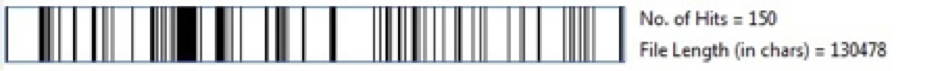
</figure>

<figure>
    <figcaption>
    Joy
    </figcaption>
    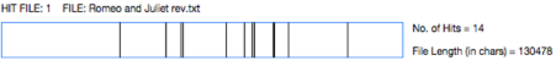
</figure>

<figure>
    <figcaption>
    Good
    </figcaption>
    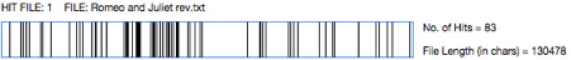
</figure>

From the information provided by AntConc on some common positive words, it is obvious that the most common positive word that I looked for was ‘Love’, which comes as no surprise as ‘Romeo & Juliet’ is portrayed worldwide as a romance.

# Common Negative Words

<figure>
    <figcaption>
    Hate
    </figcaption>
    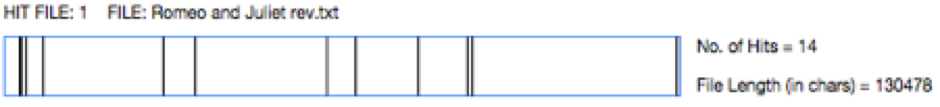
</figure>

<figure>
    <figcaption>
    Joy
    </figcaption>
    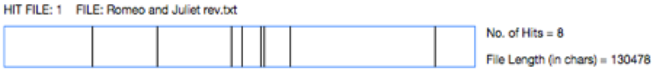
</figure>

<figure>
    <figcaption>
    Hurt
    </figcaption>
    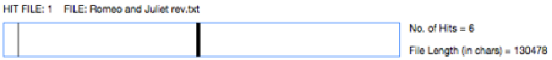
</figure>

From looking at some common negative words, the result is as expected from any typical romantic play, that being the negative words are not common and ‘Love’ appears more than ten times more than the word ‘Hate’. However, this assumption is a contradiction to the overall image of ‘Romeo & Juliet’ as when you look at the bigger picture it is revealed that all together negative words are more commonly used than positive words. This makes things interesting as previously stated, Romeo and Juliet is seen as a romantic play yet negativity is a more prominent theme in this case, which possibly introduces the idea the play is overall a tragedy.
Looking at the above results from AntConc from the common negative words, something interesting that was revealed was the use of the word ‘Hurt’. As clearly shown, all instances of the word are occurring at the same time in the play except one use of the word, which is at the start. This tells us that there is a particular scene in the play where one or more characters could express a great deal of emotional pain, possibly due to another character which is unexpected from a romantic story.

# Promises

Using WordHoard it was odd that none of the words that Shakespeare typically uses to mean promise shows up in the chart as showing up more or less than usual. It becomes more obvious when using AntConc because despite the fact that people say Romeo and Juliet is a play about promises, the word ‘promise’ only shows up once in the whole entire play and ‘promises’ also only shows up once. So using that as a base line I went through a whole dictionary of Shakespearean words to find any other words that Shakespeare used to mean promise. Once I generated the list I went back to AntConc and put in every word to so how often that they showed up in the play. After that I went through every play page by page to check that they were actually being used as promise and not one of the other possible meanings that these words usually also carry with them.

<figure>
    <figcaption>
    Promise words
    </figcaption>
    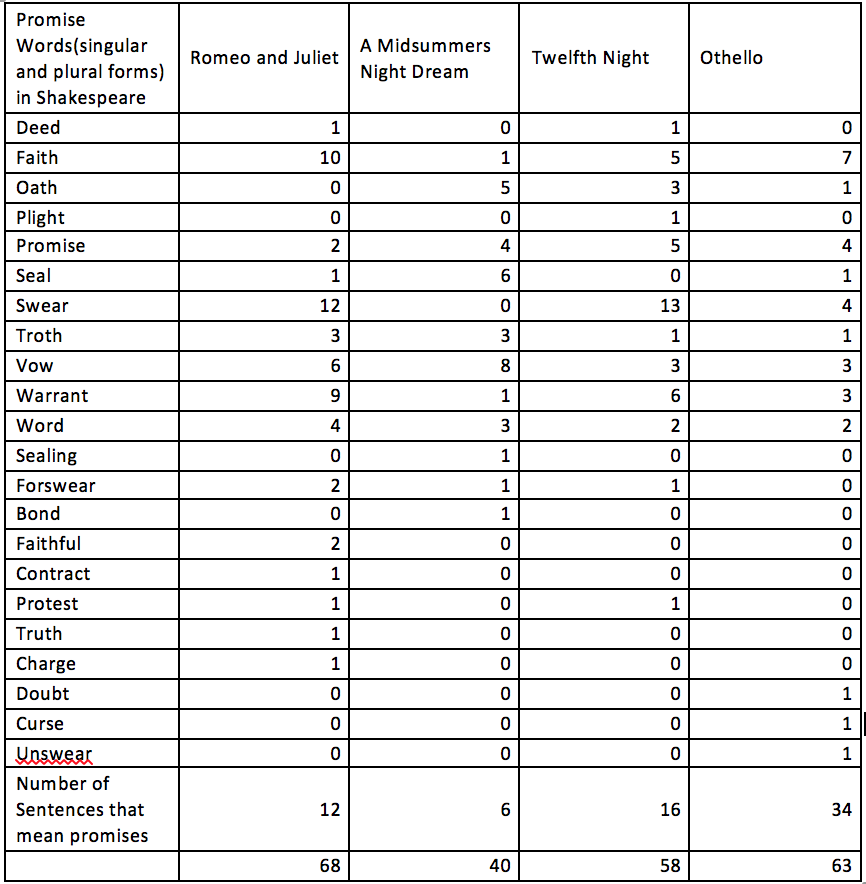
</figure>

This table shows every word used in the play to mean promise be they singular, plural, or a different tense of the word shown. It also includes the number of combined the number of lines that mean promise into a single number that appears in the play. When all the words and sentences are combined they give the total number of promises that are provided in the whole play. Even in a group with other plays where promises play a large role in the story and plot Romeo and Juliet still has more promises than the other three plays. For Twelfth Night and Othello it is actually the lines that make all the difference in whether they are a play about promise or not as if you remove them Romeo and Juliet will be even higher than them about them by over 20 words.

<figure>
    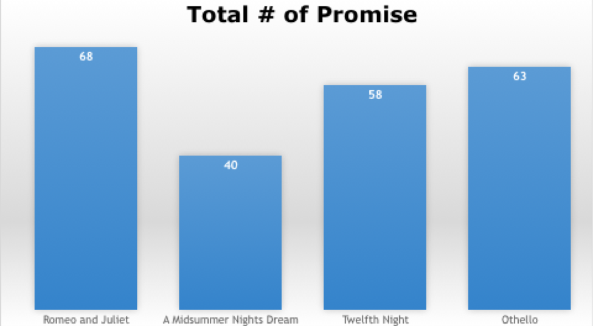
</figure>

In this chart it is easy to see that Romeo and Juliet has more promises than Midsummer Night’s Dream, Twelfth Night, and Othello though it is a very close call. A Midsummer Night’s Dream has the least number of mentioned promises in the play. Then it is Twelfth Night with 58 words and lines meaning promises in total in the play. Othello is a close second with 63 words and lines, which is expected when you look at the fact Othello is a play about breaking a promise to be faithful to your spouse. Romeo and Juliet comes out on top with 68 words or Lines that mean promise in the play. Thus Romeo and Juliet proves at least form the selected plays looked at to be a play more about promises than the rest of the selected plays.

<figure>
    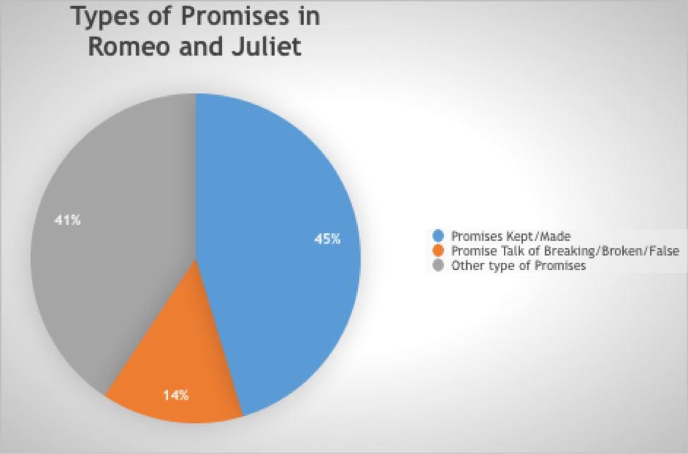
</figure>

So after calculating the total number of promises in the play I then divided them up into sections on how many of these promises were Promises that were being kept/made, how many of them were talking about breaking/broken/false promises, and how many were other types of promises for example I swear I am telling you the truth. Now what I found out from this is that some of these promises actually double up in the different categories. But based off this chart you can tell that 45% of all promises in the play of Romeo and Juliet is about promises that are being kept/made. This means that a better protion of the play involves posative realations of about the promises being made. Then only 14% of promises in the play are actually being talked about as breaking/broken/false which in the grand scheme of the play is a small percentage of the promises. Also a good portion of these promises are more along the lines of that the person doesn’t want to break their promises. Then the last 41% of the promises fall under the other category and really don’t have much to do with main driving points but it is interesting how promise is being used so much to show someone is being honest in the play.

<figure>
    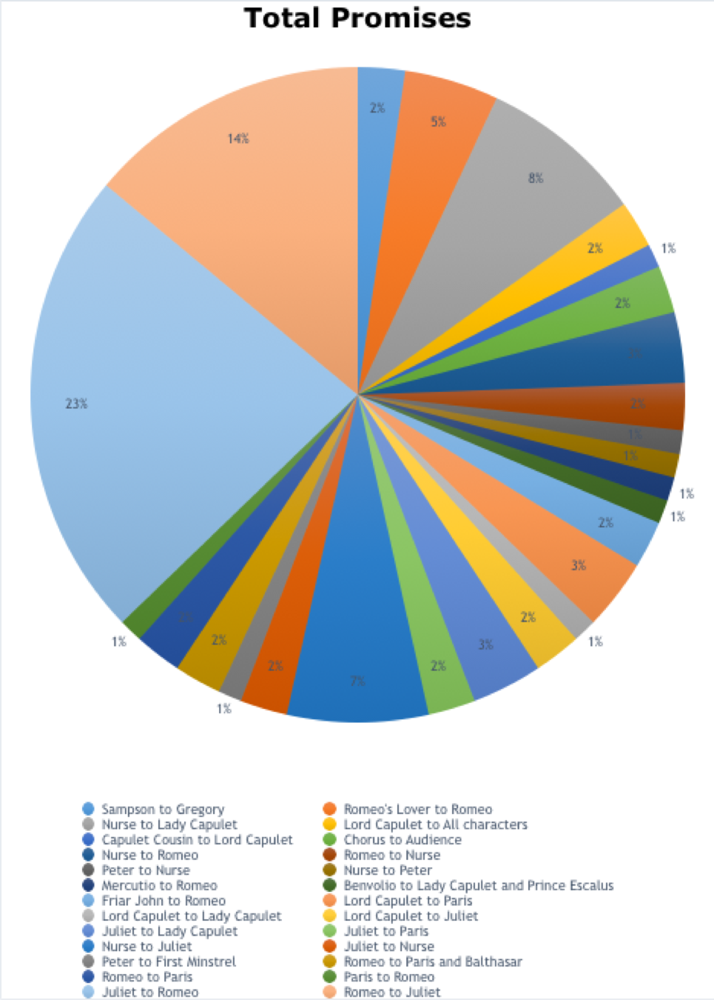
</figure>

The chart above shows the break down off every person who made a promise and who they are making the promise to. As you can see there are a lot of promises being made you can see that 37% of all promises are between Romeo and Juliet to each other. Upon a closer inspection 71% of all promises made in the play are about either Romeo and Juliet making or being made a promise in the play. This means that most promises in the play revolve around the star struck lovers and that their roles in the play have to do with most of the promises. The most interesting thing to point out about this chart is the fact that Juliet to Romeo promises are talked about more than Romeo to Juliet promises in the play.

<figure>
    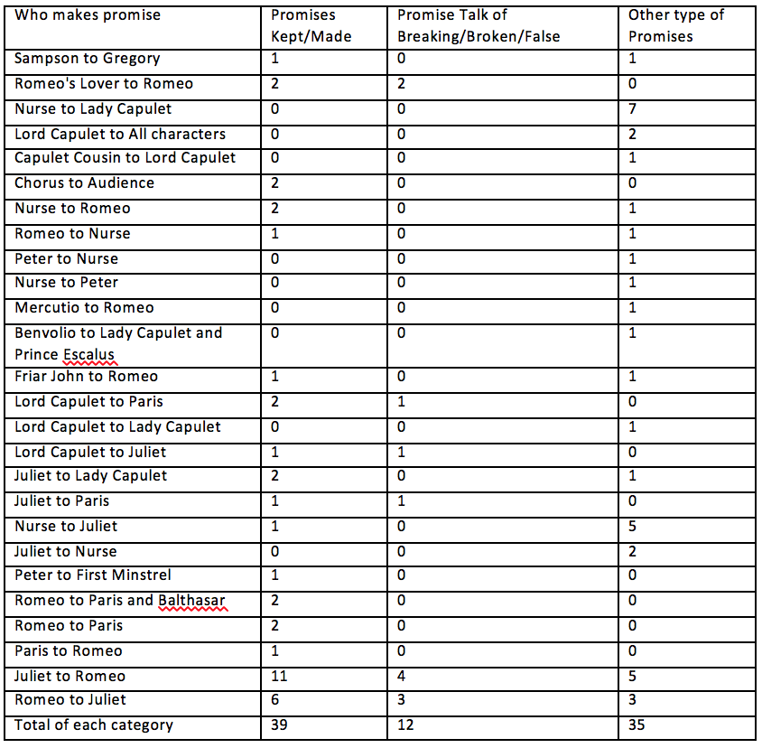
</figure>

This chart breaks down every promise made in the whole entire play into the three categories of promises. They are even further divided based off of who is making the promises and to whom those promises are being made to in the play. This allows for you to get an idea of the total promises that each character made and how they fall into the three categories of the types of plays. Some characters only make one type of play and some make a variety of different promises. Some promises in this play actually are doubled up with promises to multiple characters at once or talking about a couple of different promises all at the same time. This bring us up to a new total of 86 promises in the play all together as it now includes promises that talk about multiple promises at the same time. 

<figure>
    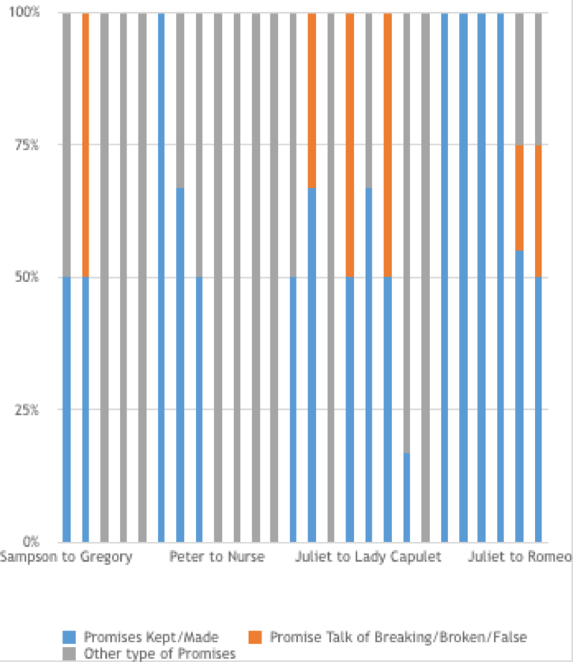
</figure>

This chart is just a nicer way of looking at the different characters and seeing what type of promises that they make for each of their promises. It also give you the ability to look and see if one character is more prone to one type of promise than another. When coupled with the pie chart that tells you the percentage of how many promises people make each other it is clear to see that a lot of the bars where there is only one type of promise is usually because that person only made a promise to someone or that with that particular person they will only say one type of promise.

<figure>
    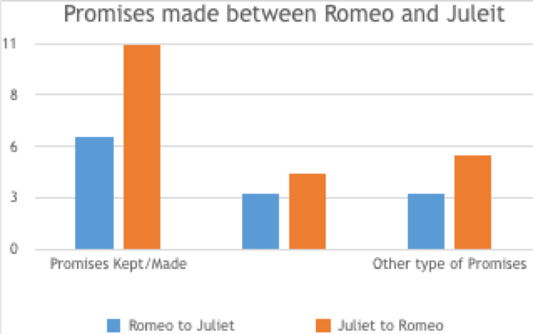
</figure>

As we saw in the pie chart Juliet talks more about her promises to Romeo than Romeo talks about his promises to her. As you can see in this chart Juliet kept/makes a lot more promises to Romeo than she does talking of breaking/broken/false promises or other types of promises. This means that she makes or keeps more promises than Romeo does. But it also means as you can see that she breaks more promise than Romeo and has a lot of other types of promises than he does as well.

<figure>
    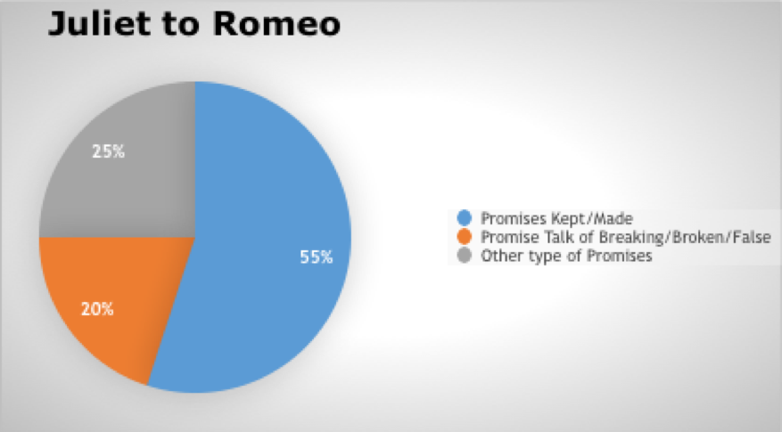
</figure>

Now what I found out from this is that some of these promises actually double up in the different categories. Juliet makes a lot more promises than Romeo at 55% of promise being kept/made when for Romeo only 50% of his promises are kept/made. Now a reason that maybe Juliet has such high promises made/kept is that a lot of the times her promises that were being talked about as breaking/broken/false were actually her talking about how she would have to keep her promises to Romeo but others kept trying to get her to break them. Juliet only has 20% of all the promises she makes falling into this category while 25% of Romeo’s promises to Juliet fell into the talk of breaking/broken/false category but upon closer inspection in the text 2 out of the 3 promises that Romeo is supposedly breaking was actually Friar John saying that Romeo was breaking his vows to Juliet and not actually him breaking them or saying he was breaking them. Thus the remaining 25% of other promises for Romeo to Juliet and Juliet to Romeo is actually them talking about what Romeo should swear by and how Juliet doesn’t want him to swear at all in A2S2. But over all the actual number of promise as seen in the bar chart Juliet has more promise to Romeo than he does to her. So even though her percentages are smaller and means that proportionally he does more Juliet technically makes more over every type of promises than Romeo does to her.