 
Using a tool called WordHoard, we can view the words that appear in The Tempest
more or less than would be expected, compared to the rest of
Shakespeare’s plays.  The words in black appear more frequently in The Tempest
than in other plays; words in grey appear less frequently.

<figure>
    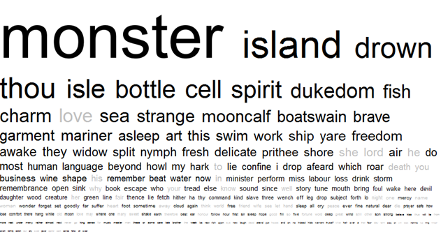
</figure>
 
It is clear from looking at the word cloud that the word “monster” is used far more often in The Tempest than in the rest of Shakespeare’s plays. However, this is a fairly obvious observation having read the play. Instead, it is much more useful/interesting to look at the words which appear more towards the middle of the word cloud, e.g. “swim”, “freedom” or “she”. With this in mind, we decided to look for interesting words or connections within these lines of the word cloud. From this, we came up with four key topics which we decided to investigate further:
 
- Freedom/slavery
- Identity
- Gender
- Sound/magic

# Summary
The Tempest (1611), one of Shakespeare’s eighteen comedies, centres around the vengeance of a past act of betrayal. Twelve years have passed since Prospero, the rightful Duke of Milan, and his daughter, Miranda, were exiled to a remote enchanted island after Prospero’s brother, Antonio, and Alonso, the King of Naples, deposed Prospero. After his arrival on the island, Prospero, a magician, acquires two slaves: a spirit named Ariel, and Caliban, the deformed monster and son of the witch Sycorax. Sensing that Antonio is aboard a nearby ship, Prospero creates a tempest (a storm) which destroys the ship and causes its passengers, including Alonso and his son Ferdinand, to take shelter on the island. Through the use of magic, Prospero then separates the passengers into groups by placing them on different parts of the island. Ferdinand finds himself separated from his father and soon after meets Miranda; the two fall in love instantly. Upon discovering this, Prospero enslaves Ferdinand and controls him with magic. Meanwhile, Ariel asks Prospero for his freedom and Prospero promises it will be granted if Ariel helps him with his plan regarding the new arrivals on the island. A new power struggle emerges between Antonio, Sebastian and Alonso, with the latter two conspiring to kill the latter so that Sebastian can become king. Caliban also becomes involved in another power struggle, recruiting Trinculo and Stephano in a plan to overthrow Prospero. However, Caliban’s plan is thwarted by Ariel who overhears and informs Prospero. Prospero later grants Ferdinand both his freedom and permission to marry Miranda. Prospero sets a trap for Caliban, Trinculo and Stephano and they are chased away by a group of goblins disguised as hounds. With all his enemies finally under his control, Prospero ultimately decides to forgive them all. He then instructs Ariel to create perfect sailing conditions so that the group can return home safely. After doing so, Prospero grants Ariel his freedom. Prospero also pardons Caliban. The play ends with Prospero renouncing magic and asking the audience to set him free from the island through their applause.

# Freedom/Slavery
To begin our analysis of the topic of freedom/slavery in The Tempest, we decided to use AntConc to find the number of hits of certain words related to this topic, including titles e.g. “master” and “servant” and generic words such as “confined” and “freedom”. We found all of these words by using WordHoard and noting any words which related to either freedom or slavery, before entering them into AntConc. Below are our results in the form of concordance plots.

<figure>
	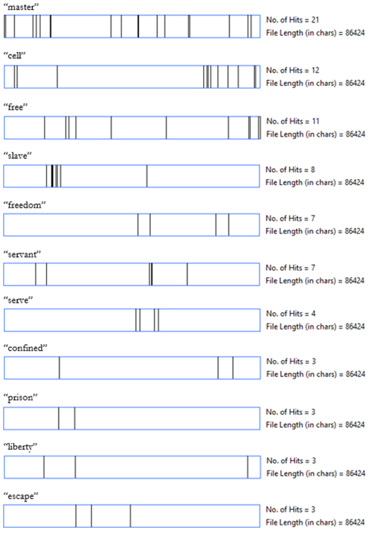
</figure>
From this, we can see that the word “master” appears consistently throughout the play, whereas words such as “slave” become less frequent and words such as “freedom” become more frequent over the course of the play.

## Why does this matter?
Observations such as the ones made above are useful when linked with some of the themes of the play, such as freedom/slavery. The idea of “master” being a consistent word throughout The Tempest is perhaps indicative of the resilience of Prospero’s powerful status as the master of Ariel and Caliban, as well as other characters later in the play. The idea of “slave” becoming less frequent over the course of the play is perhaps indicative of the way in which characters such as Ariel, Caliban and Ferdinand are all stripped of their slave status by the end of the play. Similarly, the way in which the word “freedom” becomes more frequent over the course of the play may also be the result of characters such as Ariel, Caliban and Ferdinand being granted their freedom by The Tempest’s end.

- Take another look at the concordance plots above and look for any other interesting patterns or connections then think about what they might mean.

## Master Prospero
Using the initial idea of Prospero’s role as master and slave owner, we decided to investigate this idea of power even further. Using Vocabalance, we found Prospero’s top ten most used words: 

<figure>
	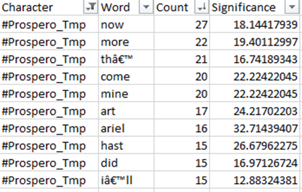
</figure>

From this we can see distinct patterns/connections in his speech by looking at what kind of words Prospero uses most. As expected, a few of these are common usage words such as “th’”, “art”, “hast” and did”. However, words such as “now”, “more” and “come” are commands, “mine” is possessive and “I’ll” and “Ariel” obviously concern Prospero and Ariel respectively.

## Why does this matter?

<figure>
	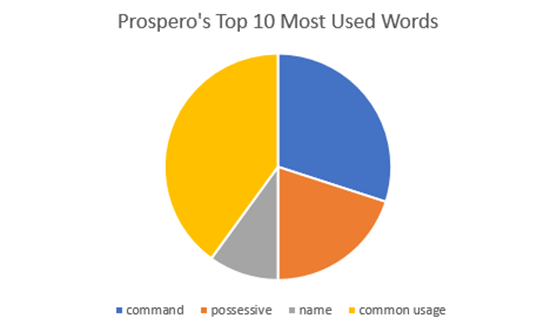
</figure>

From this graph, we can see that commanding and possessive words constitute half of Prospero’s top ten most used words. 

It could be suggested that the prevalence of command words in Prospero’s top ten most used words is telling of his role as master, as it shows that a lot of his speech is centred around commanding other characters to do things. For example, in Act I Scene II, Prospero commands Ariel to

> “Go make thyself like a nymph o’ the sea: be subject
To no sight but thine and mine, invisible
To every eyeball else. Go take this shape
And hither come in’t: go, hence with diligence!”
{:title="The Tempest, Act 1, Scene 2" .highlight}

Similarly, Prospero’s use of possessive or self-involved words enhances the idea of Prospero’s power as he views his wants, needs and possessions above that of the other characters in the play. In particular, the prevalence of the word “mine” emphasises the theme of slavery as well as Prospero’s role as slave owner as he views the enslaved characters of Ariel, Caliban and Ferdinand as belonging to him. Lastly, the appearance of “Ariel” within the above list of Prospero’s most used words emphasises both the control Prospero has over the spirit, as well as how often Prospero uses and commands Ariel to carry out tasks for his own gain.

## The Three Slaves: Ariel, Caliban and Ferdinand

After analysing Prospero’s role as master or slave owner, we next decided to look at the characters who appear, to varying degrees, in the role of slave. Three characters are made slaves over the course of the play: Ariel, Caliban and Ferdinand, and each are enslaved for various reasons formed by Prospero. Again, we used Vocabalance in order determine each of the slaves’ top ten most used words. As we did with Prospero, think about what kind of words appear in each of these character’s word lists.

<figure>
	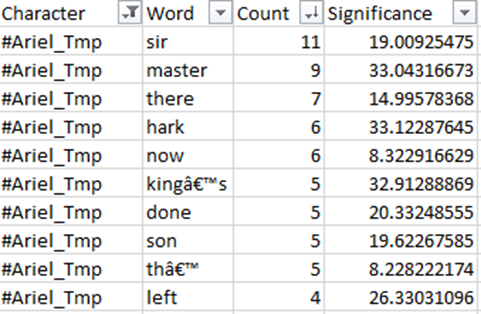
</figure>

Unsurprisingly, Ariel’s top two most used words are “sir” and “master”, i.e. male forms of address. If we think about this in terms of his status as a slave, these words further the ideas of submission to a more highly ranked figure (Prospero).

- Have a think about the rest of Ariel’s top ten most used words.
- Perhaps contrast Ariel’s words with Prospero’s and think about any difference/similarities you might find.

Caliban:

<figure>
	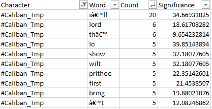
</figure>

Like Ariel, Caliban’s top ten most used words also include a male form of address (“lord”), again suggesting ideas of submission and reinforcing his status as a slave. 

What’s really interesting about Caliban’s most used words is the fact that “I’ll” is at the top. We investigated this further by using Vocabalance to track the other characters’ usage of the word.

<figure>
	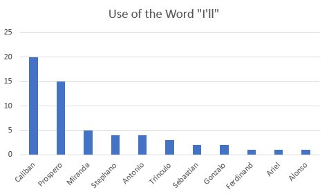
</figure>

From this, we can see that Caliban uses the word “I’ll” throughout The Tempest more than any other character, even the domineering and self-involved Prospero.

- Think about what Caliban’s use of the word “I’ll” mean in terms of his enslavement. As mentioned previously, “I’ll” is a word which revolves around the speaker, therefore it is unsurprising that Prospero uses it - why then is it surprising that Caliban uses it?
- Think about why Caliban might use “I’ll” so much in terms of his storyline throughout the play, i.e. his thirst for freedom.
- Why do Ariel and Ferdinand (the play’s other slaves) not use “I’ll” to the extent that Caliban does?

Like Prospero, Caliban’s top ten most used words also includes command words (“bring” and “show”). 

- Compare and contrast the characters of Prospero and Caliban, noting any differences and similarities between the two.
- Think about why Shakespeare might create similarities between a slave and a slave owner, and think about what significance this has to The Tempest as a whole.

Ferndinand:
<figure>
	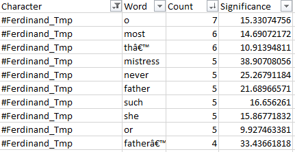
</figure>

At first glance, Ferdinand’s most list of his most used words is largely made up of common usage words (“o”, “most”, “th’”, “never”, “such” and “or”). However, some of these may hold some hidden meaning. 

- The words “most” and “never” are words which deal with extremes. Think about what (if any) extremes Ferdinand faces in The Tempest and how this connects to the language he uses.
- Similarly, have a think about the word “or”. Although seemingly insignificant, the word “or” is obviously connected with ideas of choice. Think about how the concept of choice applies to Ferdinand and those around him.
- In more general terms, think about the reasons why Ferdinand’s most used words are dominated by common usage words. What does this say about him as a character? 
- Compare Ferdinand’s most used words with the other slaves, and perhaps Prospero too.

Ferdinand’s most used words also include “she” and “mistress”, and we can presume this is due to his connection with Miranda as the only female character in the play.

- Have a think about the fact that 20% of Ferdinand’s most used words are directly connected to Miranda. What does this say about his feelings for her/their relationship in general?

# Gender

Referring back to the word cloud again, we can see that the word “she” is the second least used words in The Tempest in comparison to the rest of Shakespeare’s plays. This made us think about the wider concept of gender within the play, and so we decided to investigate this further. 

The Tempest is dominated by male characters. The play features nineteen individual speakers, of which fourteen are male, one is female and four are genderless (the four spirits). In addition to this, there are a group of sailors who we can assume are also male. Below is a graph showing the percentages of speakers according to their gender.

<figure>
	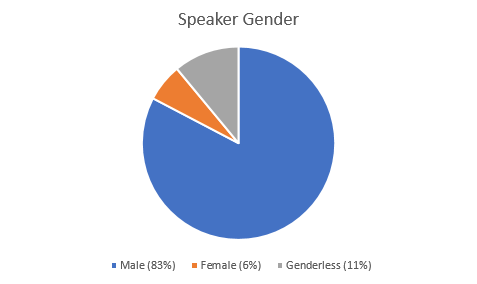
</figure>

This shows us that the overwhelming majority of the play’s speech is spoken by the male characters, at 83%. This is somewhat unsurprising, given that most of the characters are male. However, the graph also reveals another interesting point: the genderless (i.e. the spirits) characters speak more than the female characters (Miranda).

## Why does this matter?

While the data above shows huge discrepancies regarding speech and gender, it is important to look at just how much the individual characters speak. 

<figure>
	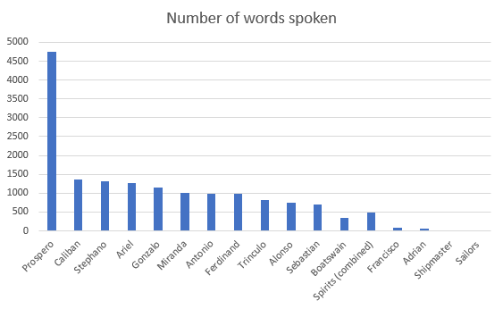
</figure>

This graph shows us the number of words spoken by each character. Unsurprisingly, as the protagonist, Prospero speaks the most. However, if we take a look at Miranda, we can see that  she speaks roughly the same amount of words as the vast majority of the other characters.

<figure>
	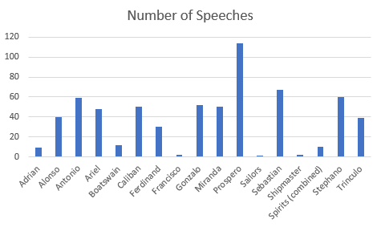
</figure>

Similarly, if we look at the number of speeches per character, we can see that, again, Miranda has roughly the same number of speeches as many of the other characters, with the obvious exception of Prospero. Note also,  she speaks more than some of the play’s key characters, including Alonso, the king. 

- Think about Miranda’s role as the only female in the play versus how much/often she speaks. What does this say about the role/importance of women in The Tempest as a whole?
- Compare the amount Miranda speaks with the characters who speak a similar amount. What similarities/differences exist between them?

## Pronouns and nicknames

We next returned to our initial findings about the word “she” and decided to look at the use of all (male and female) pronouns throughout the play. Using Wordhoard we found that the pronouns “she”, “her”, “he” and “his” were all used less in The Tempest in comparison to the rest of Shakespeare’s plays. Below is the WordHoard data for each of the pronouns.

<figure>
	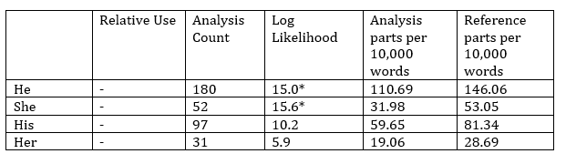
</figure>

Data explained:

- The “Relative Use” column shows whether a word is more or less frequent in The Tempest compared to the rest of Shakespeare’s plays, just as the black/grey colour of the words show in the word cloud. Here we can see each of the pronouns is used less (minus in the table or grey in the word cloud).
- The “Log Likelihood” column is perhaps the most important. It shows the extent to which the frequency of a word in The Tempest in comparison to its frequency in the rest of Shakespeare’s plays. The number of asterisks shows the significance of the result, i.e. the more asterisks, the more difference between the frequency of the word in The Tempest compared to the rest of Shakespeare’s plays. Here, then, we can see that both “he” and “she” are used significantly less in The Tempest than in other Shakespearean plays.
- The “Analysis parts per 10,000 words” column again shows the frequency of a word in The Tempest alone. For example, “he”appears 110.69 times per 10,000 words.
- The “Reference parts per 10,000 words” column performs a similar function, showing the frequency of the same word but this time across all of Shakespeare’s plays. E.g, “he” appears 146.06 times per 10,000 words. Therefore my comparing this column to the previous one, we can see that the word “he” appears fewer times per 10,000 words in The Tempest than in the rest of Shakespeare’s plays.

## Why does this matter?

It’s clear that each of the pronouns (he, she, her and his) appears less often and less frequently in The Tempest than in the rest of Shakespeare’s plays. We’ve already hypothesised that the female pronouns are used less because of the lack of female characters. But what about the male pronouns? In a male dominated play, it would be expected that there wouldn’t be much of a discrepancy here but, clearly, there is.  One possible explanation is the appearance of genderless characters throughout the play, which we have already noted speak more than the female characters (11% compared to 6%). We might also be able to draw a link between gender/pronouns and slavery here…

- Think about how the characters, especially Prospero, address Caliban (an enslaved male).
- Do pronouns, like names, have a humanising purpose? If so, what could be the purpose of a lack of pronouns - as there is in The Tempest?
- Let’s also refer back to Caliban’s use of the word “I’ll” as we noted earlier. Could this be his way of compensating for the other characters’ refusal to use male pronouns in reference to him?
- Similarly, think about the functions of nicknames. Think about the functions of both positive and negative nicknames.
- Do they have a positive or negative effect?
- Think about why Prospero (and other characters) use nicknames, especially in relation to their individual motives/plans throughout the play. 

# Identity

In The Tempest’s environment of a magical island that transcends time and space and suspends reality, characters are in a constant struggle to maintain their identities. Another pressurising factor is Prospero’s patriarchal dominance over the more marginalised characters which can be seen to affect the way characters perceive themselves inwardly as well as how they perceive others. Using a system called VocaBalance, we first analysed the number of words spoken by each character to see whose identity was most prevalent and who was less sure of themselves. 

<figure>
	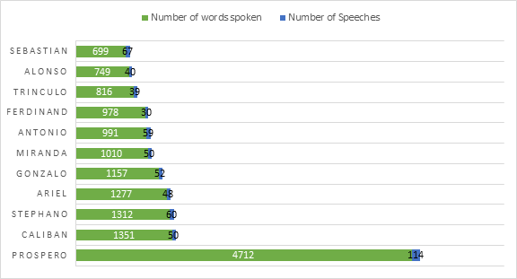
</figure>

Unsurprisingly Prospero both spoke the most and gave the highest number of speeches which only strengthens the idea of his control over the play’s characters and its outcome. What was unexpected was Caliban being the second most dominant character. His status as a slave and obvious aversion to Prospero’s captivity would suggest a mild mannered character yet his fight to gain his identity is made apparent above. We then used VocaBalance to analyse which words were most significant to Prospero.

<figure>
	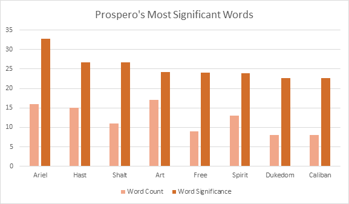
</figure>

Outwith nouns and names, Prospero’s most significant words are verbs used in the command form.  This highlights Prospero’s god like status on the island and his preference for ruling. His continuous reference to his rightful ‘Dukedom’ illustrates his need for revenge against his brother Alonso yet his actions in not treating Antonio like the ‘traitor’ he called him demonstrates his complex identity. Another factor that effectively displays Prospero’s enigmatic personality is his wrongful imprisonment of both Ariel and Caliban and his sometimes-petty outbursts towards them, such as when he calls upon spirits to pinch Caliban when he curses. This teamed with the fact that he offers to free Ariel and pardon Caliban at the end of the play once he has used them for his schemes shows the logical side of his character as appose to his vengeful side. 

In regards to Caliban’s identity it can be noted in the first graph that, though he is a slave, he is vocal in his dislike for his situation and actively attempts to change his position. Caliban being the only native of the island, was born to Sycorax the Witch and the devil and when describing his birth the word ‘littered’ is used instead of ‘born’. This hints at the premise that Caliban is more animal than human which coincides with the idea of his name being a near anagram for cannibal, derived from ‘Carib’ or ‘Caribbean’. 
As noted previously in the word cloud, ‘monster’ is the most used word. The other characters use this term to describe Caliban instead of using his name. This enforces the idea of Caliban being confined to a role or identity that the other characters choose to perceive him as. Using a tool called AntConc, we can see the number of times ‘monster’ appears throughout Shakespeare’s comedies. Though this word appears first in the word cloud and would seem too obvious to study, when compared with the other comedies the results look interesting. 

<figure>
	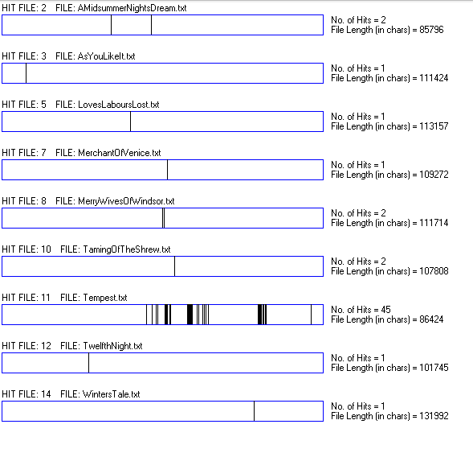
</figure>

Monster appears in the Tempest 45 times while the comedy with the closest number of appearances is A Midsummer Night’s Dream and Taming of the shrew, which both use the word twice. This shows that ‘monster’ is not a meaningless word but one of specific importance. It may be observed that the word appears is sporadic but heavy burst in the second half of the play. Using VocaBalance again, it was found that Trinculo used the word 23 times and Stephano used the word 19 times. From this we can evaluate that both Trinculo and Stephano were frightened or at the least perplexed when they met Caliban in the latter part of the play. However as the play develops, Caliban is seen to plot the murder of Prospero with the drunken pair and promises to serve Stephano in return. This calls into question Caliban’s intelligence and his judge of character as it is clear that they both don’t like him and are too drunk to carry out any evil plans. This shows Caliban to have a trusting, innocent nature regardless of his open hate for Prospero. This naivety is shown in this exert from the second scene of Act 1:

>When thou cam'st first, 
Thou strok'st me and madest much of me, wouldst 
   give me 
Water with berries in 't, and teach me how 
To name the bigger light and how the less, 
That burn by day and night. And then I loved thee, 
And show'd thee all the qualities o' th' isle, 
The fresh springs, brine pits, barren place and 
   fertile. 
{:title="The Tempest, Act 1, Scene 2" .highlight}

This illustrates that when Prospero first came to the island, Caliban taught him and Miranda how to survive on the island and in return Prospero taught him to speak. Despite these repeated signs of immaturity there are point in the play that reveal hidden layers to Caliban’s true identity. This exert shows Caliban describing his home island’s beauty (Act 3 Scene 2):

>Be not afeard; the isle is full of noises, 
Sounds and sweet airs that give delight and hurt not. 
Sometimes a thousand twangling instruments 
Will hum about mine ears, and sometime voices 
That, if I then had waked after long sleep, 
Will make me sleep again;
{:title="The Tempest, Act 3, Scene 2" .highlight}

Again we are confused as to who Caliban really is, other than the monster he is described to be. This passage shows his capability for verbalising his feelings towards his home. 

Using AntConc to decipher what words characters use when referring to Caliban, we noted that there is a collection of other words used to describe Caliban in an undesirable fashion. These include names such as ‘Hag-born,’ ‘Whelp,’ not ‘honoured with human shape,’ ‘Demi-devil,’ ‘Poor credulous monster,’  ‘Hag-seed,’ and ‘Strange Fish.’ All of these names make reference to either his parentage or lack of humanity, thus showing us again how the other characters have happily pigeonholed Caliban to be a native monster. 
In terms of the relationship between Prospero and Caliban, it is clear that the two have different narratives in explaining it. Caliban sees Prospero as a completely oppressive figure that has wrongly enslaved him while Prospero argues that he treated Caliban like an adopted son through caring for him and giving him an education. This was until Caliban attempted to rape Miranda which left Prospero seeing him as wholly ungrateful for the civilisation he had received. To Miranda and Prospero, self-knowledge and language allows one to fully understand themselves and their surroundings while Caliban shows little more than scorn for this gift. He does not see language as empowering. It only serves as a constant reminder of the differences between himself and the other character and how he has changed from the creature he was before they invaded his home. As shown by the exert below, it is clear that Caliban sees his only hope in finding his true self is by using the gift of language against Prospero (Act 1 Scene 2):

>You taught me language, and my profit on’t
Is I know how to curse. The red plague rid you
For learning me your language!

Using AntConc, we found that Caliban’s most used words were ‘I’ (5 times) and ‘I’ll,’ (20 times). This highlights his more introspective personality and how he thinks of himself before others. This may be due to his captive state as he must put himself first if he wishes to retain his identity or it may be in reference to his selfishness. We feel it is the former when all other information is considered. 

# Magic/Sound

Magic is used as a manifestation of power and control in the Tempest. The protagonist, Prospero, is a magician who enslaves a spirit, Ariel, to do his bidding in gaining revenge. Ariel, in turn, has control of the elements including the sea that surrounds the island which also symbolises the barrier between Prospero and the outside world. We used AntConc to see if general words related to the theme would hold any relevance or meaning.

<figure>
	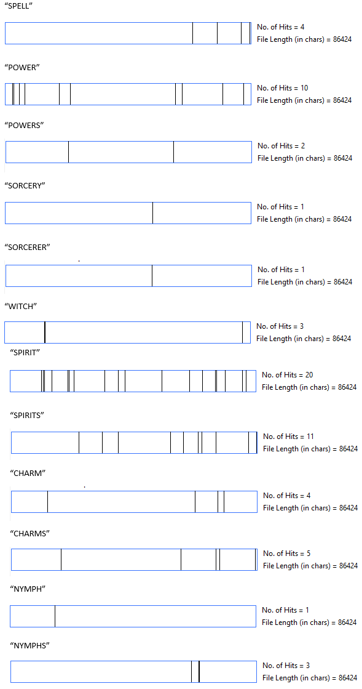
</figure>

As can be seen above, most words that would normally be seen as relevant, in relation to this topic, hold little strength in the play. The only two words with any real influence are ‘Spirit’ (20 times) and ‘Power’ (10 times). This ties in with the idea of the spirit, Ariel, using his magic to help Prospero gain back his power over Alonso as the rightful Duke of Milan. Below are examples of magic being used in the play from a position of power:

>'And pluck my magic garment from me' 
{:title="The Tempest, Act 1, Scene 2" .highlight}

>'My master through his art foresees the danger / That you, his friend, are in, and sends me forth' 
{:title="The Tempest, Act 2, Scene 2" .highlight}

>'Thunder and lightning. Enter Ariel, like a harpy, claps his wings upon the table, and, with a quaint device, the banquet vanishes' 
{:title="The Tempest, Act 3, Scene 3" .highlight}

>'My charms crack not, my spirits obey, and time / Goes upright with his carriage' 
{:title="The Tempest, Act 4, Scene 1" .highlight}

>'I have bedimmed / The noontide sun, called forth the mutinous winds, / And 'twixt the green sea and the azured vault / Set roaring war' 
{:title="The Tempest, Act 5, Scene 1" .highlight}

>'But this rough magic / I here abjure' 
{:title="The Tempest, Act 5, Scene 1" .highlight}

>'They all enter the circle which Prospero had made, and there stand charmed' 
{:title="The Tempest, Act 5, Scene 1" .highlight}

As you can see it is Prospero who holds all the power in using Ariel to do his bidding. The rest of the characters are mere pawns in his scheme, despite them being unaware of this until the end of the play. With this idea in mind we used VocaBalance to see which character used controlling words more often (aside from Prospero’s inclination towards command verbs). We found that there were few obvious words used, such as ‘control’ and ‘enslaved’ but when we studied the word ‘command’ we found an interesting outcome. As the graph shows, Prospero uses the word most and with the most significance. This harmonises with previous research as he is seen to be the controlling factor of the play. What was surprising was the fact that the Spirits came in second and Ariel third. This clearly highlights that those who are in possession of magical gifts hold the most commanding power in the play.

<figure>
	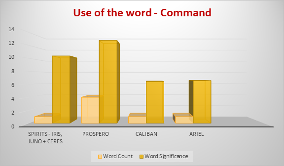
</figure>

Sounds have been used in clear association with magic. The sounds employed help to create the spirit of the mystical island and create atmosphere during key moments of action. Examples can be seen below:

>'A tempestuous noise of thunder and lightning heard'
{:title="The Tempest, Act 1, Scene 1" .highlight}
   
>'Where should this music be? i'the air or the earth?' 
{:title="The Tempest, Act 1, Scene 2" .highlight}

>'Hark! Now I hear them - Ding-dong bell' 
{:title="The Tempest, Act 1, Scene 2" .highlight}

>'Enter Ariel, invisible, playing solemn music' 
{:title="The Tempest, Act 2, Scene 1" .highlight}

>'the isle is full of noises, / Sounds and sweet airs' 
{:title="The Tempest, Act 3, Scene 2" .highlight}

>'Solemn and strange music' 
{:title="The Tempest, Act 3, Scene 3" .highlight}
 
>'Marvellous sweet music!' 
{:title="The Tempest, Act 3, Scene 3" .highlight}

>'they prick'd their ears, / Advanced their eyelids, lifted up their noses / As they smelt music...' 
{:title="The Tempest, Act 4, Scene 1" .highlight}

>'A noise of hunters heard'
{:title="The Tempest, Act 4, Scene 1" .highlight}

>'and, when I have required / Some heavenly music, which even now I do...' 
{:title="The Tempest, Act 5, Scene 1" .highlight}

Using AntConc, we looked at words relating to how characters process these sounds. The most noticeable result was the continuous use of the word ‘hear’ throughout the play, as shown by the concordance plot below. This indicates that music and sounds play a large role as character are having to listen to these noises in order to carry out action. 

<figure>
	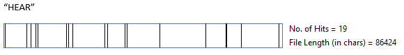
</figure>

Sounds have a multitude of purposes in this play. You are introduced to this concept immediately as in the opening scenes you see a ship’s crew being subjected to petrifying sounds that Prospero has ordered Ariel to create. All of these sounds are loud: ‘Whistle,’ ‘Cry,’ ‘Storm,’ ‘Roaring,’ ‘Thunderclaps,’ and ‘fire and cracks.’ (Act 1 Scene 1) These noises combined with the storm battering the ship instils exactly the kind of fear that Prospero wished to generate.
Prospero is often seen to use noises and music to threaten other characters. This is evident in many of his conversations. For example, when he is talking to Caliban, Trinculo and Stephano he says ‘I will plague them all, / Even to roaring.’ (Act 4 Scene 1)  He also threatens to put Ariel back in the tree he rescued him from and reminds him of his ‘groans / Did make wolves how,’ and also tells him, ‘Thou hast howled away twelve winter.’ (Act 1 Scene 2) While these are mostly threats, there is evidence of Prospero using distressing sounds while torturing Caliban. As shown when Caliban says  in Act 3 Scene 2:

>For every trifle are they set upon me, 
Sometimes like apes, that mow and chatter at me 
. . . Sometimes am I 
All wound with adders, who with cloven tongues 
Do hiss me into madness.
{:title="The Tempest, Act 3, Scene 2" .highlight}

This gives the impression that sounds are an integral part of Prospero’s power and his ability to control others. In addition to this, he also asserts his dominance by demanding submission through silence. He can be seen to this to his own daughter, Miranda, when he states ‘Ope thine ear.’ (Act 1 Scene 2). Overall sounds and music can be seen to influence many aspects of the play, whether that is Prospero’s power, characters reactions or the use of magic.

