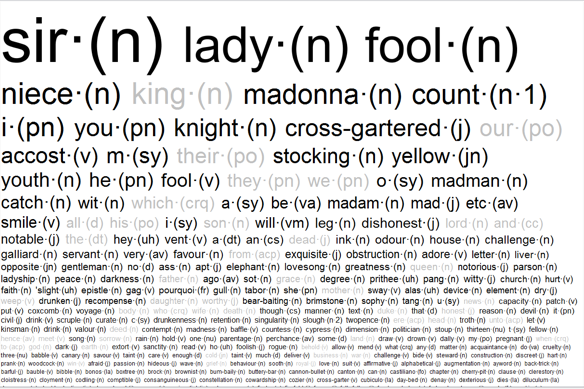
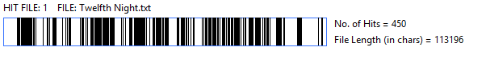
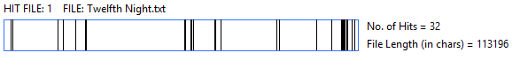
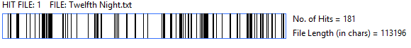
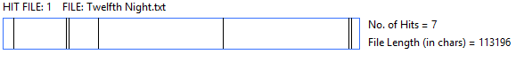
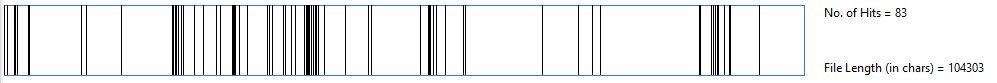
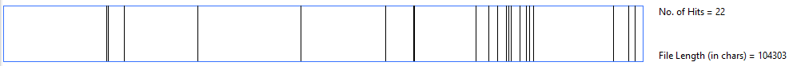
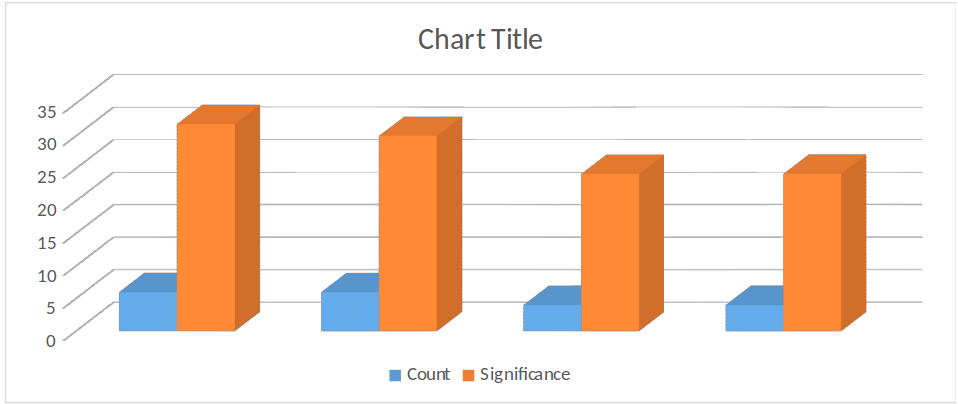

<figure>
    
</figure>

#Summary of the play

The Twelfth night is classed as a comedy play, which see Orsino, the Duke of
lllyria, falling in love with the Countess Olivia, he is rejected by her due to
her mourning the death of her brother. A ship carrying a young woman called
Viola who had been picked up by a group of sailors, after surviving a shipwreck,
she believes her twin brother Sebastian had be killed in the wreck.

Viola decided she wants to work in the Duke of lllyria household and the only
way to do so is to dress as man called Cesario, gaining her a job as a page boy
for Duke Orsino, who she quickly falls in love with but knows she cannot do
anything about her feeling due to the Duke believing that she is a male.

Orsino, who think that by sending his new page boy Cesario (Viola) to woo Olivia
on his behalf, but this then backfires as it only makes Olivia fall in love with
the page boy, making her want to marry him and sends her stewart Malvolio after
“him” with a ring.

Olivia’s uncle, Sir Toby Belch, her servant Maria, and Sir Andrew Aguecheek, who
is Sir Toby Belch friend, and also is looking to make Oliva fall in love with
him, they decided together to expose Olivia stewart Malvolio who is always
looking to woo Olivia, they do this by tricking him into believing that she is
falling in love with him by sending love letter to him asking him to dress in
certain clothes, which he does, leaving the Countess horrified and demand
Malvolio to be lock away as a madman.

Then the play take a turn which sees Viola twin brother Sebastian who has
survived the wreck turning up in lllyria, this leads to confusion between the
characters due to the fact that Viola and Sebastian look-a-like, which leads to
Cesario being challenged to a dual by jealous Sir Andrew, but Sebastian’s sea
capital and friend Antonio steps in to help and lands up being arrested.

The play ends with all being revealed that Cesario is in fact Viola dressed as a
male, then the attraction grows between Olivia and Sebastian, and also with Duke
Orsino falling in love with Viola, and both agree that when she starts dressing
like a female again they will get married.

# The significance of Words

We compared words that are linked to gender. We focused on this due to the
nature of the play, where Viola dresses as a man to work for Duke Orsino’s
household. AntConc reported the following results:

- The word "sir"
<figure>
    
</figure>
 

- The word "madman"
<figure>
    
</figure>

- The word "he"
<figure>
    
</figure>

- The word "she"
<figure>
    
</figure>

There is a relevant difference in use of words like Sir/Madam and he/she that is
directly linked to the events taking place in the play. As Viola dresses as a
man, we can clearly spot the difference between the use of male words over the
use of female words.

- The word "love"
<figure>
    
</figure>

- The word "Mad"
<figure>
    
</figure>

Seemingly, no one in the play is truly mad yet everyone is accused of madness
throughout the duration. This adds to the turbulent atmosphere of the play which
is brought about by the pursuit of love. It seems from the plotted graphs that
the words “Love” and “Mad” are used more frequently in absence of one another
which suggests that the madness occurs when searching for love and not from the
emotion itself. This adds to the idea that Orsino and Olivia’s “love” isn’t real
but is just a product of their search for love as Orsino changes his love
interest rather quickly from Olivia to Viola and Olivia changes her love
interest from Cesario to Sebastian.

# Character interaction

The interaction between characters plays a central role in this play.

Information about the structure of the play and insight into its plot itself can
be extracted by computing when main characters meet each other on stage.

Using a [tagged version of the
play](http://shakespeare.mit.edu/twelfth_night/full.html) and
[characters.py](/tools/), we parsed events like `Enter`s and `Exit`s and
computed which characters were on stage at any given time. In this chart
characters appear as columns and time goes by vertically downwards:

<figure>
    
</figure>

With this information and a basic understanding of the play, we can see how the
interaction between characters highlights different characteristics of the play.

One example are the appearances of Sir Andrew Aguecheek and Sir Toby Belch. Sir
Andrew, with a single exception, always appears on stage with Sir Toby, and
often enters after or leaves before him. Sir Toby is more dominant as a
character in terms of driving the action forward, while Sir Andrew is more of a
counterpoint to Sir Toby.

It is noticeable too how Duke Orsino, decisive to the play's argument, doesn't
appear very often.

We can also see how the appearances of Viola and Toby, each on a different
subplot, interleave prior to Act 3, when both subplots meet.

# Clothing

Clothing is an important part of the play of Twelfth Nights, due to the main
themes in the play is the fact that Viola is changing her identity to be a male
Cesario, to gain access to the Duke household, which then turns into her
nightmare as she falls in love with the Duke, but this love cannot be perused
due to her male identity, also the character of the Malvolio and why the words
were use to describe his clothing.

Colour of clothing in Elizabethan times was important in showing your station,
in accordance with English Law, known as the Sumptuary Laws. Failure to comply
with the Sumptuary Laws could result in fines, confiscation of lands, titles and
property, imprisonment and even death.

Purple clothing was worn only by royalty to instantly show their class. Colours
like gold, crimson, bright white etc. were reserved for the highest nobility.
Yellow, however, was a colour for the lower classes in Elizabethan society as it
was the most common dye as it was easy to produce and could be made in England
without shipping foreign plants. This shows yellow as a symbol of lower-class
and that Malvolio is unintentionally displaying his true position in his
society.Clothing

# Malvolio

<figure>
    
</figure>

Part of Malvolio’s character is the scene in which he dresses “silly” to try and
win Olivia’s heart; one of the words that is overused in Twelfth Night compared
to other Shakespeare’s plays is the word “cross-gartered”: this refers to the
yellow stocking with the criss-cross ribbon that is part of Malvolio’s costume.
As you can see from the above table generated by Vocabalance, the words ‘cross’,
‘yellow’, ‘stockings’ and ‘gartered’ are in the higher range of words that are
relevant to the character of Malvolio.

## Yellow as a Symbol

One of the most relevant words used in Twelfth Night when compared to other
Shakespeare works is “Yellow”, as shown by the Twelfth night Word-Cloud.

The main use of yellow in the play is for Malvolio’s cross-gartered stockings.
Yellow is a key symbol in the play and important as a symbol for Malvolio’s
character. Malvolio dons bright yellow stockings in order to attract Olivia and
move up in station.

As early as 1270, Anti-Semitism was gaining popularity in England and people
viewed the Jewish community as a threat. In response, King Edward I decreed that
Jews would need to identify themselves by wearing a yellow star on their
clothing to identify them as the lowest class in society and ostracize them from
other English people. Marvolio’s yellow socks would have been viewed as a symbol
of his lower class by the Elizabethan audience and would have accentuated the
ridiculousness of his endeavour of courting Olivia in order to rise above his
caste. Yellow has also been recognised in Christianity as a symbol of hope,
rebirth and renewal, and would have been worn by priests around Easter to
symbolise the return of Christ. These religious connotations could have been
applied to Marvolio as a symbol of his hope to reimagine himself as a worthy
suitor for Olivia and advance into high-class society. Yellow also has
connotations of boundless joy and excitement which would have made Malvolio very
unattractive to Olivia as she is mourning the death of her brother and the
stockings would have seemed very opposite and insensitive to her melancholy.

At the time of Shakespeare writing Twelfth Night, medical science surrounded the
idea of The Four Humours in a human body. The Four Humours were thought to be
the 4 liquids in the body that determined a person’s health by the balance or
imbalance of the liquids. The humours were: Yellow Bile, Black Bile, Blood and
Phlegm. Shakespeare appears to subscribe to this idea as he thinks that blood is
held solely in the liver, “…If he were opened and you find so much blood in his
liver as will clog the foot of a flea”. It was commonly believed that cowards
had white livers which were drained of blood as blood was the humour of passion
and courage.  An example from Shakespeare’s Macbeth shows Shakespeare’s
understanding of the humours.

“And take my milk for gall (1.5.53)”. Gall comes from an excess of yellow bile.
An imbalance of yellow bile in the body turns one ruthless and ambitious. The
replacement of milk in a woman, seen as a symbol of maternity and feminine
gentleness, for yellow bile shows that Lady Macbeth wants to abandon any
emotions in order to help kill King Duncan.

Romeo in Romeo and Juliet would be considered a textbook example of a person
with "too much blood." He is extremely "warm and moist" in his characterization
as being amorous, hopeful, courageous, optimistic, and loving. This is seen in
his interactions with Juliet, he is very loving and amorous towards her, and he
is also hopeful and optimistic that their relationship/marriage will be able to
overcome the feud of their families.

It was believed that an excess of yellow bile in a person could make them angry
and irritable which is personality traits that can be seen in Malvolio. 'I
marvel your ladyship takes delight in such a barren rascal… I protest, I take
these wise men that crow so at these set kind of fools, no better than the
fools' zanies.' (Act 1, Scene 5). Lines like this show that Malvolio doesn't see
much value in fun and humor. And he thinks this puts him above all the other
characters: here's another quote from Act 3, Scene 4:

'Go, hang yourselves all! You are idle shallow things: I am not of your element:
you shall know more hereafter.' When Malvolio accuses the other characters of
being idle and shallow, he's setting himself above them. He thinks he's better
than everyone else, and he fantasizes about having power over them so he can
make them follow his rules (one example is in Act 2, Scene 4, when he imagines
having the authority to scold Sir Toby for drinking too much).

This makes him the perfect target for the prank of the false letter, because
he's only too happy to believe it, and it takes him a long time to figure it out
while the other characters get to have fun at his expense.
