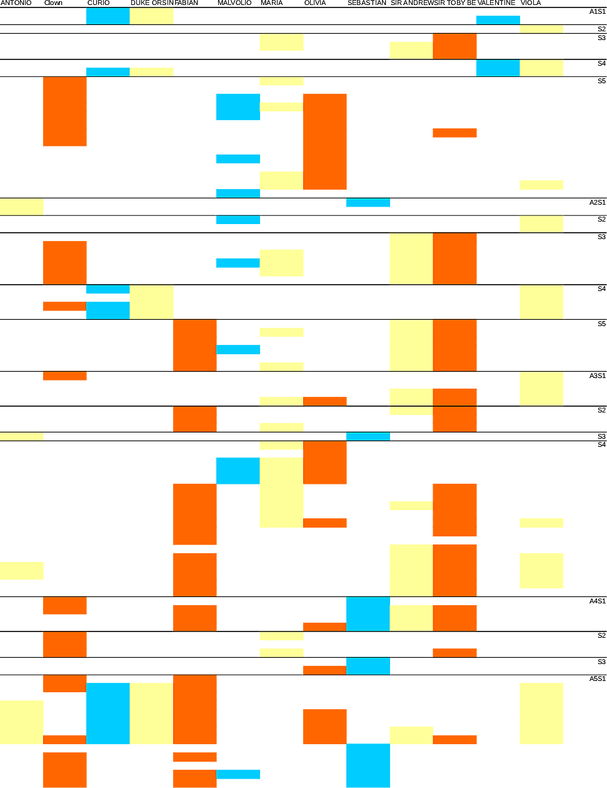

# Character interaction

The interaction between characters plays a central role in this play.
Information about the structure of the play and insight into its argument itself
can be extracted by computing when main characters meet each other on stage.

Using a [tagged version of the
play](http://shakespeare.mit.edu/twelfth_night/full.html) we parsed events like
`Enter`s and `Exit`s and computed which characters were on stage at any given
time. This chart is a representation of that:

<figure>
    
</figure>
