# Winter's Tale

## Summary

The Winter’s Tale is a late play composed between 1609 and 1611 and published in the First Folio of 1623. The play begins when Leontes, King of Sicilia, believes that his wife Hermione has committed adultery with his childhood friend Polixenes, King of Bohemia. Hermione is imprisoned whilst Polixenes escapes after he is informed by Leontes’ faithful servant Camillo that he has been ordered to poison him. Hermione is then trialled in a public inquisition, and after hearing the death of her son Mamillius, passes away. Whilst in prison, Hermione gives birth to a daughter who is banished by Leontes to the coast of Bohemia. Sixteen years pass, during which Perdita, the King and Queen’s daughter, has been adopted and raised by a shepherd. After being courted by a disguised Florizel, Perdita flees to elope in Leontes court in Sicilia to escape Florizel’s enraged father Polixenes. Upon arriving in Sicily, Perdita’s birth is discovered, becomes reunited with her still penitent father and her marriage sanctioned by the court. In an extraordinary last scene, a statue of Hermione comes to life, bringing the play to a happy ending.

The Winter’s Tale belongs to a set of plays produced in the final period of Shakespeare’s playwright career, comprising of Pericles, Cymbeline and The Tempest. The Winter’s Tale and the other plays with which it is grouped have often been described as tragicomedies or the late romances, which generally distinguishes them from the series of tragedies (Othello, King Lear and Macbeth) that precedes them. Tragicomedy as a genre was relatively new to the early English theatre, following the arrival of Guarini’s Il Pastor Fido (1590) from Italy and its subsequent development by playwrights John Fletcher and Francis Beaumont in their works Philaster, or Love Lies a Bleeding (1609-1610) and A King and No King (1611). Drawing from the Italian as well as English model, The Winter’s Tale combines tragic and comic elements by intermingling typical tragic and comedic plot forms, subject matter, standard characters and other aspects. The category of romance, a label first used by Edward Dowden in Shakespeare: A Critical Study of His Mind and Art (1875) and now used by most modern critics and editors to classify these plays, describes another common set of features that are strongly grounded in medieval and early modern romance literature. Such features include motifs of separation, reconciliation and reunion, wanderings, the supernatural, magical and fantastical, and, of course, elements of comedy and tragedy.

Shakespeare’s main source for The Winter’s Tale is Robert Greene’s prose romance Pandosto: The Triumph of Time, first published in 1588. Greene’s story follows a much similar plotline, in which Pandosto, King of Bohemia (Leontes’ counterpart), accuses his wife of adultery with his long-time companion, the King of Sicilia. The play ends, however, in much darker terms, as Pandosto commits suicide when his daughter’s identity is revealed. Other sources for the drama include Ovid’s Metamorphoses, perhaps the inspiration for the statue scene in which Hermione is brought back to life.

## Ways of Reading

Since the play’s inception The Winter’s Tale has generated a wide range of readings. Whereas some commentators have opened up the political dimensions of the play, especially in ideas about Kingship and tyranny in relation to reflections on the Jacobean political scene, others have pointed to the subject of art and artifice. In what follows, we explore how tools such as Wordhoard and Antconc can aid us in ways of reading The Winter’s Tale

## Gender

By looking at pronouns in The Winter’s Tale, we came up with several interesting conclusions about the representation of women in this play. We originally scanned Shakespeare’s corpus and found that the pronoun ‘he’ is used far more than ‘she’. When scanning The Winter’s Tale we found that the average for ‘she’ is much higher than the corpus average, with a hit number of 195. However, whilst Shakespeare may have used the word she more often in this play than in his others, it does not mean it has been put into any more of a positive light. When using Antconc to analyse the context around the use of ‘she’, it is quite often used in a detrimental way. An example of this is when someone says “she has”. This is quite often followed by something negative, drudging up old feuds and past indiscretions. It is not always the case that she is used in a negative light – although it occurs more often than not. If someone say “she is” it is quite often used in a more reverent way, to describe the character or thing almost as something to be cherished and protected. This is a common occurrence in Shakespeare’s work, although this is likely just a sign of the times, that women were portrayed as weak and obedient and those who were not so, would soon be whipped into shape.

<figure>
	<figcaption>
		Figure 1
	</figcaption>
	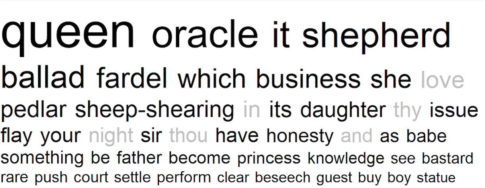
</figure>

## Symbolism of Symbols

The use of seasons and words describing seasons is well known theme in The Winter’s Tale. After reading the play and noticing the turning point of the play when we learn that Leontes and Hermione’s daughter has grown up and fallen in love, we decided to analyse the use the seasons and their words further.
Using Antconc, we first looked at Winter and when it was used – out with the title – and the rough context of it. The first very obvious thing that we noticed was that ‘winter’ was mentioned 7 times within the play and this all occurred between the beginning and the middle of the play. The significance of this is the negative beginning to the story and the common themes in the beginning of suspicion, jealousy and darkness. The word ‘cold’ is only referred to 3 times in the play in the rough middle of the play but each time this is mentioned it is used somehow to refer to death.

Once we were satisfied these themes were linked to the theme and feeling of winter, we looked onto more positive, summer and spring like words. Unlike the winter, spring and summer were only mentioned between the middle and the end of the play, once we discover about Perdita falling in love with Polixenes’ son. Summer is said four times and spring is said twice according to Antconc and again, they are often used to signify rebirth and beauty as opposed to darkness and suspicion. They reflect the turning of the play and the more common themes of the second half such as love, friendship and reunion. Warm had three hits on Antconc and each time was near the end of the play referring to Hermione’s statue coming back to life. This also signified a death versus reanimation when considering the contexts surrounding the use of warm and cold.

## Beauty and Nature

We used two different kinds of software to analyse themes of beauty and nature in The Winter’s Tale. The first, Antconc, was primarily used to distinguish the number of hits for a particular word (e.g. beauty or nature) and the placement or frequency of the words in the text. Wordhoard was the primary software used for this section and was extremely useful for distinguishing context and providing information for analysis regarding wider themes and other areas of research.

There were 5 hits in the Winter’s Tale for ‘beauty’. These were just instances where it was referenced directly, even though beauty is an overarching theme of the play. What is interesting is that the context of each reference also included allusions to nature, or notions of feminine beauty. While it is common knowledge that beauty and nature are linked in this play, the use of software like Wordhoard can speed up the process of finding evidence for this and provide focused examples. For example, using Wordhoard we were able to distinguish that Act 4, Scene 4 had the best evidence to analyse the linked themes of nature and art.

<figure>
	<figcaption>
		Figure 2.1
	</figcaption>
	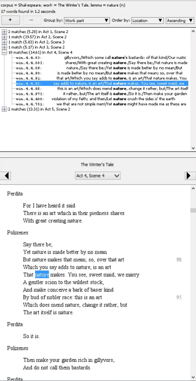
</figure>

<figure>
	<figcaption>
		Figure 2.2
  </figcaption>
	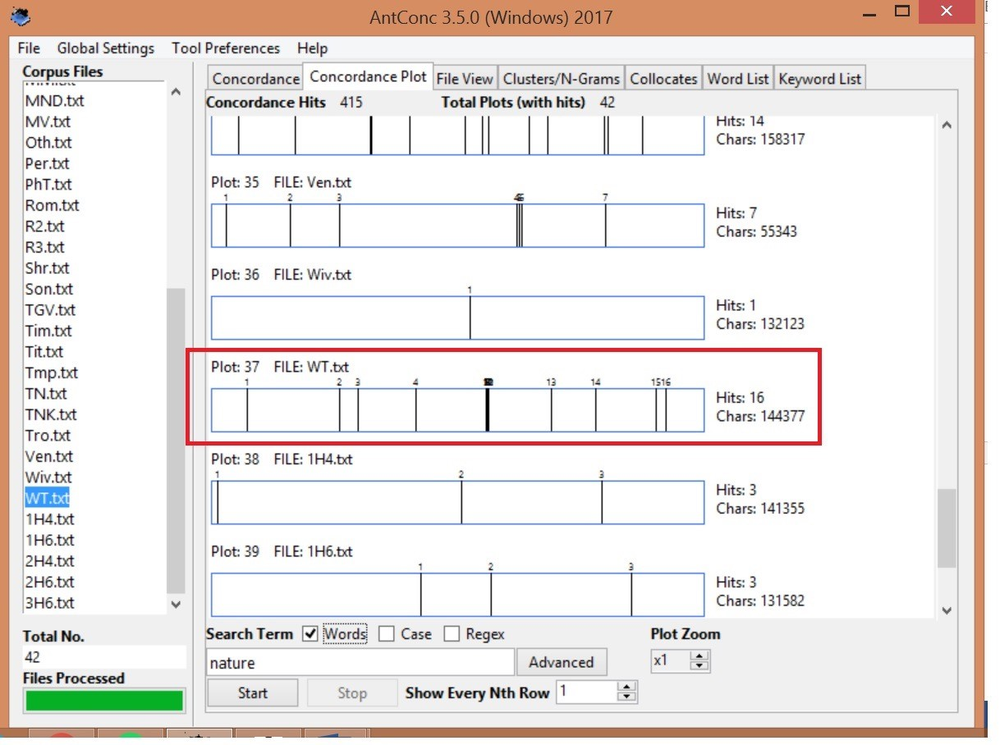
</figure>

<figure>
	<figcaption>
		Figure 2.3
	</figcaption>
	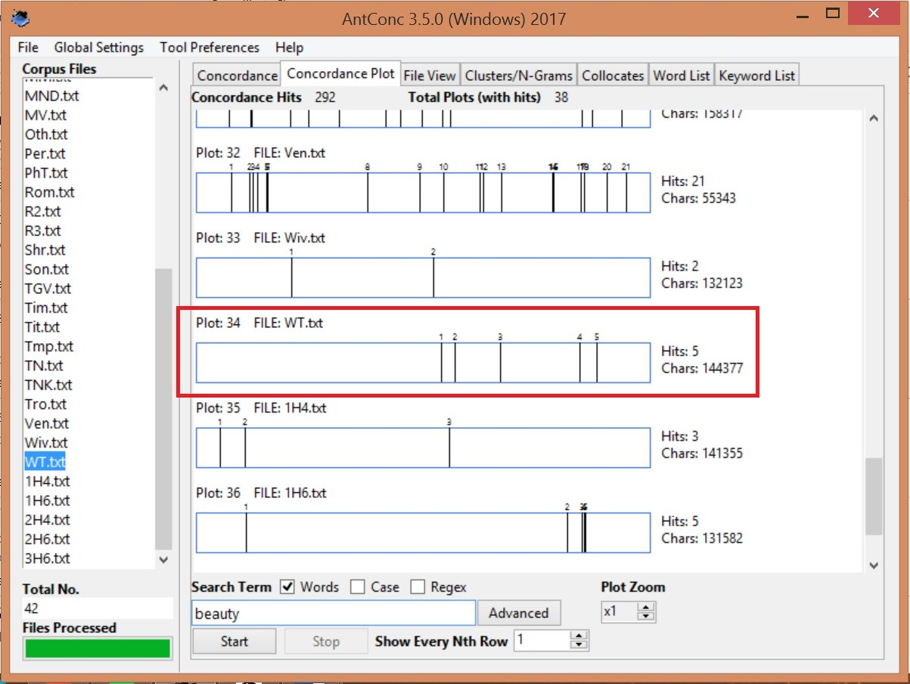
</figure>

Nature is mentioned directly more frequently, a total of 17 times. Most of the time it is referred to with female pronouns, personified as a woman (Mother Nature presumably). It is spoken of highly, as a divine force, with references of nobility permeating the text. Wordhoard allows us to establish a timeline as well as context for the prominent themes of the play that we already know. References to beauty and femininity are more frequent in the latter half of the play, which correlates in the plot to Perdita and Florizel’s betrothal, and the resurrection of Hermione. The strong correlation between femininity, beauty and nature opens up discussion around what traits were considered ‘natural’ for a woman at that time, and why beauty and value were so strongly linked to chastity and purity.

## Genre

As noted before, Shakespearian scholars have often used different labels like ‘tragicomedy’ or ‘romances’ or ‘late plays’ to classify The Winter’s Tale and the three other late plays, Pericles, Cymbeline and The Tempest, on the basis of their thematic, stylistic and structural similarities. Whilst they are certainly useful for picking out sets of common features in this play group, whether or not they are stable categories is another matter that has seen much critical attention over the years. It is well known that Shakespeare’s plays have a tendency to conflate and diminish their own generic distinctions, and the fact that genre definitions in general can be arbitrary or too loosely defined, presents a problem to those who wish to describe plays such as The Winter’s Tale according to a particular category of dramatic composition. In trying to find a solution to this problem, we explored ways in which quantitative approaches to linguistic features of plays like The Winter’s Tale can help to designate a genre. We looked, in particular, at one linguistic feature common to all of Shakespeare’s plays: negative and positive words associated with emotion and affect. We started with the intuition that tragedies are more likely to have a higher volume of negative words and comedies more likely to have a higher volume of positive words; following this intuition we assumed that tragicomedy is expected to have a mix of this.

<figure>
	<figcaption>
		Figure 3.1
	</figcaption>
	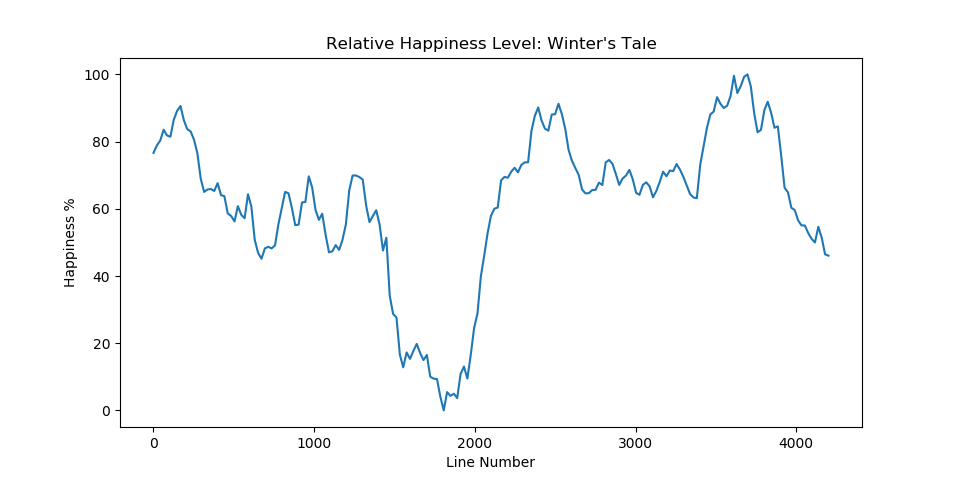
</figure>

We developed a programme that could measure the relative ‘happiness’ level of The Winter’s Tale by generating a line graph that plots the frequency of positive words in the play. On ‘y’ axis of figure 3.1 relative happiness level is measured as a percentage based on the level of saturation of positive words. On ‘x’ axis relative happiness level is measured across the interval of the play in line numbers.

The results in figure 3.1. produced a story arc that corresponded to the expectations of our first intuition by replicating the dramatic structure of tragicomedy. The line graph clearly shows a trend in the distribution of positive or ‘happy’ words across the length of the play that can be described as ‘tragicomic’. At the beginning of the graph the relative happiness level is high but drops dramatically until we reach the end of the tragic halve of the play. The relative happiness level then increases over the course of the comic halve of the play until stabilising at the very end.

<figure>
	<figcaption>
		Figure 3.2
	</figcaption>
	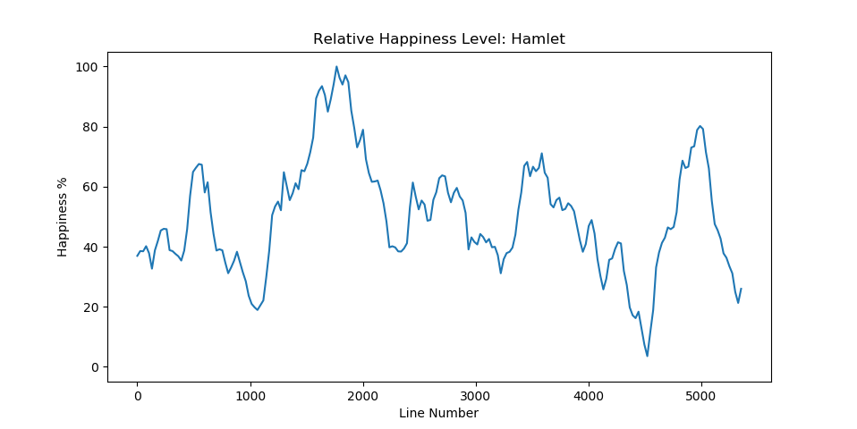
</figure>

<figure>
	<figcaption>
		Figure 3.3
	</figcaption>
	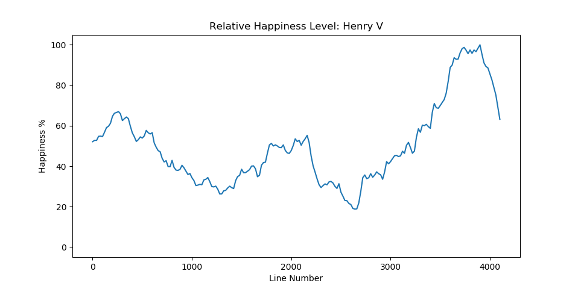
</figure>

<figure>
	<figcaption>
		Figure 3.4
	</figcaption>
	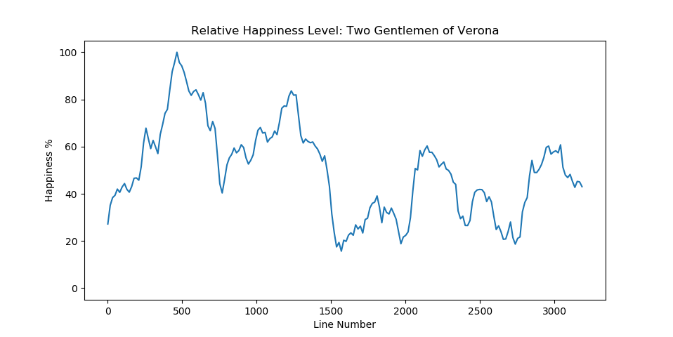
</figure>

<figure>
	<figcaption>
		Figure 3.5
	</figcaption>
	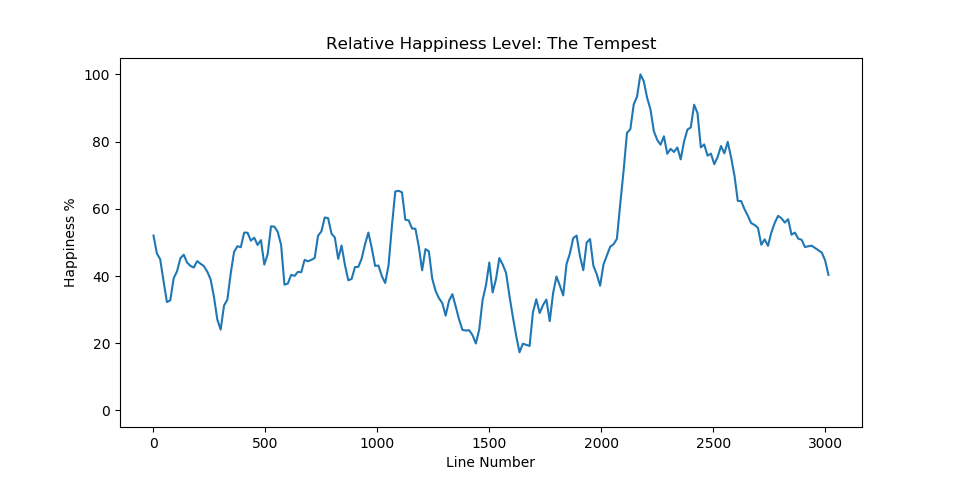
</figure>

We also looked at other plays from different genres to see how this trend changes. Figure 3.3 shows that the relative happiness level of Henry V peaks at the end in the marriage scene between King Henry V and French Princess Catherine of Valois. This is the same also for The Tempest which shows a spike near the end of the play in figure 3.5. The graph can help determine the structure of history plays like Henry V and late romances like The Tempest which often defy easy categorisation in terms of dramatic form. However, for Hamlet and The Two Gentlemen of Verona the results that were produced ran against what we expected generically. Both graphs from figures 3.2. and 3.4 appear to show frequent spikes and drops in relative happiness level. The results are thus counter-intuitive to what we would expect from one tragedy and one comedy. This opens up the possibility of critically engaging with notions of genre in Shakespeare’s plays.

## Modal Verbs

###**Why Discuss Modal Verbs?**

The metaphor is often the focal point in terms of the linguistic creativity in Shakespeare’s literature. However, modal verbs frame powerful stage moments, as it covers a double dimension of meanings. Modal verbs are related to one’s knowledge claims, articulating information ranging from “possibility” to “necessity”; it also registers the speaker’s potential action, drivers and duties etc.

<figure>
	<figcaption>
    Figure 4.1 The Percent of Modal Verbs in One Play
  </figcaption>
	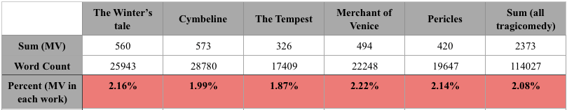
</figure>

<figure>
	<figcaption>
		Figure 4.2
	</figcaption>
	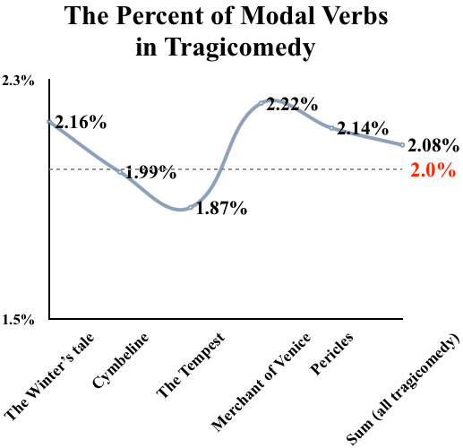
</figure>

It is found that the modal verbs generally take up two percent in the Shakespeare’s tragicomedy and this proportion is nearly constant. The use of modals to deliberate and assess various inclinations is relatively stable, which is less affected by the overall word count or the storyline. The number of modal verbs in The Winter’s tale is the second most out of all tragicomedies. It means that there is an alternative space to reflect class and personality of characters, reinforcing the tone of speech, disclosing situational complexity, and portraying character psychology.

<figure>
	<figcaption>
		Figure 4.3 The Use of Modals in WT and Overall Tragicomedy 
	</figcaption>
	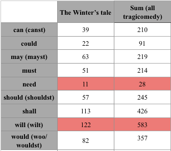
</figure>

<figure>
	<figcaption>
		Figure 4.4 
	</figcaption>
	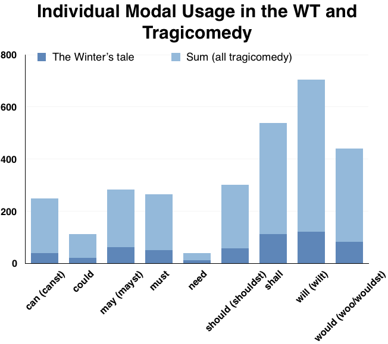
</figure>

It is noted that a few prior terms of modal verbs should be accounted as well, as in the early modern English when the lexical words gradually transform into grammatical words, some modal verbs change their forms due to the dialect use or 2rd person singular. “Will” and “shall” are the two modal verbs most commonly used in The Winter’s Tale. Conversely, “need” are least used in the work (although it is controversial whether “need” is considered to be a modal verb). This trend is also proved in all the Shakespeare’s tragicomedy, the frequency of “will” is around 20 times more than “need”. The two types of modality, epistemic modality (likelihood) and deontic modality (permission and duty) outweigh the number of dynamic modality (subject’s own willingness or ability). One explanation of that is both “shall” and “will” are alternative future markers, and therefore these two modals would score high in the comparison with other modals. Apart from that, there is literary significance, as “shall” and “will” project assured future fact, comparing to “can” (close to possible state). According to that, the characters especially emphasize their tone of assurance in the play, further painting enthusiasm, assertiveness and other colours.

<figure>
	<figcaption>
		Figure 4.5 The Percentage of Every Modal in Five Tragicomedies
	</figcaption>
	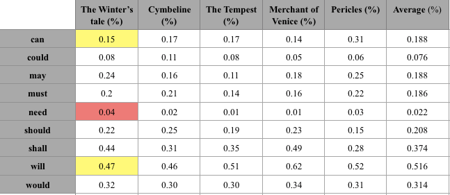
</figure>

<figure>
	<figcaption>
		Figure 4.6
	</figcaption>
	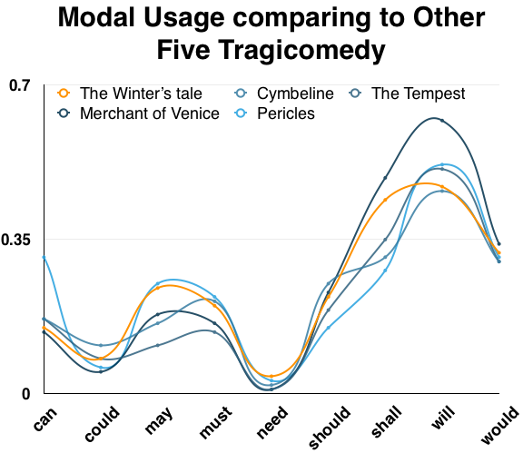
</figure>

If comparing with other tragicomedy work, The Winter’s Tale uses every modal verb more than average number except “can” (function as any of the three types of modality), and “will” (epistemic modality). Among these, “need”, with its low proportion, are utilized most in the five tragicomedy plays. “Need” emphasizes the affirmative tone of voice of the character and reflects the situational grimness, which often appears as the form of negative or question sentence, for example, Leontes affirms his decisions and power as the king by the collocation of “need no” when commanding the lords; Paulina reinforces her persuasive and comforting turn of speech when talking to the Jailer in the sentence “You need not fear it.”.

